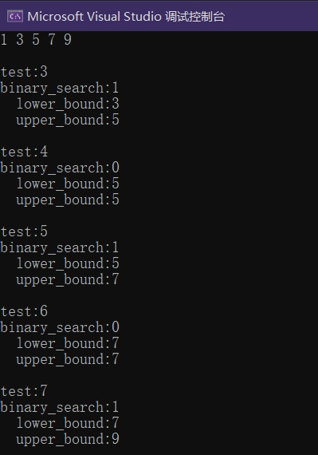

**该算法的复杂性与随机访问迭代器是对数关系，而对于其他迭代器是线性关系，并且与步骤数成比例 (last - first)。**

换而言之就是，仅数组型容器是采用二分查找，而其他容器查找操作实际上都是逐个遍历的。

<br>

这里提到的容器都已经进行过排序。

<br>

***

# binary_search

判断给定范围内有无等效的元素，存在将返回true。


MSDN：[点击跳转](https://learn.microsoft.com/zh-cn/cpp/standard-library/algorithm-functions)


```cpp
template<class ForwardIterator, class Type>
bool binary_search(
    ForwardIterator first,
    ForwardIterator last,
    const Type& value);

template<class ForwardIterator, class Type, class BinaryPredicate>
bool binary_search(
    ForwardIterator first,
    ForwardIterator last,
    const Type& value,
    BinaryPredicate pred);
```
#### 参数
*first*
指定范围-前

*last*
指定范围-后

*value*
条件值

*pred*
额外谓词(仿函数)指定，
用户定义的谓词函数对象，用于定义对一个元素小于另一个元素的理解。 二元谓词采用两个参数，并且在满足时返回 true，未满足时返回 false。


<br>


# lower_bound
获取比条件值大或者相等的最小元素的位置，返回对应迭代器(以便数据的插入操作)


MSDN：[点击跳转](https://learn.microsoft.com/zh-cn/cpp/standard-library/algorithm-functions?view=msvc-170#lower_bound)

```cpp
template<class ForwardIterator, class Type>
ForwardIterator lower_bound(
    ForwardIterator first,
    ForwardIterator last,
    const Type& value );

template<class ForwardIterator, class Type, class BinaryPredicate>
ForwardIterator lower_bound(
    ForwardIterator first,
    ForwardIterator last,
    const Type& value,
    BinaryPredicate pred );
```


#### 参数
*first*
指定范围-前

*last*
指定范围-后

*value*
条件值

*pred*
额外谓词(仿函数)指定，
用户定义的谓词函数对象，用于定义对一个元素小于另一个元素的理解。 二元谓词采用两个参数，并且在满足时返回 true，未满足时返回 false。

<br>


# upper_bound
获取比条件值大的最小元素的位置，返回对应迭代器(以便数据的插入操作)。
可以理解为lower_bound的后一个位置，个人目前暂时认为没啥用处


MSDN：[点击跳转](https://learn.microsoft.com/zh-cn/cpp/standard-library/algorithm-functions?view=msvc-170#upper_bound)


```cpp
template<class ForwardIterator, class Type>
ForwardIterator upper_bound(
    ForwardIterator first,
    ForwardIterator last,
    const Type& value);

template<class ForwardIterator, class Type, class Compare>
ForwardIterator upper_bound(
    ForwardIterator first,
    ForwardIterator last,
    const Type& value,
    Compare pred);
```


#### 参数
*first*
指定范围-前

*last*
指定范围-后

*value*
条件值

*pred*
额外谓词(仿函数)指定，
用户定义的谓词函数对象，用于定义对一个元素小于另一个元素的理解。 二元谓词采用两个参数，并且在满足时返回 true，未满足时返回 false。


# 测试代码+运行结果：
```cpp
#include<algorithm>
#include<list>
#include<vector>
#include<string>

int main() {
	std::list<int>lst = { 9,7,5,3,1 };
	lst.sort();//排序与否都将对查找结果造成直接影响

	//std::vector<int>lst = { 9,7,5,3,1 };
	//std::sort(lst.begin(), lst.end());//排序与否都将对查找结果造成直接影响

	std::vector<int>test = { 3,4,5,6,7};
	for (auto i = lst.begin(); i != lst.end(); ++i)
		printf_s("%d ", *i);
	printf_s("\n\n");
	for (auto i = test.begin(); i != test.end(); ++i) {
		printf_s("test:%d\n",*i);
		printf_s("binary_search:%d\n", std::binary_search(lst.begin(), lst.end(), *i));
		{
			auto iter = std::lower_bound(lst.begin(), lst.end(), *i);
			printf_s("  lower_bound:%s\n", iter == lst.end()?"-":std::to_string(*iter).data());
		}
		{
			auto iter = std::upper_bound(lst.begin(), lst.end(), *i);
			printf_s("  upper_bound:%s\n", iter == lst.end()?"-":std::to_string(*iter).data());
		}
		printf_s("\n");
	}
	return 0;
}
```


<br>

***

# 参考：
- algorithm函数：[https://learn.microsoft.com/zh-cn/cpp/standard-library/algorithm-functions?view=msvc-170](https://learn.microsoft.com/zh-cn/cpp/standard-library/algorithm-functions?view=msvc-170)
- C++ STL中的Binary search：[https://www.cnblogs.com/wkfvawl/p/9475939.html](https://www.cnblogs.com/wkfvawl/p/9475939.html)
