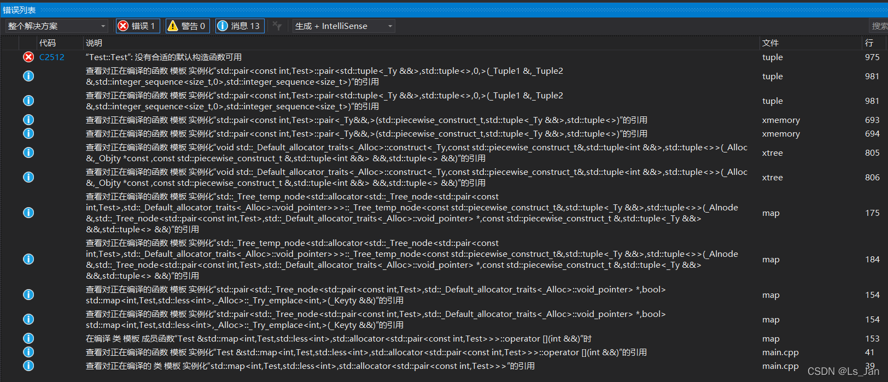
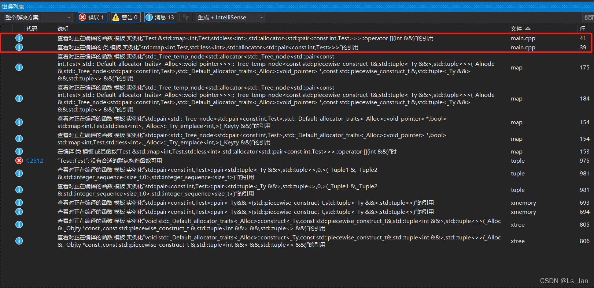

### 示例：

```cpp
#include<map>
using namespace std;
class Test {
public:
	int num;
	Test(int Num) :num(Num) {}
};

int main() {
	map<int, Test>mmm;//个人命名习惯。对于一些没啥用的、单纯拿来debug的变量，用这种名字不仅省事，而且在规范的代码里头会很扎眼，debug之后不容易忘了把它删掉
	
//	mmm[3] = Test(0);//【不可用】
	mmm.insert(pair<int, Test>(3, Test(0)));

//	mmm[3].num = 8;//【不可用】
	mmm.find(3)->second.num = 8;

	return 0;
}
```

把【不可用】的代码取消注释后，进行编译时会出现编译失败的情况。
报错中出现大量信息，建议对文件进行排序以便快速定位问题根源。





<br>


***

### 报错原因说明：
为说明这个原因，首先先说明下“左值”和“右值”

##### 左值和右值：

```cpp
#include<map>
using namespace std;

int main(){
	map<int,int> test;
	test[7];//注意一下，这条语句是不会报错的，同时会在test中插入一条记录{7:0}，至于为什么值是0，是因为int()返回的是0。
	//在C++的map里，键不存在时会直接创建一个新的键值对(也就是空白记录)
	//而在py里，键不存在时会抛异常(可以使用try-except抓住)，但test[7]=53不会
    //C++中的这条test[7]语句，等价于py中的test.setdefault(7,int())
	return 0;
}
```

说的深层次一点，就是**左值和右值**的导致的，说粗鲁点就是左值是接受值的，右值是提供值的。
``a=(b=53)+47``，这条语句，在C++能成功执行，而在py中会提示语法错误
，提示报错的最主要原因是b不能作为左值的同时作为右值

在py中，**孤零零的一条语句test[7]会被视为右值存在**，想想也是很明显的，如果它是左值的话，它要从谁接受值呢
所以，test[7]会报错是因为test[7]是作为右值存在，当7这个键不存在时自然会报错。而test[7]=53这条语句中test[7]作为左值，不存在test[7]那就创建一个test[7]，并且赋值为53

而在C++里，左值右值的界限比较模糊，一个变量即可作为左值的同时作为一个右值**

<br>


##### 报错-需要有默认构造函数
正是因为C++的这种模棱两可，编译器在编译代码时，无论key是否存在，在调用map的operator[]时都需要“默认构造函数”(因为左右值模糊，系统无法确定调用该函数到底是执行“插入”行为还是“查询”行为)。

换而言之就是，如果我不使用这个糟糕的下标运算符，使用函数``map::insert``、``map::find``的话将不会出现这些问题

<br>
<br>


***

# 参考：

- map 下标操作 value 需要有默认构造函数：[https://blog.csdn.net/wschli/article/details/39379193](https://blog.csdn.net/wschli/article/details/39379193)
