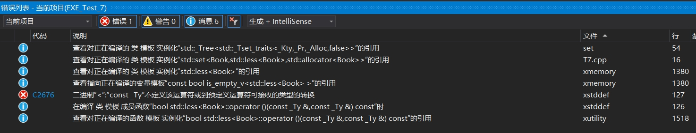

# 示例代码：

``` cpp
struct Book {
	int id;
	unsigned price;
	Book(int ID, unsigned Price) :id(ID), price(Price) {}
};

#include<set>
using namespace std;

int main() {
	set<Book>sss;
	sss.insert(Book(1, 3));
	return 0;
}
```



<br>

***

# 解决方法：
#### 1.新增成员函数``operator<(const XXX& comp)const``
``` cpp
struct Book {
	int id;
	unsigned price;
	Book(int ID, unsigned Price) :id(ID), price(Price) {}
	bool operator<(const Book& book)const {//【新增】
        return this->id < book.id; 
    }
};

#include<set>
using namespace std;

int main() {
	set<Book>sss;
	sss.insert(Book(1, 3));
	return 0;
}
```
<br>

#### 2.新增运算符函数``operator<(const XXX& left,const XXX& right)``

``` cpp
struct Book {
	int id;
	unsigned price;
	Book(int ID, unsigned Price) :id(ID), price(Price) {}
};

bool operator<(const Book& book1, const Book& book2) {//【新增】
	return book1.id < book2.id;
}

#include<set>
using namespace std;

int main() {
	set<Book>sss;
	sss.insert(Book(1, 3));
	return 0;
}
```

<br>

#### 3.新增比较类，比较类中重载成员函数``operator(const XXX& left, const XXX& right)const``，并在set模板第二参数中将比较类传入

```cpp
struct Book {
	int id;
	unsigned price;
	Book(int ID, unsigned Price) :id(ID), price(Price) {}
};

class BookComp{//【新增】
public:
	bool operator()(const Book& left, const Book& right)const{
		return left.id < right.id;
	}
};


#include<set>
using namespace std;

int main() {
	set<Book, BookComp>sss;//【新增】
	sss.insert(Book(1, 3));
	return 0;
}
```


<br>


***

# set简述：

``set``是按升序排列每个元素的容器，它有对应的无序版本``unordered_set``。

使用``set``插入自定义数据时，需要额外实现``operator<``函数，以作为数据一致性判断依据。

由于``set``是升序容器，可以将其作为升序列表使用。
虽说如此，这个升序列表是静态的，也就是如果你的升序逻辑发生变化(例如多级排序)那么得重新创建一个新的``set``并将所有数据重新插入，可以说是代价略微昂贵


<br>

***

# 参考：

- C++标准库容器-关联容器：[https://learn.microsoft.com/zh-cn/cpp/standard-library/stl-containers?view=msvc-170#associative-containers](https://learn.microsoft.com/zh-cn/cpp/standard-library/stl-containers?view=msvc-170#associative-containers)

- set自定义类型与比较函数：[https://www.cnblogs.com/shawnhue/archive/2011/12/22/set_comparison_strick_weak_ordering.html](https://www.cnblogs.com/shawnhue/archive/2011/12/22/set_comparison_strick_weak_ordering.html)