算是C嘎嘎入门教程(但至少需要知道HelloWorld怎么写
内容不能说全，因为是想到哪写到哪，再次就是C++是真的很杂。
(本文章10分钟起步，内容很多，做好心理准备...

<br>

***
# 1、头文件(\*.h)、源文件(\*.cpp）
- 头文件不参与编译，头文件的最大作用是简化/规范代码。一大段代码可以移动到“XXX.h”中，然后那大段代码的位置可以简单一个``#include"XXX.h"``代替。通常情况下头文件仅可包含函数声明、变量声明、类/结构体的声明或定义。
- 源文件参与编译，无法通过编译那一般是某名称未声明/未定义(或者过定义/重复定义)，一般IDE(例如VSCode)能给你指出这些语义错误。
- 绝对不能``#include"XXX.cpp"``，哪怕目前能跑，下一步指不定瘸给你看。迫不及待想看是怎么瘸的？[跳转到4.2](#h4.2)，但还是建议顺序阅读(毕竟文章内容我进行过调整的

<br>

***
# 2、声明与定义<font id=h2></font>
- 声明可以重复无数次，但定义只能一次(不能多也不能少)，无论是变量、函数、类、结构体。
- C++的定义具有声明效果。
- 如果变量有初始化那么肯定是定义，不可能是声明。例如``extern int num;``和``extern int num=3;``，前者是声明，后者是定义；也例如``struct Item;``和``struct Item{int num=5;};``，前者是声明，后者妥妥的是定义。
- 仅有声明而没有定义的类/结构体是无法实例化的(也就是无法创建对象)，会在编译阶段出现报错。
- 仅有声明而没有定义(或未能寻找到定义)的变量/函数，会在链接阶段出现报错。

<br>

## 2.1、以下表格展示声明和定义的区别：
说明   | 代码截图
-------- | -----
裸奔(不带``static``/``extern``修饰)的是定义，并且会被赋予默认初值|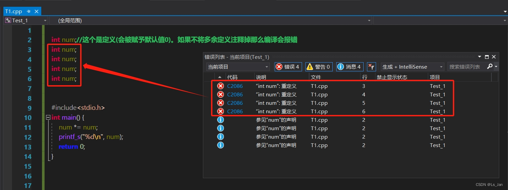
有``static``修饰的变量是定义|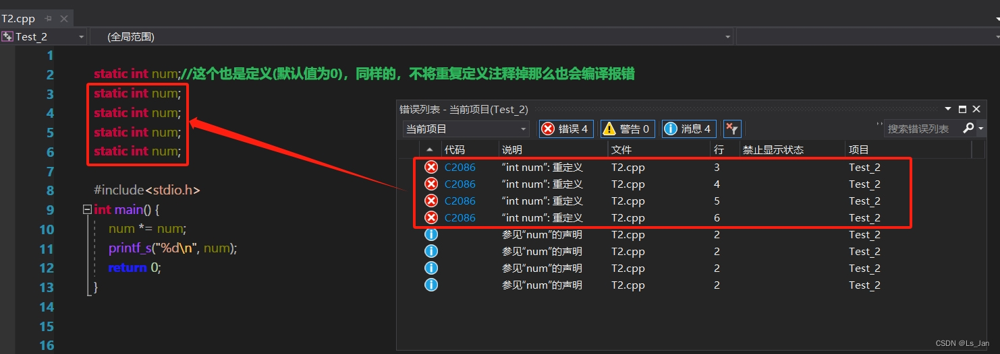
有``extern``修饰的变量是声明。<br>但如果对变量赋初值那么为是定义(因为初始化)|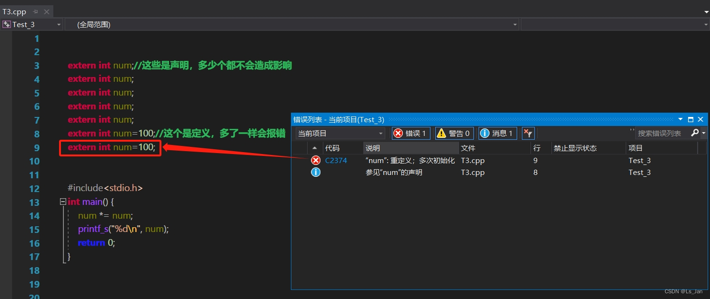
声明/创建类型：``class``/``struct``|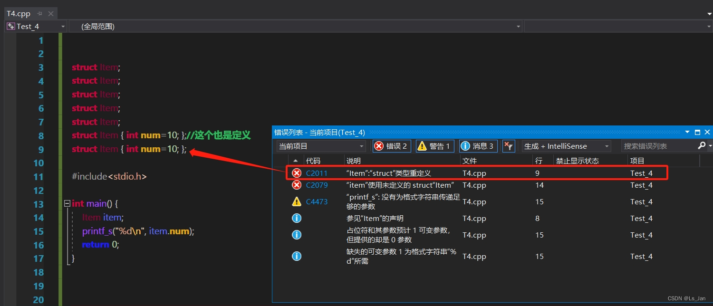
创建类型：``typedef``|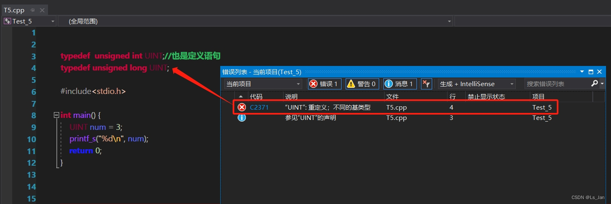
声明/创建函数|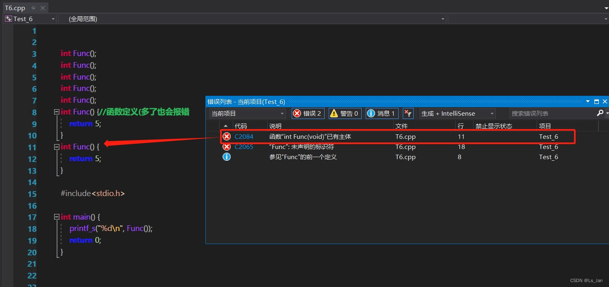

<br>

## 2.2、以下表格展示仅有声明没有定义时的报错：
说明   | 代码截图
-------- | -----
变量|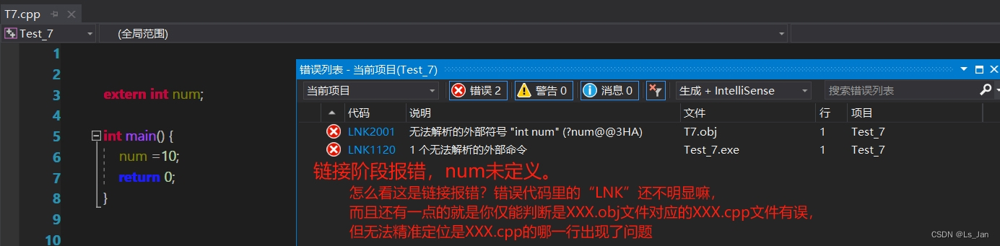
函数|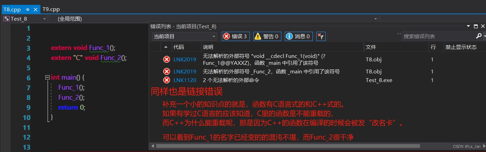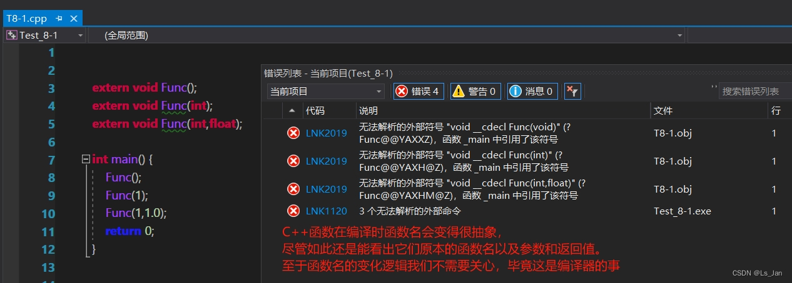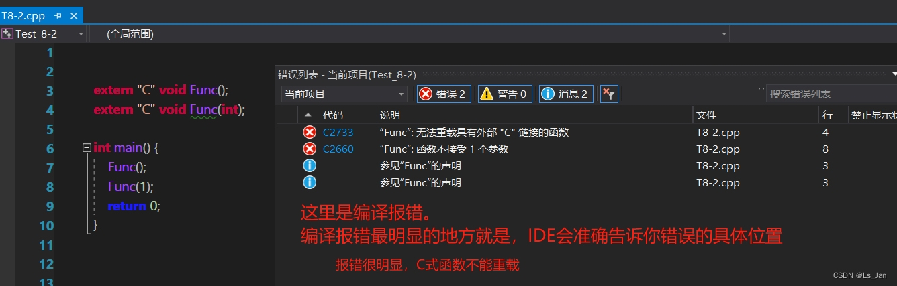
类/结构体|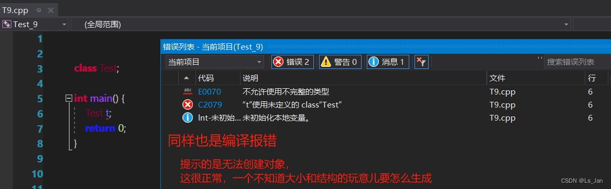


<br>


***


# 3、``static``和``extern``
这俩修饰词可以作用于变量和函数，而对类``class``和结构体``struct``来说将不起作用的，不起效的原因说来话长，这里展开会跑题。


## 3.1、``static``和``extern``的作用：<font id="static和extern的作用"></font>
作用域|``extern``|``static``|<无>
-|-|-|-
全局|[定义]：变量/函数可供其他cpp文件访问<br>[声明]：可访问其他cpp文件的变量/函数|[定义]变量/函数仅供本cpp文件使用(可有效防止污染命名空间<br>[声明]仅用于函数，声明一个静态函数|(等同``extern``)
局部|[声明]：访问全局变量/函数。实际没啥用处，但可以起一个规范作用(强调某东西是全局的|[定义]：创建静态局部变量，创建行为只会执行一次并且变量会长久滞留内存中直到程序结束|[定义]：创建局部变量，仅供本作用域使用

特别的，<font color=#00FFFF>在类中使用``static``修饰的静态成员变量仅仅是起到“声明”的效果，还要对该变量进行定义。</font>因为这是类内的，在此不展开说明。类内搞特殊的语法多了去了，全指出来可是会死人的，除了``static``之外还有``virtual``、``final``、``explict``、``operator``、``const``、``mutable``等关键词。

<br>

## 3.2、``static``和``extern``的应用：
多cpp文件下它们的作用尤为重要：
1. ``extern``确保函数/全局变量定义在指定cpp文件，防止出现重复定义；
2. ``static``保护变量/函数不受其他cpp文件的干扰，同时也不污染全局命名空间(有效避免无意中造成的重定义)；
3. ``extern``用的比较多的情况下是全局声明(也就是放在函数体外)，放在函数体内的局部声明更像是起到一种强调作用；
4. ``extern``在声明/定义函数时可省略(有和没有都一个样)。

以下为样例代码和运行结果：

```cpp
//T1_Main.cpp
extern int num;
extern void Func_1(int);
extern void Func_2(int);

int main() {
	num = 100;
	Func_1(num);
	Func_2(num);

	//extern void Func_0();//Func_0是T1_Extra-2.cpp下定义的静态函数，
	//Func_0();//取消这两行注释后IDE会提示Func_0未定义(因为静态函数不对外
	return 0;
}
```

```cpp
//T1_Extra-1.cpp
#include<stdio.h>

int num = 10;
void Func_1(int val) {
	printf_s("%d,%d\n",num,val);
}
```

```cpp
//T1_Extra-2.cpp
#include<stdio.h>

static int num = 10;
extern void Func_1(int);

static void Func_1(int val) {
	return;
}

void Func_2(int val) {
	Func_1(777);//可以看到这里并没有调用外部文件的Func_1，而是本文件下的静态函数Func_1。说明本文件下的静态函数优先级更高
	printf_s("%d,%d\n", num, val);
}

static void Func_0() {//本文件下的静态函数不对外，也就是其他cpp文件是没法访问到这里的函数Func_0
	printf_s("!!!\n");
}
```


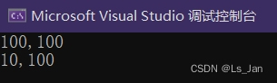

<br>

***
# 4、``#include``
## 4.1、用简单但离谱的代码来展示``#include``的作用：
```cpp
//T2_Extra.h
printf_s("%d\n", 555);
```
```cpp
//T2_Main.cpp
#include<stdio.h>
int main() {
#include "T2_Extra.h"
	return 0;
}
```
这份代码等同于：
```cpp
#include<stdio.h>
int main() {
printf_s("%d\n", 555);
	return 0;
}
```
``#include``的作用就是简单粗暴的文本替换罢了，没什么特别的。

<br>

## 4.2、``#include``一个cpp文件的问题：<font id="h4.2"></font>
为什么我要放在这里才讲``#include``的作用，那是因为只有这样才能清晰地表述``#include"XXX.cpp"``这种行为到底有多蠢。
```cpp
//T3_Main.cpp
#include<stdio.h>
#include"T3_Extra.cpp"

int main() {
	printf_s("%d\n", Func(100));
	return 0;
}
```

```cpp
//T3_Extra.cpp
int Func(int val) {
	return val * val;
}
```


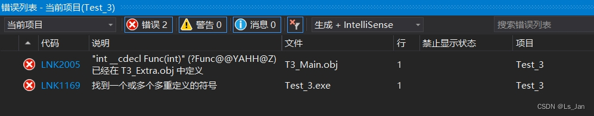

结合我上面提到的要点，这里的重定义不是显而易见？

<br>

## 4.3、硬要``#include"XXX.cpp"``一条路走到黑：
``static``解君愁<font size=1>(暂时的)</font>，仅需在T3_Extra.cpp的Func定义前添加一个``static``关键词，即：
```cpp
//T3_Extra.cpp
static int Func(int val) {
	return val * val;
}
```
T3_Main.cpp保持不变，然后代码能成功运行：


只不过很显然，这种行为将会给每个include了cpp文件的源代码的编译工作造成不小的压力，因为这会创建相当多的静态变量/静态函数(直观影响就是程序文件增大)，而且我还没提到include重复包含、交错包含的情况(这更会引起重定义问题)。

<br>

***


# 5、``struct``和``class``

这俩可以创建对应的数据结构，只不过在缺乏定义的情况下类和结构体是无法实例化的。<font size=1>(小小声补充，虽然没提到``union(联合体)``、``enum(枚举类)``、``enum class(强枚举类)``但其实它们也和类/结构体是一样的，无定义便无法使用。</font>

多个cpp文件，同时定义同名类/结构体是不会引起冲突的，除了上面提到的“无定义就无法实例化，也就无法使用”的原因外，还有个原因就是C/C++底层的实现逻辑并不在乎这个问题，它会全部转为指针+偏移量。这里我不知道怎么组织语言进行说明，反正可以理解为：<font color=#00FFFF>定义的类/结构体仅在本cpp文件下生效，就如同被强制赋予了``static``属性</font>。

有人就问了，“既然仅在本cpp文件生效，那么它们是怎么互相联动的”，这是个好问题，以至于我要用多个示例代码进行说明。


<br>

## 5.1、内联函数``inline``
可以看这篇文章：[[CSDN]C++内联函数](https://blog.csdn.net/Hello_World_213/article/details/125854669)，这博文非常清楚地说明了内联函数的作用和底层实现。
这里用简单粗暴的方式来说明：<font color=#00FFFF>内联函数有static的特性，它只在本cpp文件下生效。</font>

为什么我要提内联函数呢？这不是离题了吗，不不不，<font color=#00FFFF>当你在类定义里头定义成员函数时，这个函数就已经隐式成为了内联函数(也就是它和类定义成为一体，都仅在本cpp文件下生效)。</font>
顺带一提，没有所谓的“内联函数声明”，说白了就是<font color=#00FFFF>``inline``修饰函数声明是不会生效的，``inline``用于修饰函数定义。</font>

以下代码展示“``inline``函数不对外”的特点：

```cpp
//T4_Main.cpp
#include<stdio.h>

extern int Func(int);
int main() {
	printf_s("%d\n", Func(100));
	return 0;
}
```
```cpp
//T4_Extra.cpp
inline int Func(int val) {
	return val*val;
}
```
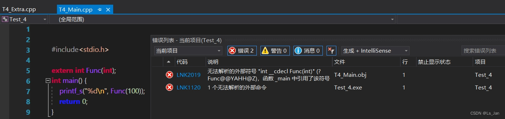
<br>

当你将类成员函数的定义移出类声明，但又忘了删掉IDE“智能”添加的``inline``的话，就会出现成员函数未定义的问题，原因同上。
这里也给一份代码作为参考：

```cpp
//T5_Main.cpp
#include"T5_Extra.h"

int main() {
	Test t;
	t.Print();
}
```
```cpp
//T5_Extra.h
#pragma once

class Test {
public:
	void Print();
};
```
```cpp
//T5_Extra.cpp
#include"T5_Extra.h"
#include<stdio.h>

inline void Test::Print() {//删去多余inline，或是将该函数定义放置于头文件T5_Extra.h中，亦或是将函数定义放于类声明内
	printf_s("Hello World!\n");
}
```

<br>

## 5.2、访问类/结构体成员本质上是通过指针+偏移量进行的<font id="h5.2"></font>
可以看这篇文章[[知乎问答]C语言结构体的底层原理](https://www.zhihu.com/question/563145415/answer/2734765913)，亦或是看下面的示例代码：
```cpp
//T6_Main.cpp
struct Test {
	int num_1;
	char mid;
	int num_2;
};

#include<stdio.h>
int main() {
	Test t{ 100,'M',200 };
	int* val_d1, * val_d2;
	int* val_p1, * val_p2;

	val_d1 = &t.num_1;
	val_d2 = &t.num_2;

	char* ptr = (char*)&t;//使用指针。char类型可以视作byte类型，方便以1字节为单位进行偏移
	val_p1 = (int*)(ptr + 0);
	val_p2 = (int*)(ptr + 8);//为什么这里是+8而不是+5，我也忘了，好像是跟“内存对齐”有关

	printf_s("%d,%d\n", *val_d1, *val_d2);
	printf_s("%d,%d\n", *val_p1, *val_p2);
	printf_s("%d,%d\n", val_d1 == val_p1, val_d2 == val_p2);
}
```
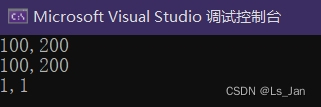

这也就说明底层实现压根不关心类/结构体长什么样的，<font color=#00FFFF>编译器在编译时并不会把类/结构体的定义存进像是符号表之类的地方，而是将其全部转换转换为指针+偏移的样子</font>，而与之做对比的是函数和变量，函数定义将会存放到程序代码段中，变量则是在数据段中。

<br>


## 5.3、类/结构体定义的本质

类/结构体的定义与其说是定义，倒不如说是一种对变量的解释。
在[5.2](#h5.2)中已经提到，编译器编译时会将类/结构体访问的成员全部用指针+偏移量的形式表示。

有了解过强制类型转换吗？就是那个意思。我可以以强制转换的方式，对一个变量采取完全不同的解释方式访问其内部数据(而这有着程序运行异常的风险)。

下面代码与浮点数底层存储有关，与文章[[知乎专栏]IEEE754标准: 一 , 浮点数在内存中的存储方式](https://zhuanlan.zhihu.com/p/343033661)一起食用效果更佳。
```cpp
//T9_Main.cpp
#include<stdio.h>

struct Float {//使用了位域，将浮点数32位拆成3个部分，详见IEEE754浮点数存储
	int fraction : 23;
	int exponent : 8;
	int sign : 1;
};


void Explain_F(float val) {
	Float* f = (Float*)&val;//强制转换，但转换的是指针(因为要访问底层数据)
	int sign = f->sign & 0x1;
	int exponent = (f->exponent )& 0xFF;
	int fraction = (f->fraction)&0x7FFFFF;
	printf_s("%.3f  %u %d %u \n",val, sign,exponent,fraction);
}

int main() {
	for (auto i = 0; i < 10; ++i) {
		float val = i + i/10.0;
		Explain_F(val);
		//访问https://www.h-schmidt.net/FloatConverter/IEEE754.html
		//检验结果是否一致
	}
	return 0;
}
```
在这个网站[https://www.h-schmidt.net/FloatConverter/IEEE754.html](https://www.h-schmidt.net/FloatConverter/IEEE754.html)中比较运行结果，可以发现是一致的
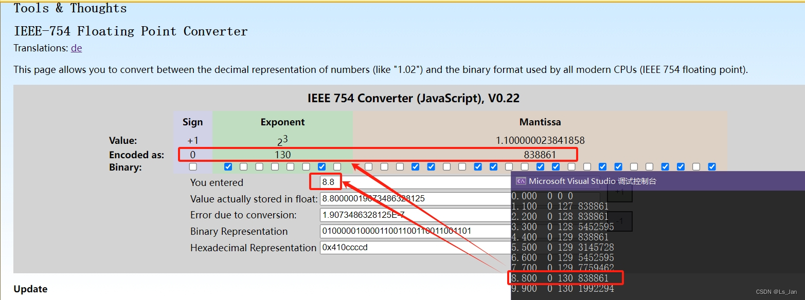
<br>

这里再附赠一份奇怪的代码(是能运行的哦)。
猜猜下面代码会输出什么？点击查看运行结果：

```cpp
//T9-1_Main.cpp
class Test {
public:
	int a;
	void Print();
};

int main() {
	Test t{ 0x44424000 };
	t.Print();
	return 0;
}

```

```cpp
//T9-1_Extra.cpp
class Test {
public:
	float x;
	void Print();
};

#include<stdio.h>
void Test::Print() {
	printf_s("%.0f\n", this->x);
}

```


所以定义一个类/结构体，然后生成实例化对象，本质上就是创建一个有着一定大小的变量罢了，而变量内部数据如何访问，取决于这个变量所对应的类/结构体的定义。
至于类成员函数则是另一套做法，具体可以看这篇文章[[CSDN]C++中类所占的内存大小以及成员函数的存储位置](https://blog.csdn.net/luolaihua2018/article/details/110736211)，我这里就不做过多解释。

<br>

## 5.4、定义类静态成员变量 
在[3.1](#static和extern的作用)中提到了一点：<font color=#00FFFF>在类中使用static修饰的静态成员变量仅仅是起到“声明”的效果，还要对该变量进行定义。</font>
这里不过多进行解释，给一份样例代码进行参考：

```cpp
//T8_Main.cpp
#include"T8_Extra.h"
#include<stdio.h>
int main() {
	printf_s("%d\n",Test::num);
	return 0;
}
```
```cpp
//T8_Extra.h
class Test {
public:
	static int num;
};
```
```cpp
//T8_Extra.cpp
#include"T8_Extra.h"
int Test::num = 777;//定义类静态成员变量，哪怕这个静态成员变量是private也一样
```


<br>


***

## 6、头文件规范
规范的头文件应该只包含声明，不应包含函数/变量定义(除了类和结构体)。只不过在特殊场合下的确可以往头文件中写入定义以供多个cpp文件使用，但也仅是特殊场合(不建议在不熟练C++的情况下搞特殊)。
问我什么是声明？[跳回去看](#h2)

这里放一份超杂大杂烩代码以及运行结果作为参考(其实这代码写到后面都不知道自己在干啥，作用性不强，完全作为示例罢了)：
```cpp
//Main.cpp
//【主程序】
#include"Integer.h"
#include"Utility.h"

int main() {
	Integer n1(1);
	Integer n2(3);
	Integer n3(5);
	printf_s("Create: %d,%d,%d\n",n1,n2,n3);
	printf_s("Sum: %d\n",Integer::Get_Sum());
	printf_s("Max: %d\n",Integer::Get_Max());
	Print_Enter();

	Integer n4(7);
	Integer n5(9);
	printf_s("Create: %d,%d\n", n4, n5);
	printf_s("Sum: %d\n", Integer::Get_Sum());
	printf_s("Max: %d\n", Integer::Get_Max());
	Print_Enter();

	int val = 100;
	printf_s("SetVal: %d -> %d\n",n4,val);
	n4.Set_Val(val);
	printf_s("Sum: %d\n", Integer::Get_Sum());
	printf_s("Max: %d\n", Integer::Get_Max());
	Print_Enter();

	return 0;
}
```
```cpp
//Integer.h
//【写着搞笑的整型类】
#pragma once

class Integer {//一个没啥用的类，写着搞笑的
public:
	Integer(int val);//初始化时传入整数值
	~Integer();
	operator int();//隐式类型转换
public:
	int Get_Val();//获取值
	void Set_Val(int val);//设置值
	static int Get_Sum();//获取所有Integer对象的值之和
	static int Get_Max();//获取所有Integer对象中的最大值

private:
	int __val;//整数值
	static int __sum;//所有Integer对象的值之和
};


//——————————————————————————————————————————————————————

inline int Integer::Get_Val(){//【内联函数】获取记录的整数值
	return this->__val;
}
```

```cpp
//Utility.h
//【通用函数】
#pragma once
#include<vector>
#include<stdio.h>

extern void Print_Enter(int count=1);//【外部函数】简单输出个换行符
template<typename T>
int Search(std::vector<T>lst,T target);//【模板函数】对已升序排序的列表lst以二分查找算法查找target的索引位置


//——————————————————————————————————————————————————————

template<typename T>
int Search(std::vector<T>lst, T target) {//模板函数的定义比较特殊，它只能落于头文件中。原因我忘了，感兴趣的可以自己去查
	int L = 0;
	int R = lst.size();
	int M = (L + R) / 2;
	while (L+1 < R) {
		int mid = lst[M];
		if (mid== target)//找到目标
			return M;
		if (mid < target)
			L = M;
		else
			R = M;
		M = (L + R) / 2;
	}
	return R;
}
```

```cpp
//Integer.cpp
#include "Integer.h"
#include"Utility.h"
#include<vector>

static std::vector<int>__record;//【静态数据，仅供本cpp使用】记录Integer对象的值(升序排序)，以便查找最大值
int Integer::__sum = 0;//【类静态数据成员的初始化】这可没有错，变量定义总该要落到某个cpp文件中，哪怕这个数据成员是private也一样

static void Insert(int val);//【函数声明】向__record中插入数值
static void Erase(int val);//【函数声明】移除__record中的数值


Integer::Integer(int val) {
	Insert(val);
	this->__val = val;
	this->__sum += val;
}

Integer::~Integer() {
	Erase(this->__val);
	this->__sum -= this->__val;
}

void Integer::Set_Val(int val) {
	Erase(this->__val);
	Insert(val);
	Integer::__sum += val - this->__val;
	this->__val = val;
}

int Integer::Get_Max() {
	return __record.back();
}

int Integer::Get_Sum() {
	return Integer::__sum;
}

Integer::operator int(){
	return this->Get_Val();
}


//——————————————————————————————————————————————————————

static void Insert(int val) {//【静态函数，仅供本cpp使用】向__record中插入数值
	int pos = Search(__record, val);
	auto iter = __record.begin() + pos;
	__record.insert(iter, val);
}
static void Erase(int val) {//【静态函数，仅供本cpp使用】移除__record中的数值
	int pos = Search(__record, val);
	auto iter = __record.begin() + pos;
	if (*iter == val)
		__record.erase(iter);
}
```
```cpp
//Utility.cpp
#include"Utility.h"

void Print_Enter(int count){
	do {
		printf_s("\n");
	} while (--count>0);
}
```

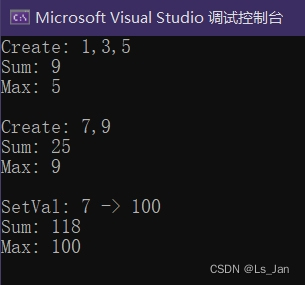


这一盆大杂烩代码涉及的东西很多，(对新手不友好)：
- 外部函数``extern``
- 静态函数``static``
- 内联函数``inline``
- 模板函数``template``
- 类型转换函数``operator XXX()``
- 静态变量定义
- 类静态成员函数的声明与定义
- 类静态成员变量的声明与定义


<br>


***

# 参考：

- C++静态局部变量：[[CSDN]https://blog.csdn.net/weixin_44470443/article/details/104503759](https://blog.csdn.net/weixin_44470443/article/details/104503759)
- C语言结构体的底层原理：[[知乎问答]https://www.zhihu.com/question/563145415/answer/2734765913](https://www.zhihu.com/question/563145415/answer/2734765913)
- C++类成员函数：[[菜鸟教程]https://www.runoob.com/cplusplus/cpp-class-member-functions.html](https://www.runoob.com/cplusplus/cpp-class-member-functions.html)
- C++中类所占的内存大小以及成员函数的存储位置：[[CSDN]https://blog.csdn.net/luolaihua2018/article/details/110736211](https://blog.csdn.net/luolaihua2018/article/details/110736211)
- C++对象调用成员函数的底层实现：[[知乎问答]https://www.zhihu.com/question/31265363/answer/55045589](https://www.zhihu.com/question/31265363/answer/55045589)
- C++内联函数：[[CSDN]https://blog.csdn.net/Hello_World_213/article/details/125854669](https://blog.csdn.net/Hello_World_213/article/details/125854669)
- C++ 中的 inline 用法：[[菜鸟教程]：https://www.runoob.com/w3cnote/cpp-inline-usage.html](https://www.runoob.com/w3cnote/cpp-inline-usage.html)
- 标准C++关键字：[[MSDN]https://learn.microsoft.com/zh-cn/cpp/cpp/keywords-cpp?view=msvc-170#standard-c-keywords](https://learn.microsoft.com/zh-cn/cpp/cpp/keywords-cpp?view=msvc-170#standard-c-keywords)
- C++隐式类型转换：[[博客园]https://www.cnblogs.com/apocelipes/p/14415033.html#用户自定义转换](https://www.cnblogs.com/apocelipes/p/14415033.html#%E7%94%A8%E6%88%B7%E8%87%AA%E5%AE%9A%E4%B9%89%E8%BD%AC%E6%8D%A2)
- 用户定义的C++类型转换：[[MSDN]https://learn.microsoft.com/zh-cn/cpp/cpp/user-defined-type-conversions-cpp?view=msvc-170#ConvFunc](https://learn.microsoft.com/zh-cn/cpp/cpp/user-defined-type-conversions-cpp?view=msvc-170#ConvFunc)
- IEEE754标准: 一 , 浮点数在内存中的存储方式：[[知乎专栏]https://zhuanlan.zhihu.com/p/343033661](https://zhuanlan.zhihu.com/p/343033661)
- IEEE754浮点数转换工具：[https://www.h-schmidt.net/FloatConverter/IEEE754.html](https://www.h-schmidt.net/FloatConverter/IEEE754.html)
- printf_s格式化输出：[[MSDN]https://learn.microsoft.com/zh-cn/cpp/c-runtime-library/format-specification-syntax-printf-and-wprintf-functions?view=msvc-170#type-field-characters](https://learn.microsoft.com/zh-cn/cpp/c-runtime-library/format-specification-syntax-printf-and-wprintf-functions?view=msvc-170#type-field-characters)
***
以上出现的代码上传至github：[https://github.com/Ls-Jan/CPP_Grammar/tree/main](https://github.com/Ls-Jan/CPP_Grammar/tree/main)
未经本人同意不得私自转载，本文章发布于CSDN：[https://blog.csdn.net/weixin_44733774/article/details/134163900](https://blog.csdn.net/weixin_44733774/article/details/134163900)


