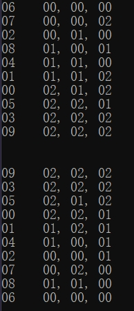

有多种实现多级排序表的方法，这里列举几个：
- 使用升序容器``set``
- 使用``algorithm``库中的排序函数``sort``
- 使用``list``/``vector``并计算每次数据的插入点
- 使用数据库


这里简单说下以上方法的优缺点(仅为个人看法)

###### 使用``set``：
- 一般解；
- 辅以``map``可以记录并返回每次数据的插入点位置；
- 优先级发生改变时需要清除容器并重新添加元素(而这大幅提高代码复杂程度)；


###### 使用``sort``：
- 最省事；
- 无法获取每次数据的插入点位置；
- 每次都要计算；
- 动态化难度大，应用场景一般；


###### 使用``list``/``vector``：
- 较优解；
- 可获取数据的插入点位置，易动态化；
- 可以直接使用algorithm库中的算法，避免重复造轮；

###### 使用数据库：
- 最省事；
- 最优解；
- 可获取数据的插入点位置，易动态化；
- 依赖环境；

<br>


***

下面提供一份代码，请试着完成ScoreList.h和ScoreList.cpp以实现多级排序表ScoreList

# 示例代码：

```cpp
//Declare.h
#pragma once
#include<map>
#include<vector>

enum class Subject {//科目
	English,//英语
	Chinese,//国语
	Math,//数学
};

struct Score {//数据信息
	unsigned studentID;
	std::map<Subject, unsigned>score;
	int CompWith(const Score& right, std::vector<Subject>&priorityLst);//根据权重进行比较(大于将返回1，小于则-1），id一致时返回0。当score值都一致时返回以id值大小进行比较
};


class Interface_ScoreList {
public:
	virtual int Length() = 0;//数据大小
	virtual void SetPriorityList(std::vector<Subject>priorityLst) = 0;//设置排序优先级
	virtual bool InsertRecord(Score* score) = 0;//插入一条数据
	virtual bool EraseRecord(Score* score) = 0;//移除一条数据
	virtual Score* PopRecord() = 0;//移除最后一条数据
	virtual Score* Start(bool reversed = false) = 0;//开始遍历，返回首条数据
	virtual Score* Next() = 0;//获取下条数据。遍历完成后将返回nullptr
};
```

```cpp
//Declare.cpp
#include "Declare.h"
int Score::CompWith(const Score& right, std::vector<Subject>& priorityLst){
	auto& left = *this;
	if (left.studentID==right.studentID)
		return 0;
	for (auto prior = priorityLst.begin(); prior != priorityLst.end(); ++prior) {
		int diff = left.score.at(*prior) - right.score.at(*prior);
		if (diff == 0)
			continue;
		return diff>0?1:-1;
	}
	return left.studentID > right.studentID?1:-1;
}
```

```cpp
//Main.cpp
#include"ScoreList.h"
#include<random>

int main() {
	srand(1);
	ScoreList lst;
	//插入数据
	for (auto i = 0; i < 15; ++i) {
		Score* s = new Score();
		s->studentID = i%10;//测试重复插入
		s->score[Subject::English] = rand() % 3;
		s->score[Subject::Chinese] = rand() % 3;
		s->score[Subject::Math] = rand() % 3;
		lst.InsertRecord(s);
	}
	//排序后输出
	lst.SetPriorityList({ Subject::English,Subject::Math,Subject::Chinese });
	for (auto s = lst.Start(true); s != nullptr; s = lst.Next())
		printf_s("%.2d, %.2d, %.2d, %.2d\n", s->studentID, s->score[Subject::English], s->score[Subject::Math], s->score[Subject::Chinese]);
	printf_s("\n\n");
	lst.SetPriorityList({ Subject::Math,Subject::Chinese,Subject::English });
	for (auto s = lst.Start(); s != nullptr; s = lst.Next())
		printf_s("%.2d, %.2d, %.2d, %.2d\n", s->studentID, s->score[Subject::English], s->score[Subject::Chinese], s->score[Subject::Math]);
	for (auto s = lst.PopRecord(); s != nullptr; s = lst.PopRecord())
		delete s;

	return 0;
}

```

<br>

```cpp
//ScoreList.h
#pragma once
#include"Declare.h"
#include<set>
class SourceList :public Interface_ScoreList {
public:
	int Length();//数据大小
	void SetPriorityList(std::vector<Subject>prioritylst);//设置排序优先级
	bool InsertRecord(Score* score);//插入一条数据
	bool EraseRecord(Score* score);//移除一条数据
	Score* PopRecord();//移除最后一条数据
	Score* Start(bool reversed = false);//开始遍历，返回首条数据
	Score* Next();//获取下条数据。遍历完成后将返回nullptr
};

```
```cpp
//ScoreList.cpp
#include"ScoreList.h"
int ScoreList::Length(){//数据大小
}
void ScoreList::SetPriorityList(std::vector<Subject>priorityLst){//设置排序优先级
}
void ScoreList::InsertRecord(Score* score) {//插入一条数据
}
void ScoreList::EraseRecord(Score* score) {//移除一条数据
}
Score* ScoreList::PopRecord() {//移除最后一条数据
}
Score* ScoreList::Start(bool reversed) {//开始遍历，返回首条数据
}
Score* ScoreList::Next() {//获取下条数据。遍历完成后将返回nullptr
}
```

<br>

***


# 补充代码实现多级排序表ScoreList

这里提供三份代码，分别是使用set、sort和使用list/vector三种方法。
(代码手搓，可能有小bug，投入使用前需进行充分的测试



## 1、使用set
```cpp
//ScoreList_Set.h
#pragma once
#include"Declare.h"
#include<set>
#include<map>
class ScoreList_Set :public Interface_ScoreList {
private:
	class __Score {
	public:
		Score* __score;
		ScoreList_Set* __parent;
	public:
		__Score(Score* data, ScoreList_Set* parent);
		bool operator<(const __Score& right)const;
	};
	std::set<__Score>__array;
	std::set<__Score>::iterator __iter;
	std::set<__Score>::reverse_iterator __riter;
	std::vector<Subject> __priorityLst;
	bool __reversed;
	bool __isValid;
public:
	ScoreList_Set();
	std::vector<Subject>* GetPriorityList();//返回排序优先级
	int Length();//数据大小
	void SetPriorityList(std::vector<Subject>priorityLst);//设置排序优先级
	bool InsertRecord(Score* score);//插入一条数据
	bool EraseRecord(Score* score);//移除一条数据
	Score* PopRecord();//移除最后一条数据
	Score* Start(bool reversed = false);//开始遍历，返回首条数据
	Score* Next();//获取下条数据。遍历完成后将返回nullptr
};
```
```cpp
//ScoreList_Set.cpp
#include"ScoreList_Set.h"

ScoreList_Set::__Score::__Score(Score* score,ScoreList_Set*parent) {
	this->__score = score;
	this->__parent = parent;
}

bool ScoreList_Set::__Score::operator<(const __Score& right)const {
	auto rst=this->__score->CompWith(*right.__score, *this->__parent->GetPriorityList());
	if (rst==0)//拒绝插入id一致的数据
		return false;
	return rst>0;
}


ScoreList_Set::ScoreList_Set() {
	this->__iter = this->__array.begin();
	this->__riter = this->__array.rbegin();
	this->__reversed = false;
	this->__isValid = false;
}

int ScoreList_Set::Length() {
	return this->__array.size();
}

std::vector<Subject>* ScoreList_Set::GetPriorityList() {//获取排序优先级
	return &this->__priorityLst;
}

void ScoreList_Set::SetPriorityList(std::vector<Subject>priorityLst) {//设置排序优先级
	this->__priorityLst = priorityLst;
	std::vector<Score*>lst;
	for (auto iter = this->__array.begin(); iter != this->__array.end(); ++iter)
		lst.push_back(iter->__score);
	this->__array.clear();
	for (auto iter = lst.begin(); iter != lst.end(); ++iter)
		this->__array.insert(__Score(*iter,this));
	this->__isValid =false;
}

bool ScoreList_Set::InsertRecord(Score* score) {//插入一条数据
	auto rst = this->__array.insert(__Score(score, this));
	this->__isValid = false;
	return rst.second;
}

bool ScoreList_Set::EraseRecord(Score* score) {//移除一条数据
	this->__array.erase(__Score(score,this));
	this->__isValid = false;
	return true;
}

Score* ScoreList_Set::PopRecord() {//移除最后一条数据
	auto iter = this->__array.rbegin();
	if (iter == this->__array.rend())
		return nullptr;
	auto s = iter->__score;
	this->__array.erase(*iter);
	this->__isValid = false;
	return s;
}

Score* ScoreList_Set::Start(bool reversed) {//开始遍历，返回首条数据
	this->__reversed = reversed;
	this->__isValid = this->__array.size()>0;
	if (this->__isValid) {
		if (reversed) {
			this->__riter = this->__array.rbegin();
			return this->__riter->__score;
		}
		else {
			this->__iter = this->__array.begin();
			return this->__iter->__score;
		}
	}
	return nullptr;
}

Score* ScoreList_Set::Next() {//获取下条数据。遍历完成后将返回nullptr
	if (this->__isValid) {
		if (this->__reversed) {
			if (++this->__riter != this->__array.rend()) {
				return this->__riter->__score;
			}
		}
		else {
			if (++this->__iter != this->__array.end()) {
				return this->__iter->__score;
			}
		}
		this->__isValid = false;
	}
	return nullptr;
}
```


## 2、使用sort

```cpp
//ScoreList_Sort.h
#pragma once
#include"Declare.h"
#include<set>
class ScoreList_Sort :public Interface_ScoreList {
private:
	std::set<unsigned>__IDs;
	std::vector<Subject>__prioritylst;
	std::vector<Score*>__array;
	std::vector<Score*>::iterator __iter;
	bool __isValid;
public:
	ScoreList_Sort();
	int Length();//数据大小
	void SetPriorityList(std::vector<Subject>prioritylst);//设置排序优先级
	bool InsertRecord(Score* score);//插入一条数据
	bool EraseRecord(Score* score);//移除一条数据
	Score* PopRecord();//移除最后一条数据
	Score* Start(bool reversed = false);//开始遍历，返回首条数据
	Score* Next();//获取下条数据。遍历完成后将返回nullptr
};
```

```cpp
//ScoreList_Sort.cpp
#include"ScoreList_Sort.h"
#include<algorithm>

ScoreList_Sort::ScoreList_Sort() {
	this->__isValid = false;
}

int ScoreList_Sort::Length(){
	return this->__array.size();
}

void ScoreList_Sort::SetPriorityList(std::vector<Subject> prioritylst) {
	this->__prioritylst = prioritylst;
	this->__isValid = false;
}

bool ScoreList_Sort::InsertRecord(Score* score) {
	auto id = score->studentID;
	if (this->__IDs.find(id) == this->__IDs.end()) {
		this->__isValid = false;
		this->__IDs.insert(id);
		this->__array.push_back(score);
		return true;
	}
	return false;
}

bool ScoreList_Sort::EraseRecord(Score* score) {
	this->__isValid = false;
	auto id = score->studentID;
	if (this->__IDs.find(id) == this->__IDs.end()) {
		for (auto iter = this->__array.begin(); iter != this->__array.end(); ++iter) {
			if (*iter == score) {
				this->__array.erase(iter);
				this->__IDs.erase(id);
				break;
			}
		}
	}
	return true;
}

Score* ScoreList_Sort::PopRecord() {
	this->__isValid = false;
	Score* s = nullptr;
	if (this->__array.size() > 0) {
		s = this->__array.back();
		this->__array.pop_back();
		this->__IDs.erase(s->studentID);
	}
	return s;
}

Score* ScoreList_Sort::Start(bool reversed) {
	this->__isValid = this->__array.size() != 0;

	//lambda闭包救我狗命，虽然可以使用functional库中的bind来绑定函数，只不过有一些麻烦
	std::sort(this->__array.begin(), this->__array.end(), [this,&reversed](Score* left, Score* right) {
		auto rst =left->CompWith(*right, this->__prioritylst);
		if (rst == 0)
			return false;
		return reversed ?rst < 0 :rst>0;
		});

	this->__iter = this->__array.begin();
	if (this->__isValid) {
		return *this->__iter;
	}
	return nullptr;
}

Score* ScoreList_Sort::Next() {
	if (this->__isValid) {
		if (++this->__iter != this->__array.end()) {
			return *this->__iter;
		}
		this->__isValid = false;
	}
	return nullptr;
}
```

## 3、使用list/vector
```cpp
//ScoreList_List.h
#pragma once
#include"Declare.h"
#include<list>
#include<set>
class ScoreList_List :public Interface_ScoreList {
private:
	std::vector<Subject>__prioritylst;
	std::list<Score*>*__array;
	std::list<Score*>::iterator __iter;
	std::list<Score*>::reverse_iterator __riter;
	bool __reversed;
	bool __isValid;
public:
	ScoreList_List();
	~ScoreList_List();
	int Length();//数据大小
	void SetPriorityList(std::vector<Subject>prioritylst);//设置排序优先级
	bool InsertRecord(Score* score);//插入一条数据
	bool EraseRecord(Score* score);//移除一条数据
	Score* PopRecord();//移除最后一条数据
	Score* Start(bool reversed = false);//开始遍历，返回首条数据
	Score* Next();//获取下条数据。遍历完成后将返回nullptr
};
```

```cpp
//ScoreList_List.cpp
#pragma once
#include"ScoreList_List.h"
#include<algorithm>
ScoreList_List::ScoreList_List() {
	this->__array = new std::list<Score*>();
	this->__iter = this->__array->begin();
	this->__riter = this->__array->rbegin();
	this->__reversed = false;
	this->__isValid = false;
}

ScoreList_List::~ScoreList_List() {
	delete this->__array;
}

int ScoreList_List::Length(){
	return this->__array->size();
}

void ScoreList_List::SetPriorityList(std::vector<Subject> prioritylst) {
	this->__prioritylst = prioritylst;
	//其实这里应该使用sort函数，算了也懒得再改
	auto oldArray = this->__array;
	this->__array = new std::list<Score*>();
	for (auto i = oldArray->begin(); i != oldArray->end(); ++i)
		this->InsertRecord(*i);
	delete oldArray;
}

bool ScoreList_List::InsertRecord(Score* score) {
	auto iter = std::lower_bound(this->__array->begin(), this->__array->end(), score, [this](Score* left, Score* right) {
		auto rst = left->CompWith(*right, this->__prioritylst);
		return rst>0;
		});
	if (iter != this->__array->end()) {
		if ((*iter)->studentID == score->studentID) 
			return false;
		this->__array->insert(iter, score);
		return true;
	}
	this->__array->push_back(score);
	return true;

}

bool ScoreList_List::EraseRecord(Score* score) {
	this->__isValid = false;
	auto iter = std::lower_bound(this->__array->begin(), this->__array->end(), score, [this](Score* left, Score* right) {
		auto rst = left->CompWith(*right, this->__prioritylst);
		return rst;
		});
	if (iter != this->__array->end()) {
		this->__array->erase(iter);
	}
	return true;
}

Score* ScoreList_List::PopRecord() {
	this->__isValid = false;
	if (this->__array->size() > 0) {
		Score* s = this->__array->back();
		this->__array->pop_back();
		return s;
	}
	return nullptr;
}

Score* ScoreList_List::Start(bool reversed) {
	auto& iter = this->__iter;
	auto& riter = this->__riter;
	auto& array = this->__array;
	this->__reversed = reversed;
	this->__isValid = array->size() > 0;
	if (this->__isValid) {
		if (reversed) {
			riter = array->rbegin();
			return *riter;
		}
		else {
			iter = array->begin();
			return *iter;
		}
	}
	return nullptr;
}

Score* ScoreList_List::Next() {
	auto& iter = this->__iter;
	auto& riter = this->__riter;
	auto& array = this->__array;
	if (this->__isValid) {
		if (this->__reversed) {
			if (++riter != array->rend())
				return *riter;
		}
		else {
			if (++iter != array->end())
				return *iter;
		}
		this->__isValid = false;
	}
	return nullptr;
}

```
