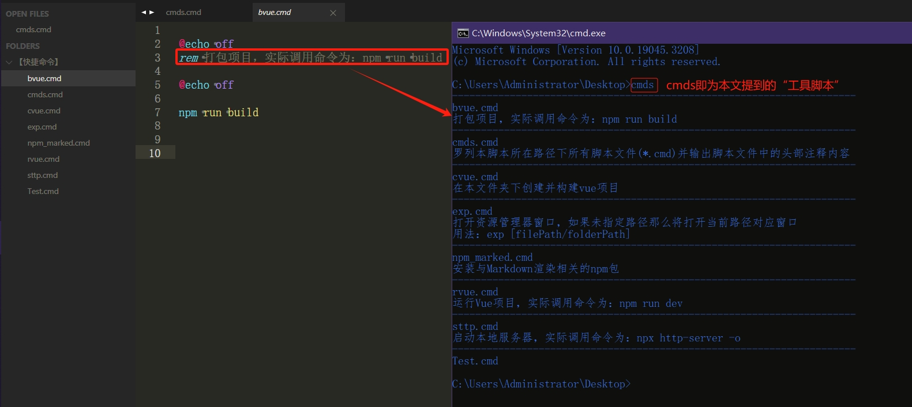

# 自定义CMD命令：

- ``cmds``：输出目录下的自定义命令的名称以及命令文件中的头部注释内容
- ``exp``：资源管理器explorer的简写，同时也能额外传入一个参数作为目标路径
- ``cvue``：在本路径下创建并构建vue项目
- ``rvue``：实际调用命令为：npm run dev，一般用于运行Vue项目所以就把这命令写成``rvue``

# ``cmds.cmd``运行截图：

# 说明：
- 资源在附录中，需跳转到Github仓库下载
- 建议在环境变量中配一个路径方便调用和维护命令

