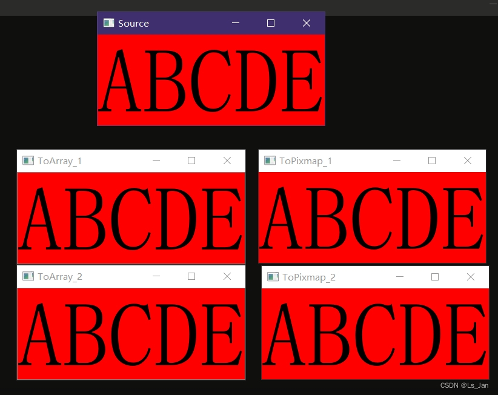

这里给出``QPixmap``→``numpy.ndarray``的两条转换(一个是使用``PIL.Image``而另一个不用)，
以及``numpy.ndarray``→``QPixmap``两条转换(同样也是用不用``PIL.Image``的区别)。


<br>

***

# 代码+运行结果：
```python
from PyQt5.QtCore import QPoint,QRect,Qt
from PyQt5.QtWidgets import QLabel
from PyQt5.QtGui import QPixmap,QImage

import numpy as np
from cv2 import cv2
import sys
from PyQt5.QtWidgets import QApplication


def ToArray_1(pix):#pix是RGBA四通道QPixmap。额外使用PIL.Image模块
	#忘了是哪里看到的，然后翻历史记录死活找不到，作罢
    from PIL import Image
    pImg=Image.fromqpixmap(pix)
    arr=np.array(pImg)
    arr=cv2.cvtColor(arr,cv2.COLOR_RGBA2BGRA)
    return arr

def ToArray_2(pix):#pix是RGBA四通道QPixmap。不使用PIL.Image模块
    #https://deepinout.com/numpy/numpy-questions/700_numpy_qimage_to_numpy_array_using_pyside.html#ftoc-heading-3
    h,w=pix.height(),pix.width()
    buffer = QImage(pix).constBits()
    buffer.setsize(h*w*4)
    arr = np.frombuffer(buffer, dtype=np.uint8).reshape((h,w,4))
    return arr.copy()

def ToPixmap_1(arr):#arr对应四通道图片。额外使用PIL.Image模块
    #https://blog.csdn.net/ielcome2016/article/details/105798279
    from PIL import Image
    arr=cv2.cvtColor(arr,cv2.COLOR_RGBA2BGRA)
    return Image.fromarray(arr).toqpixmap()

def ToPixmap_2(arr):#arr对应四通道图片。不使用PIL.Image模块
    #https://blog.csdn.net/comedate/article/details/121259033
    #https://blog.csdn.net/weixin_44431795/article/details/122016214
    # arr=cv2.cvtColor(arr,cv2.COLOR_RGBA2BGRA)
    img=QImage(arr.data, arr.shape[1], arr.shape[0], arr.shape[1]*4, QImage.Format_RGBA8888)
    return QPixmap(img)

def pixShow(pix,title):
    lb=QLabel()
    lb.setPixmap(pix)
    lb.setWindowTitle(title)
    lb.show()
    return lb


if __name__=='__main__':

    app = QApplication(sys.argv)

    wid_0=QLabel("ABCDE")
    wid_0.setStyleSheet("font-size:150px ; background-color:#FF0000")
    wid_0.setWindowTitle('Source')

    grab=wid_0.grab()#grab抓出的图是4通道的
    cv2.imshow('ToArray_1',ToArray_1(grab))
    cv2.imshow('ToArray_2',ToArray_2(grab))
    wid_1=pixShow(ToPixmap_1(ToArray_1(grab)),"ToPixmap_1")
    wid_2=pixShow(ToPixmap_2(ToArray_1(grab)),"ToPixmap_2")
    wid_0.show()

    sys.exit(app.exec())


```



***


# 补充：
1. 上面代码中均是RGBA四通道图片的操作(因为``QWidget.grab()``抓出来的图是4通不是3通的)，有其他应用场景的需要自己调整；
2. 如果出现彩图变色问题可以尝试使用``arr=cv2.cvtColor(arr,cv2.COLOR_RGBA2BGRA)``对``np.array``对象进行换色调整。简单查了下貌似是历史遗留问题，背锅侠是``openCV``


# 新补充：
1. 上面函数``ToArray_2``中，返回的arr必须``copy()``。别问，问就是一个多小时的黑盒debug。copy的原因是要脱离局部变量``buffer``的约束(不然就会重复体验到怪异的程序异常+程序崩溃，C语言访问野指针导致程序崩溃的经历已经太多了


<br>

***
###### 小小声
曾测试过```PIL.Image```模块，发现这玩意儿效率很低的来着<font size=1>(所以才尽量绕着走</font>

***

# 参考：
- QPixmap转np.array(无PIL.Image)：[https://deepinout.com/numpy/numpy-questions/700_numpy_qimage_to_numpy_array_using_pyside.html#ftoc-heading-3](https://deepinout.com/numpy/numpy-questions/700_numpy_qimage_to_numpy_array_using_pyside.html#ftoc-heading-3)
- np.array转QPixmap：[https://blog.csdn.net/ielcome2016/article/details/105798279](https://blog.csdn.net/ielcome2016/article/details/105798279)
- np.array转QPixmap(无PIL.Image)：[https://blog.csdn.net/comedate/article/details/121259033](https://blog.csdn.net/comedate/article/details/121259033)
- np.array转QPixmap(无PIL.Image)：[https://blog.csdn.net/weixin_44431795/article/details/122016214](https://blog.csdn.net/weixin_44431795/article/details/122016214)
- 为什么OpenCV使用BGR而非RGB格式：[https://blog.csdn.net/sgchi/article/details/104475033](https://blog.csdn.net/sgchi/article/details/104475033)
- 为什么openCV使用BRG模式读入图像：[https://www.zhihu.com/question/37253195](https://www.zhihu.com/question/37253195)

