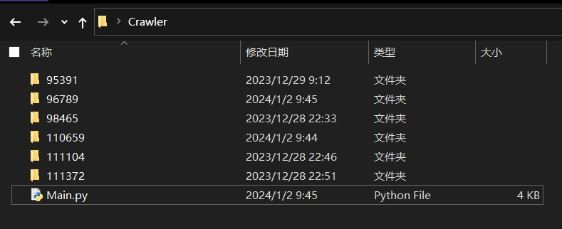
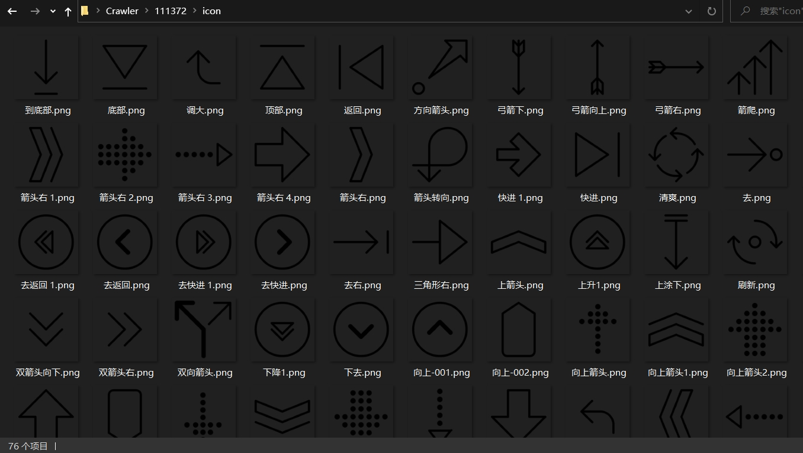

# 自用勿外传

爱给网的图片素材没加水印，防盗不是那么好，能很轻松爬取。

虽然下面脚本代码应该可以进一步抽象封装为“爬虫类”但因为爬的少所以也不清楚怎么写泛用性更高的爬虫，因此本脚本代码的耦合度很高并且只针对爱给网(如果网站规则发生变化的话估计还得大改


# Python脚本 + 运行结果

```py
import requests
import json
import os
from bs4 import BeautifulSoup
import base64


class Crawler_AiGei:
	__seq={#用于替换文件名中的一些无效符号
		'\\':'-',
		'/':'-',
		'|':'-',
		':':'-',
		'"':'\'',
		'?':'%',
		'*':'%',
		'<':'%',
		'>':'%',
	}
	def __init__(self,url,savePath=None):
		url=url.split('?')[0]
		if(not savePath):
			savePath=os.path.splitext(os.path.split(url)[1])[0]
		if(not os.path.exists(savePath)):
			os.makedirs(savePath)
		if(not os.path.exists(savePath)):
			raise Exception(f'目录【{savePath}】创建失败！')

		self.__url=f'{url}?page=$page'
		self.__tPage=1
		self.__savePath=savePath
	def Opt_Start(self):
		htmlPath=os.path.join(self.__savePath,'html')
		if(not os.path.exists(htmlPath)):
			os.makedirs(htmlPath)
		iconPath=os.path.join(self.__savePath,'icon')
		if(not os.path.exists(iconPath)):
			os.makedirs(iconPath)

		page=1
		urls={}
		while(page<=self.__tPage):
			path=os.path.join(htmlPath,f'{page}.html')
			if(os.path.exists(path)):
				with open(path,'rb') as f:
					html=f.read()
			else:
				html=self.Opt_Load(page)
				with open(path,'wb') as f:
					f.write(html)
			self.Opt_Analyse(html,urls)
			page+=1

		print('\n开始保存')
		for oldName in urls:
			newName=oldName
			for seqs in self.__seq.items():
				newName=newName.replace(seqs[0],seqs[1])
			if(newName!=oldName):
				urls[newName]=urls.pop(oldName)
		self.Opt_Download(urls,iconPath)
	def Opt_Load(self,page):
		url=self.__url.replace('$page',str(page))
		html=self.RequestUrl(url)
		return html
	def Opt_Analyse(self,html,rst):
		urls=rst
		if(html):
			soup = BeautifulSoup(html,'html.parser')
			divPage=soup.find(class_='pageInfo_totalPage')
			if(divPage):
				self.__tPage=int(divPage.text)
			for div in soup.findAll(class_='unit-content-main'):
				name='icon'
				divName=div.find(class_='unit-info-row resc-info-bottom-info-name')
				if(divName):
					if(divName.b):
						name=divName.text.strip()

				divImg=div.find('img')
				if(divImg.has_attr('data-original')):
					data=divImg['data-original'][len('aigei-image-encode-'):]
					url=base64.b64decode(data).decode()
				elif(divImg.has_attr('src')):
					url=divImg['src']
					if(url.find('//')==0):
						url='https:'+url
				else:
					continue
				urls.setdefault(name,[]).append(url)
	def Opt_Download(self,urls,savePath=None):
		def Save(url,name):
			extension=os.path.splitext(url.split('?')[0])[1]
			path=os.path.join(savePath,name+extension)
			if(not os.path.exists(path)):
				data=self.RequestUrl(url)
				if(data):
					with open(path,'wb') as f:
						f.write(data)
		for name,urls in urls.items():
			if(len(urls)==1):
				Save(urls[0],name)
			else:
				name=f'{name}-$num'
				num=1
				for url in urls:
					Save(url,name.replace('$num',str(num).zfill(3)))
					num+=1
	@staticmethod
	def RequestUrl(url,GET=True,headers=None,payload=None):
		print(f'获取{url}')
		func = getattr(requests,'get' if GET else 'post')
		rst=None
		try:
			res=func(url,data=payload,headers=headers)
			rst=res.content
		except:
			pass
		return rst

if __name__=='__main__':
	urls=[
		'https://www.aigei.com/view/95391.html',
		'https://www.aigei.com/view/98465.html',
		'https://www.aigei.com/view/111104.html',
		'https://www.aigei.com/view/111372.html',
		'https://www.aigei.com/view/110659.html',
		'https://www.aigei.com/view/96789.html',
	]
	craw=Crawler_AiGei(urls[-1])
	craw.Opt_Start()
```






# 参考：
- 简单使用BS4：[https://zhuanlan.zhihu.com/p/26683864](https://zhuanlan.zhihu.com/p/26683864)
- BS4基本用法：[https://www.cnblogs.com/kaibindirver/p/9927297.html](https://www.cnblogs.com/kaibindirver/p/9927297.html)

