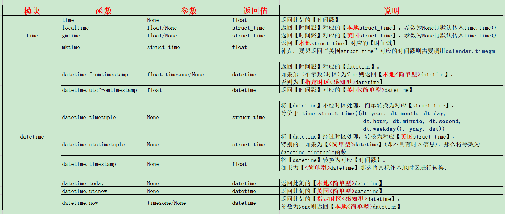

# 时间戳与日期

在说到这俩模块之前，首先先明确几个概念：
1. 时间戳是个很单纯的东西，没有“时区”一说，因为时间戳本质上是经过的时间。
2. 日常生活中接触到的“日期”、“某点某时某分”准确的说是时间点，都是有时区概念的。
在日常生活中如果说现在几点但不说明时区的话就都视为本地时区，这在datetime中也一样，不额外附上时区信息的话都视为本地时区。

 
 

***
# time模块和datetime模块

在time模块中比较常用的函数有``time.time``、``time.gmtime``、``time.localtime``、``time.mktime``，其中``time.gmtime``的“gm”代表的含义是“Greenwich Mean Time(格林尼治平均时间)”，也就是该函数会返回英国时间，也可以理解为UTC-0。我们处在东八区，为UTC+8，如果使用``time.gmtime``的话获取到的时间往往会少8小时，要改用``time.localtime``才能获取到正确的时间。

而datetime模块比time模块要稍微复杂那么一些，用文字也不好表达，之后用图表的方式进行叙述。datetime更加复杂的一大原因是time模块是 _面向函数_，而datetime模块是 _面向对象_。具体来说就是：
- ``time.struct_time``这个类里头没有什么函数可以调用，就像是C语言里的结构体那样仅存放信息，虽然可以携带“时区”信息但许多模块对其进行处理时会将其中的时区信息无视掉(所以经常出现转换的时间与预期不符的问题)；
- ``datetime.datetime``则不一样，这个类里头有不少的函数/方法，而方法与类对象是强耦合关系，类对象中有无时区信息都会对方法的执行结果造成显著影响。在官方文档中有明确提及``datetime.datetime``对象有“naive(简单型)”和“aware(感知型)”这两种类型，虽然看上去很复杂但实际上也就“有无携带时区信息”的差别罢了：有“时区信息”的就是aware(感知型)，没有的则是naive(简单型)。可通过获取``datetime.datetime``对象``tzinfo``属性来判断其是否带有时区信息。
- 一般情况下``datetime.datetime``对象往往是naive(简单型)，也就是在你不经意的时候你以为它是“UTC”但实际上是“LMT”，例如通过``datetime.datetime.utcnow``获得的datetime对象竟然是不带时区的，如果不查官方文档的话甚至还以为它会带着时区信息，而官方文档也强调了这一点：[[datetime.utcnow](https://docs.python.org/zh-cn/3.7/library/datetime.html#datetime.datetime.utcnow)]datetime.utcnow()返回的当前 UTC 日期和时间是一个 _**本机**_ datetime 对象，哈哈哈哈哈直接气炸了好吧。(所谓的“本机”也就是本地的意思，说直白点就是``datetime.datetime.utcnow``返回的是个``naive-datetime``对象)；
- 补充说明，“``函数(function)``”和“``方法(method)``”有着轻微差别，具体点就是“首参有无绑定特定对象”的区别。这里不展开说明避免跑题，感兴趣的可以自己了解下。简单使用下``@staticmethod``和``@classmethod``将更直观地看出``函数(function)``和``方法(method)``的差异。

 
 

***
# 图表说明：

以下为个人总结的图片表格：

# 补充：

1. 上面说过，``datetime.datetime``类对象可分为“naive(简单型)”和“aware(感知型)”这两种东西，也就是一个没时区信息(默认本地时区)，一个有时区信息。
简单型datetime的tzinfo(时区信息)为None，而感知型的为datetime.timezone对象。
在有关创建datetime对象的函数中，如果没有指定时区，返回的datetime对象将全是“简单型”(如有特例请指正)。
2. 有两种生成时区对象datetime.timezone的方法：
``datetime.timezone(datetime.timedelta(hours=8,minutes=30))``
``pytz.timezone('Asia/Shanghai')``
其中关于``pytz.timezone``的可支持时区(即传入的参数)可通过``pytz.all_timezones``这个列表进行查询。pytz为系统自带模块。
3. 以下是能够生成aware-datetime对象的函数：
``datetime.datetime.now``
``datetime.datetime.fromtimestamp``
``datetime.datetime.replace``
``datetime.datetime.astimezone``
``datetime.datetime.strftime``
4. 通常使用``datetime.datetime.replace``进行naive-datetime和aware-datetime的相互转换，例如``datetime.datetime.utcnow``返回的是不带时区信息的naive-datetime对象，需要调用``datetime.datetime.replace``来转化为aware-datetime对象便于后期处理。

虽然才想起来需要补充代码，但想想还是算了(编写样例代码好麻烦的说实话)，而且本博文的性质更偏向于“文档说明”而不是“应用举例”。关于``time``模块和``datetime``模块的具体用法需自行搜索以及测试。

顺带一提，如果出现运行结果与本文描述的不一致，可能是python版本的差异造成的，此时需要参考官方文档。我的Python版本为3.7.8，(当前Python都已经出到3.11了

 

***

# 参考资料：
- time模块：[(官方文档)https://docs.python.org/zh-cn/3.7/library/time.html](https://docs.python.org/zh-cn/3.7/library/time.html)
- datetime模块：[(官方文档)https://docs.python.org/zh-cn/3.7/library/datetime.html](https://docs.python.org/zh-cn/3.7/library/datetime.html)
- 通过pytz获取指定时区：[(博客园)https://www.cnblogs.com/meitian/p/12839164.html](https://www.cnblogs.com/meitian/p/12839164.html)
- 通过datetime.timezone获取简单时区(简单时区不包含夏令时)：[(官方文档)https://docs.python.org/zh-cn/3.7/library/datetime.html#timezone-objects](https://docs.python.org/zh-cn/3.7/library/datetime.html#timezone-objects)
- Python3中datetime不同时区转换介绍与踩坑：[(博客园)https://www.cnblogs.com/AcAc-t/p/python3_datetime_timezone.html](https://www.cnblogs.com/AcAc-t/p/python3_datetime_timezone.html)

