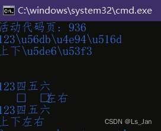

## ``encode``和``decode``：
1.  ``str``没有``decode``函数，但对应的有``encode``函数，该函数作用是转码为``bytes``对象
2.  ``bytes``通过``decode``函数转换回对应的``str``
3. 对于一些偏激的(可以用过分来形容)的字符串，例如``一二三\\u56db\\u4e94\\u516d``，是有相应的解决方法的。至于为什么我用“偏激”来形容，因为正常情况下是不应该出现这种混杂情况的，<font size=1>(出现这种情况多半是哪个煞x忽视字符编码问题直接一股脑字符串连接。</font>
使用``str.encode('ascii','backslashreplace')``将中文部分全转换为``\u字符``即可
4. 若是出现其他类型的混乱字符串(例如掺杂utf-8编码的中文字串``一二三\\xe5\\x9b\\x9b\\xe4\\xba\\x94\\xe5\\x85\\xad``)的话，请先拎清楚到底是哪里造成的问题。这篇博客里不提供对应的解决方法，自己谋生路，写个函数逐字符转换也好，用re正则替换也罢，又或是使用``codecs.register_error()``注册一个新的编码器，反正能跑就行。


<br>

***

## 示例代码+运行结果：
```python

tx1='123\\u56db\\u4e94\\u516d'
tx2='上下\\u5de6\\u53f3'

print(tx1)
print(tx2)
print()
print()

print(tx1.encode().decode("unicode-escape"))#这个encode使用utf-8转码，在遇到非ASCII时直接暴毙
print(tx2.encode().decode("unicode-escape"))#暴毙输出
print(tx1.encode('ascii','backslashreplace').decode('unicode-escape'))#这个encode会无视反斜杠字符的转码，同时对其他非ASCII字符转换为\u字符
print(tx2.encode('ascii','backslashreplace').decode('unicode-escape'))#转换成功

```


***
# 补充：
这里是没有显式提到“中文转\u字符”，
但“中文转\u字符”这操作在上面的示例代码中有出现，
当然，除了``str.encode('ascii','backslashreplace')``也可以使用``str.encode('unicode-escape')``进行转换

***
# 参考：
- ``str.encode``函数参数-``backslashreplace``： [https://www.w3school.com.cn/python/ref_string_encode.asp](https://www.w3school.com.cn/python/ref_string_encode.asp)
- ``str.encode``函数参数-``codecs.register_error()``：[https://www.runoob.com/python/att-string-encode.html](https://www.runoob.com/python/att-string-encode.html)
- ``codecs``模块：[https://cloud.tencent.com/developer/section/1371694](https://cloud.tencent.com/developer/section/1371694)

