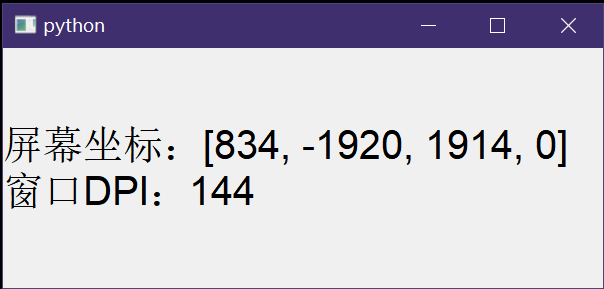

运行下面的代码，会显示窗口所在屏幕的屏幕坐标信息以及窗口DPI(同时也是屏幕DPI)，并且窗口内容随着窗口的跨屏拖动而发生变化。

|  |  |
| - | - |

<br>

```py
from PyQt5.QtWidgets import QApplication,QLabel
from PyQt5.QtGui import QFont
from ctypes import windll
from ctypes import Structure, cast, POINTER, windll,sizeof,pointer
from ctypes.wintypes import LPARAM, WPARAM, DWORD, LONG,HINSTANCE,POINT,RECT,HWND,UINT
import win32con

user32=windll.LoadLibrary('User32.dll')
class MSG(Structure):
	_fields_ = [
	('hwnd',HWND),
	('message',UINT),
	('wParam',WPARAM),
	('lParam',LPARAM),
	('time',DWORD),
	('pt',POINT),]
class MONITORINFO(Structure):
	_fields_ = [
	('cbSize',DWORD),
	('rcMonitor',RECT),
	('rcWork',RECT),
	('dwFlags',DWORD),]

class Test(QLabel):
	def __init__(self):
		super().__init__()
		dpi=self.logicalDpiX()#这个API能够获取到窗口DPI
		self.__Update(dpi)
	def __Update(self,dpi:int,winRect:list=None):
		if(not winRect):
			geo=self.geometry()
			winRect=[geo.left(),geo.top(),geo.right(),geo.bottom()]
		hMonitor=user32.MonitorFromRect(RECT(*winRect),win32con.MONITOR_DEFAULTTONEAREST)
		info=MONITORINFO(sizeof(MONITORINFO))
		user32.GetMonitorInfoA(hMonitor,pointer(info))
		rect=info.rcMonitor
		rect=[rect.left,rect.top,rect.right,rect.bottom]
		self.setText(f"屏幕坐标：{rect}\n窗口DPI：{dpi}")
	def nativeEvent(self,eventType,message):
		msg=cast(message.__int__(),POINTER(MSG))[0]
		if(int(msg.message)==736):#win32con并没有WM_DPICHANGED这个宏的值，乐
			dpi=msg.wParam & 0xFF
			rect=cast(msg.lParam.__int__(),POINTER(RECT))[0]
			self.__Update(dpi,[rect.left,rect.top,rect.right,rect.bottom])
			#此时许多数据都没有得到更新，例如logicalDpiX()、geometry()等
		return super().nativeEvent(eventType,message)


if True:
	# QApplication.setHighDpiScaleFactorRoundingPolicy(Qt.HighDpiScaleFactorRoundingPolicy.PassThrough)
	# QApplication.setAttribute(Qt.AA_DisableHighDpiScaling)
	# QApplication.setAttribute(Qt.AA_EnableHighDpiScaling)
	# QApplication.setAttribute(Qt.AA_UseHighDpiPixmaps)

	app=QApplication([])

	# screens=QGuiApplication.screens()
	# for s in screens:
	# 	print(s.geometry(),s.devicePixelRatio())

	ts=Test()
	ts.setFont(QFont("",20))
	ts.setGeometry(1000,500,500,200)
	ts.show()

	app.exec()
```


上面代码中的两个ctypes类型``MSG``和``MONITORINFO``可以用以下方式进行创建：

```py
def genStruct(name="Structure", **kwargs):
    return type(name, (Structure,), dict(_fields_=list(kwargs.items()),))
MONITORINFO = genStruct(
	cbSize=DWORD,
	rcMonitor=RECT,
	rcWork=RECT,
	dwFlags=DWORD,)
MSG = genStruct(
	hwnd=HWND,
	message=UINT,
	wParam=WPARAM,
	lParam=LPARAM,
	time=DWORD,
	pt=POINT,)
```


# 参考：
- MonitorFromRect：[https://learn.microsoft.com/zh-cn/windows/win32/api/winuser/nf-winuser-monitorfromrect](https://learn.microsoft.com/zh-cn/windows/win32/api/winuser/nf-winuser-monitorfromrect)
- WM_DPICHANGED：[https://learn.microsoft.com/zh-cn/windows/win32/hidpi/wm-dpichanged](https://learn.microsoft.com/zh-cn/windows/win32/hidpi/wm-dpichanged)
- QT无边框窗体——拦截windows消息实现 ：[https://www.cnblogs.com/feipeng8848/p/14493087.html](https://www.cnblogs.com/feipeng8848/p/14493087.html)
- QWidget.nativeEvent：[https://doc.qt.io/qt-6/qwidget.html#nativeEvent](https://doc.qt.io/qt-6/qwidget.html#nativeEvent)
- qt捕获全局windows消息：[https://www.cnblogs.com/findumars/p/5738833.html](https://www.cnblogs.com/findumars/p/5738833.html)

