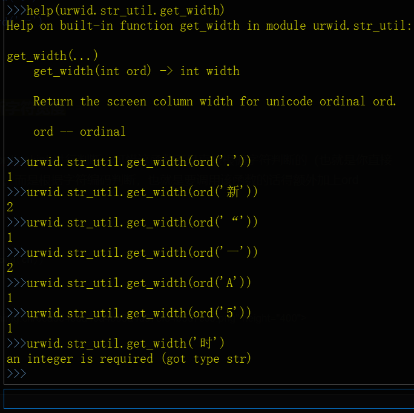

<br>
<br>

### 使用urwid判断字符宽度

用``urwid.str_util.get_width(ordinal:int)``进行判断，这函数根据字符编码判断，需调用``ord``获取字符对应编码

```python
ch='A'
#urwid.str_util.get_width(ch)#【这个直接报错提示参数错误】
urwid.str_util.get_width(ord(ch))
```




<br>
<br>
<br>
<br>
<br>

### 安装urwid

Windows端：``pip install urwid``

Linux端：``apt-get install python-urwid``


# 参考：

- Python计算字符宽度的方法：[https://www.php.cn/faq/227808.html](https://www.php.cn/faq/227808.html)

- Github-urwid：[https://github.com/urwid/urwid](https://github.com/urwid/urwid)

