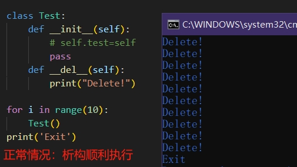
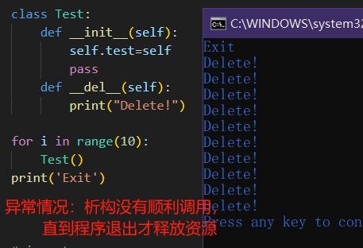
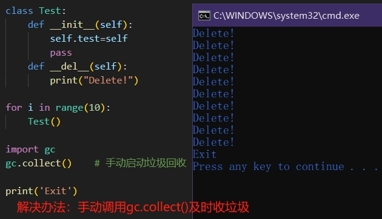

一份简单的代码，足以说明内存泄漏是有多容易触发，仅仅是利用循环引用就能让垃圾回收失效，进而内存泄漏，更不用提大项目下各种复杂的引用关联了。

其中一个解决方法就是使用``gc.collect()``手动收垃圾。

```py
class Test:
	def __init__(self):
		self.test=self
	def __del__(self):
		print("Delete!")

for i in range(10):
	Test()

# import gc
# gc.collect()#手动启动垃圾回收

print('Exit')
```

<br>







<br>

***


有关Python垃圾回收机制的详细说明可以网上查找参考资料，我随便找了几篇：
- [[知乎]深/浅拷贝+内存回收机制+避免内存泄漏](https://zhuanlan.zhihu.com/p/368065134)
- [[知乎]Python 中的垃圾回收机制](https://zhuanlan.zhihu.com/p/62282961)
- [[知乎]python内存泄漏排查小技巧](https://zhuanlan.zhihu.com/p/436577356)


