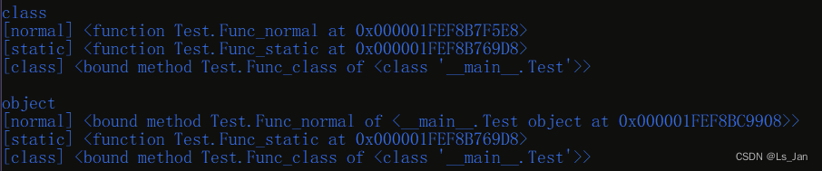
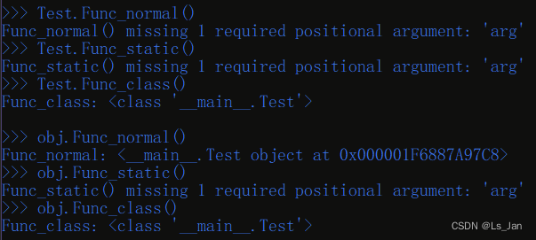

``method``与``function``的最大区别就是<font color=#FF0000>函数参数有无发生绑定</font>。

***
# 自定义类Test：
首先先来一个自定义类：

```python
class Test:
    def Func_normal(arg):
        print('Func_normal:',arg)
    @staticmethod
    def Func_static(arg):
        print('Func_static:',arg)
    @classmethod
    def Func_class(arg):
        print('Func_class:',arg)
```


<br>

***
# 代码样例：

先来一份代码以及运行结果：
```python
obj=Test()#Test为本文开头提到的自定义类
for item in ['Test','obj']:
    print('\n'+('class'if item=='Test' else 'object'))
    for name in ['normal','static','class']:
        print(f'[{name}]',eval(f'{item}.Func_{name}'))
```



为了更直观地看出差别，这里简单的编写一个表格：


属性访问|<font color=#FF0000 >**[normal]**</font>|<font color=#FF0000 >**[@staticmethod]**</font>|<font color=#FF0000 >**[@classmethod]**</font>
-|-|-|-
<font color=#FF0000 >**class**</font>|function|function|method-<i>**class**</i>
<font color=#FF0000 >**object**</font>|method-<i>**object**</i>|function|method-<i>**class**</i>


可以看出通过类和通过对象访问到的是不完全一致的，而这与本主题有关。
但是仅仅通过这个还不够直观地表现出它们的差异性，这里再附加一份测试代码以及运行结果：

```python
obj=Test()#Test为本文开头提到的自定义类
for item in ['Test','obj']:
    for name in ['normal','static','class']:
        try:
            tx=f'{item}.Func_{name}()'
            print('>>>',tx)
            exec(tx)
        except Exception as e:
            print(e)
    print()
```





这里同样贴心地将上面的结果整理成表格便于对比：
不传参数|<font color=#FF0000 >**[normal]**</font>|<font color=#FF0000 >**[@staticmethod]**</font>|<font color=#FF0000 >**[@classmethod]**</font>
-|-|-|-
<font color=#FF0000 >**class**</font>|<错误：缺失1参>|<错误：缺失1参>|<i>**class**</i>
<font color=#FF0000 >**object**</font>|<i>**object**</i>|<错误：缺失1参>|<i>**class**</i>

<br>

***

# 分析：
在上面的代码样例中得到两张表格，这里再重新把俩表格放在一起以便进行对比，请仔细比对俩表格之间的差异。

属性访问|<font color=#FF0000 >**[normal]**</font>|<font color=#FF0000 >**[@staticmethod]**</font>|<font color=#FF0000 >**[@classmethod]**</font>
-|-|-|-
<font color=#FF0000 >**class**</font>|function|function|method-<i>**class**</i>
<font color=#FF0000 >**object**</font>|method-<i>**object**</i>|function|method-<i>**class**</i>

不传参数|<font color=#FF0000 >**[normal]**</font>|<font color=#FF0000 >**[@staticmethod]**</font>|<font color=#FF0000 >**[@classmethod]**</font>
-|-|-|-
<font color=#FF0000 >**class**</font>|<错误：缺失1参>|<错误：缺失1参>|<i>**class**</i>
<font color=#FF0000 >**object**</font>|<i>**object**</i>|<错误：缺失1参>|<i>**class**</i>


以下为结论：
- ``method``与``function``的最大区别就是参数有无进行绑定。
- 在本例中，``method``在调用时不需要参数，因为第一个参数已经与特定对象进行了绑定，而``function``需要传入1参数才能正常调用。
- ``@classmethod``的作用是将函数的第一个参数绑定为本类(无论是通过类还是类对象进行调用)，``@staticmethod``的作用则是撤去第一个参数的绑定。


<br>


***
# 完整代码：

```python
class Test:
    def Func_normal(arg):
        print('Func_normal:',arg)
    @staticmethod
    def Func_static(arg):
        print('Func_static:',arg)
    @classmethod
    def Func_class(arg):
        print('Func_class:',arg)

obj=Test()
for item in ['Test','obj']:
    print('\n'+('class'if item=='Test' else 'object'))
    for name in ['normal','static','class']:
        print(f'[{name}]',eval(f'{item}.Func_{name}'))

print('\n\n'+'——'*30+'\n\n')

obj=Test()
for item in ['Test','obj']:
    for name in ['normal','static','class']:
        try:
            tx=f'{item}.Func_{name}()'
            print('>>>',tx)
            exec(tx)
        except Exception as e:
            print(e)
    print()
```

