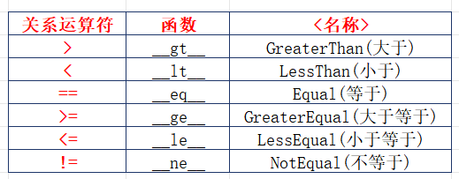
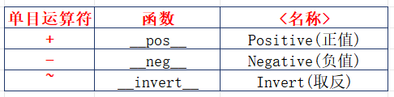
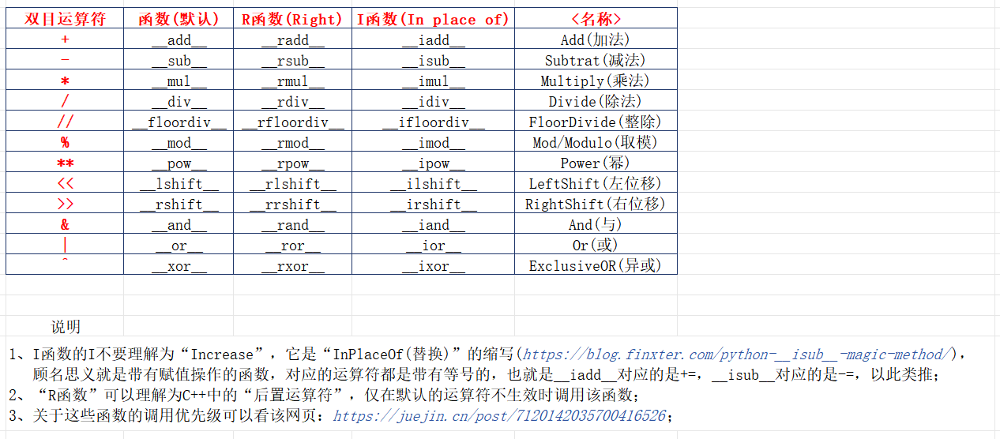
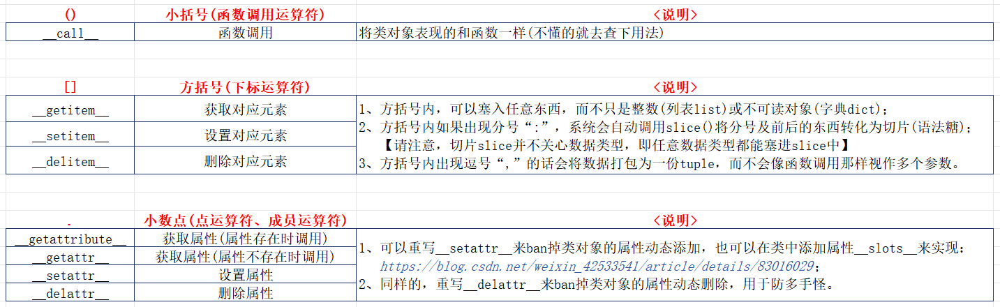
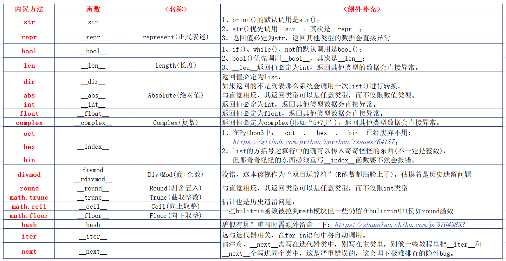
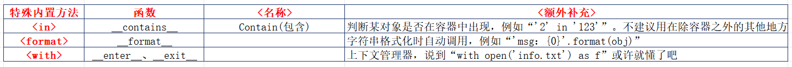

先说下Python版本：【Python 3.7.8】
以下用图片表格展示，一是防扒，二是没精力改成md格式。

还有就是内容肯定没有完全包含(而且也很难做到)，像是``__reduce__``与py自带模块pickle有关(pickle用于对象序列化/反序列化)、``sys.getsizeof``调用``__sizeof__``，还有一些像是``__init__``、``__new__``、``__del__``之类的没去写了

 

***

# 1、关系运算符

 

# 2、单目运算符

 

# 3、双目运算符

 

# 4、特殊运算符

 

# 5、内置方法

 

***

## 附录：
1. 魔法方法参考-1：[https://zhuanlan.zhihu.com/p/412194931](https://zhuanlan.zhihu.com/p/412194931)
2. 魔法方法参考-2：[https://blog.csdn.net/be5yond/article/details/120082149](https://blog.csdn.net/be5yond/article/details/120082149)
3. 魔法方法参考-3：关键词搜“魔术方法”，这哥们写的挺详尽(但也有少量错漏需自己甄别)：[https://blog.csdn.net/be5yond/category_8565745.html?spm=1001.2014.3001.5515](https://blog.csdn.net/be5yond/category_8565745.html?spm=1001.2014.3001.5515)
4. “I函数”的“I”是“in-place-of”而不是其他东西：[https://blog.finxter.com/python-__isub__-magic-method/](https://blog.finxter.com/python-__isub__-magic-method/)
5. \_\_sub__、\_\_isub__、\_\_rsub__的调用优先级：[https://juejin.cn/post/7120142035700416526#comment](https://juejin.cn/post/7120142035700416526#comment)
6. bin、oct、hex函数调用的是\_\_index__方法而不是\_\_int__方法，以及\_\_bin__、\_\_oct__、\_\_hex__在Python3中已经废弃：[https://github.com/python/cpython/issues/64187](https://github.com/python/cpython/issues/64187)
7. 使用\_\_slots__限制类对象的属性添加：[https://blog.csdn.net/weixin_42533541/article/details/83016029](https://blog.csdn.net/weixin_42533541/article/details/83016029)
8. \_\_eq__和\_\_hash__的用法：[https://zhuanlan.zhihu.com/p/37643853](https://zhuanlan.zhihu.com/p/37643853)

