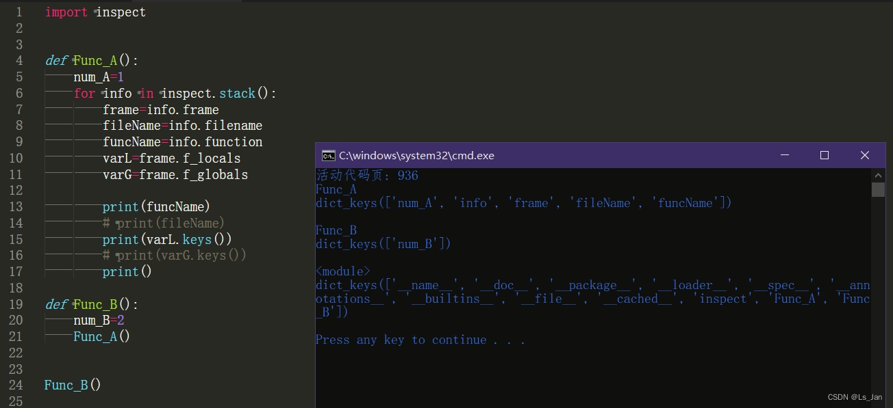

水文一篇(毕竟已经有很多相关内容)。

暂时找到两个方式获取调用者信息，一个是``traceback``，另一个是``inspect``。
其中， ``inspect``能获取更为详尽的上下文信息(?)，在某些特殊场合甚至能以此省略函数调用时传入的``locals()``和``globals()``。

<br>

***

# 代码+运行结果：

```python
import inspect
def Func_A():
	num_A=1
	for info in inspect.stack():
		frame=info.frame
		fileName=info.filename
		funcName=info.function
		varL=frame.f_locals
		varG=frame.f_globals

		print(funcName)
		# print(fileName)
		print(varL.keys())
		# print(varG.keys())
		print()

def Func_B():
	num_B=2
	Func_A()
	
Func_B()

```



<br>

***


# 补充：
- 无论是通过``locals()``还是通过上面代码中的``frame.f_locals``亦或是其他途径，获取到局部上下文都仅仅只是份拷贝(原因多半是线程安全)，也就是不要妄想在A函数中增删改B函数的局部变量(而且往往也没这必要/意义)。<font size=1>(如同找茬一般指出“通过对象的函数方法来修改对象内容”以此反对我提到的“无法修改”的，我无法反驳(是无语层面的无法反驳</font>

- 跨文件时不同文件的全局上下文``globals()``是不同的(但都是可读可写的)，可以通过``inspect``模块达到“调用一个函数后增删改全局变量”的特殊目的，算是平常用不到的非常规操作。


