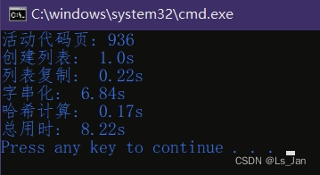

一个玩具，写着来玩的。
用的``time``模块，代码很简单(所以才说是个玩具)


<br>

***

# 代码：
```python
import time
class TimeStamp:
	__timestamp=None
	__key=None
	def __init__(self,tips=None,key=None):
		self.__timestamp={}
		self.NewStamp(tips,key)
	def NewStamp(self,tips,key=None):
		self.__timestamp[key]=(time.time(),tips)
		self.__key=key
	def Duration(self,key=None,printVal=True):
		if(key not in self.__timestamp):
			key=self.__key
		val=round(time.time()-self.__timestamp[key][0],2)
		if(printVal):
			print(f'{self.__timestamp[key][1]}:  {val}s')
		return val

```


<br>

# 测试样例+运行结果：

```python

import random
if __name__=='__main__':
	ts=TimeStamp('总用时','Total')

	ts.NewStamp('创建列表')
	lst=[random.randint(1,100) for i in range(1000000)]
	ts.Duration()

	ts.NewStamp('列表复制')
	lst=lst*100
	ts.Duration()

	ts.NewStamp('字串化')
	s=str(lst)
	ts.Duration()

	ts.NewStamp('哈希计算')
	h=hash(s)
	ts.Duration()

	ts.Duration('Total')
```




***
###### 小小声

- 这么简单的东西都上传？是来互联网灌垃圾的是吧<font size=1>(没错</font>
- 没想到``hash``的效率挺高，反倒是变量的字串化有可能成为瓶颈(只不过也得数据量大到相当程度才会影响效率
