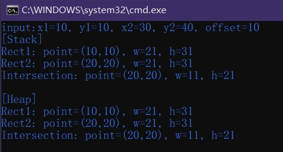

核心模块是``ctypes``，但调用时有许多细节需要注意，包括但不限于：

- 使用何种函数加载dll，有``CDLL``、``WinDLL``、``OleDLL``、``PyDLL``等，通常来说``CDLL``的使用更加常见，详见官方文档：[https://docs.python.org/zh-cn/3/library/ctypes.html#loading-shared-libraries](https://docs.python.org/zh-cn/3/library/ctypes.html#loading-shared-libraries)；
- 注意Python的系统版本，如果当前是64位的，那么在调用32位dll时会出现异常`OSError: [WinError 193] %1 不是有效的 Win32 应用程序`，反过来也一样；
- 调用dll是有“指定函数签名”这种行为的，对获取到的函数的``argtypes``和``restype``进行设置，就像C++使用``LoadLibrary``+``GetProcAddress``动态获取dll的函数指针时进行的强制转换一样；
- dll函数可以返回结构体指针，借此可以进行进一步的操作，虽然不是很提倡这种做法；

# 代码：
以下附上两份代码，分别是生成DLL的C++代码和调用DLL的Python代码，这两份代码在我的Github仓库[CPP_DLL](https://github.com/Ls-Jan/CPP_DLL/tree/main)中均可查到。

- 虽然这里附上的cpp文件并没有太大的参考价值(因为这里讨论的是Python的dll调用，又不是dll的生成)，但还是加上算了，万一哪天又得翻出来呢？
- 关于Python的“结构体”，要着重强调的一点是，那个``_fields_``，是单下划线，有些洒哔博文弄成双下划线让我Debug半小时；
- 这里不细说``ctypes``的用法，网上大把，或者看文章末尾的参考，亦或者直接翻ctypes官方文档[ctypes工具函数](https://docs.python.org/zh-cn/3/library/ctypes.html#ctypes.POINTER)

<br>

```cpp
//MakeDLL_StructData.h
#pragma once

struct Point {
	int x;
	int y;
};

struct Rect {
	Point point;
	int w;
	int h;
};


//后缀带_Stack的是栈变量相关函数
//后缀带_Heap的是堆变量相关函数
//为什么要弄这两类函数呢，因为想测试“直接返回结构体数据而不是结构体指针到底会不会弹白窗口(程序崩溃)”，结果意料之外的没事

//Create_Rect_XXX生成一个Rect数据
//Get_Intersection_XXX计算两个Rect的重合区域并返回新的Rect数据
//Release_Rect_Heap用于回收堆变量
//dll的数据指针需秉承“打哪来回哪去”的原则，从dll中生成的堆变量必须由dll释放
extern "C" _declspec (dllexport) Rect Create_Rect_Stack(int x1, int y1, int x2, int y2);
extern "C" _declspec (dllexport) Rect * Create_Rect_Heap(int x1, int y1, int x2, int y2);
extern "C" _declspec (dllexport) Rect Get_Intersection_Stack(Rect a, Rect b);
extern "C" _declspec (dllexport) Rect * Get_Intersection_Heap(Rect * a, Rect * b);
extern "C" _declspec (dllexport) void Release_Rect_Heap(Rect * rect);

Point Intersection(int a1, int a2, int b1, int b2);
```

```cpp
//MakeDLL_StructData.cpp
#include "MakeDLL_StructData.h"
#include<utility>

Rect Create_Rect_Stack(int x1, int y1, int x2, int y2) {
	Rect rect;
	if (x1 > x2)
		std::swap(x1, x2);
	if (y1 > y2)
		std::swap(y1, y2);
	rect.point.x = x1;
	rect.point.y = y1;
	rect.w = x2 - x1 + 1;
	rect.h = y2 - y1 + 1;
	return rect;
}

Rect* Create_Rect_Heap(int x1, int y1, int x2, int y2) {
	Rect* rect = new Rect(Create_Rect_Stack(x1, y1, x2, y2));
	return rect;
}

void Release_Rect_Heap(Rect* rect) {
	delete rect;
}

Rect Get_Intersection_Stack(Rect a, Rect b) {
	Rect rect;
	Point rst1=Intersection(a.point.x,a.point.x+a.w,b.point.x,b.point.x+b.w);
	Point rst2=Intersection(a.point.y,a.point.y +a.h,b.point.y,b.point.y +b.h);
	rect.point.x = rst1.x;
	rect.point.y = rst2.x;
	rect.w = rst1.y-rst1.x;
	rect.h = rst2.y-rst2.x;
	return rect;
}

Rect* Get_Intersection_Heap(Rect* a, Rect* b) {
	Rect* rect = new Rect(Get_Intersection_Stack(*a, *b));
	return rect;
}

Point Intersection(int a1, int a2, int b1, int b2) {
	int temp = 0;
	Point rst;
	if (a1 > a2)
		std::swap(a1, a2);
	if (b1 > b2)
		std::swap(b1, b2);
	if (a1 < b1) {
		temp = std::max(b1, a2);
		temp = std::min(b2, temp);
		rst.x = b1;
		rst.y = temp;
	}
	else {
		temp = std::max(a1, b2);
		temp = std::min(a2, temp);
		rst.x = a1;
		rst.y = temp;
	}
	return rst;
}
```

```py
# LinkDLL_StructData.py
import ctypes

class Point(ctypes.Structure):
	_fields_=[
		('x',ctypes.c_int),
		('y',ctypes.c_int),
	]
class Rect(ctypes.Structure):
	_fields_=[
		('point',Point),
		('w',ctypes.c_int),
		('h',ctypes.c_int),
	]

if __name__=='__main__':
	dll_x64='../x64/Debug/MakeDLL_StructData.dll'
	dll_x86='../Debug/MakeDLL_StructData.dll'

	dll=ctypes.CDLL(dll_x64)
	if(dll):
		Create_Rect_Stack=dll.Create_Rect_Stack
		Create_Rect_Stack.argtypes=(ctypes.c_int,ctypes.c_int,ctypes.c_int,ctypes.c_int)
		Create_Rect_Stack.restype=Rect

		Create_Rect_Heap=dll.Create_Rect_Heap
		Create_Rect_Heap.argtypes=(ctypes.c_int,ctypes.c_int,ctypes.c_int,ctypes.c_int)
		Create_Rect_Heap.restype=ctypes.POINTER(Rect)

		Get_Intersection_Stack=dll.Get_Intersection_Stack
		Get_Intersection_Stack.argtypes=(Rect,Rect)
		Get_Intersection_Stack.restype=Rect

		Get_Intersection_Heap=dll.Get_Intersection_Heap
		Get_Intersection_Heap.argtypes=(ctypes.POINTER(Rect),ctypes.POINTER(Rect))
		Get_Intersection_Heap.restype=ctypes.POINTER(Rect)

		Release_Rect_Heap=dll.Release_Rect_Heap
		Release_Rect_Heap.argtypes=(ctypes.POINTER(Rect),)
		Release_Rect_Heap.restype=None


		x1=10
		y1=10
		x2=30
		y2=40
		offset=10

		print(f'input:x1={x1}, y1={y1}, x2={x2}, y2={y2}, offset={offset}')
		if True:
		# if False:
			rect1= Create_Rect_Stack(ctypes.c_int(x1),ctypes.c_int(y1),ctypes.c_int(x2),ctypes.c_int(y2))
			# rect1= Create_Rect_Stack(x1,y1,x2,y2)
			rect2= Create_Rect_Stack(x1+offset, y1 + offset, x2 + offset, y2 + offset)
			rect3= Get_Intersection_Stack(rect1, rect2)
			print("[Stack]")
			print(f"Rect1: point=({rect1.point.x},{rect1.point.y}), w={rect1.w}, h={rect1.h}")
			print(f"Rect2: point=({rect2.point.x},{rect2.point.y}), w={rect2.w}, h={rect2.h}")
			print(f"Intersection: point=({rect3.point.x},{rect3.point.y}), w={rect3.w}, h={rect3.h}\n")
		if True:
		# if False:
			pRect1= Create_Rect_Heap(x1,y1,x2,y2)
			pRect2= Create_Rect_Heap(x1+offset, y1 + offset, x2 + offset, y2 + offset)
			pRect3= Get_Intersection_Heap(pRect1, pRect2)
			rect1=pRect1.contents
			rect2=pRect2.contents
			rect3=pRect3.contents
			rect=Rect(point=Point(x=3,y=4),w=5,h=6)
			print("[Heap]")
			print(f"Rect1: point=({rect1.point.x},{rect1.point.y}), w={rect1.w}, h={rect1.h}")
			print(f"Rect2: point=({rect2.point.x},{rect2.point.y}), w={rect2.w}, h={rect2.h}")
			print(f"Intersection: point=({rect3.point.x},{rect3.point.y}), w={rect3.w}, h={rect3.h}\n")
			Release_Rect_Heap(pRect1)
			Release_Rect_Heap(pRect2)
			Release_Rect_Heap(pRect3)
```



<br>


# 参考：
- [Python调用dll报错：OSError: [WinError 193] %1 不是有效的 Win32 应用程序](https://www.cnblogs.com/yan-test/p/16284761.html)
- [python如何得到dll函数返回的uint64值，返回值被截断？](https://www.zhihu.com/question/62413156)
- [ctypes模块](https://docs.python.org/zh-cn/3.7/library/ctypes.html#loading-shared-libraries)
- [Python动态链接库加载方式](http://blog.timd.cn/python-ctypes/)
- [Python与C交互之指针](https://www.cnblogs.com/forforever/p/16019344.html)

