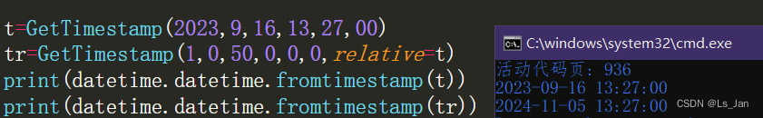

使用模块``datetime``，附赠一个没啥用的“时间推算”功能(获取n天后对应的时间

<br>

***
# 代码：

```python
import datetime

def GetTimestamp(year,month,day,hour,minute,second,*,relative=None,timezone=None):#返回指定时间戳。指定relative时进行时间推算
    """
        根据传入的参数返回时间戳
        传入relative进行时间推算(relative为时间戳)
        不指定timezone的值则默认为本地时区
    """

    if(relative):
        relative=datetime.datetime.fromtimestamp(relative,tz=timezone)
        d_y,d_m=divmod(relative.month+month,12)#month的取值限制在1~12
        d_y=relative.year+year+d_y
        d_d=relative.day
        t_h=relative.hour
        t_m=relative.minute
        t_s=relative.second
        dt=datetime.datetime(d_y,d_m,d_d,t_h,t_m,t_s,tzinfo=timezone)
        delta=datetime.timedelta(days=day,hours=hour,minutes=minute,seconds=second)#timedelta以day进行推算
        dt+=delta
    else:
        dt=datetime.datetime(year,month,day,hour,minute,second,tzinfo=timezone)
    return dt.timestamp()


t=GetTimestamp(2023,9,16,13,27,00)
tr=GetTimestamp(1,0,50,0,0,0,relative=t)#1年50天后
print(datetime.datetime.fromtimestamp(t))
print(datetime.datetime.fromtimestamp(tr))
```

# 运行结果



***
# 补充：
1. ``可变参数*``的特殊用法：在定义函数时，函数声明中的``可变参数*``后面仍然可以跟参数，作用便是星号*后面的参数需显式指定才能正常传入。这操作一定程度上可以规范代码和增加代码可读性，上面代码中的自定义函数GetTimestamp便使用了该技巧。
2. 官方原文：<font color=#EE0000>time模块中的功能可能无法处理纪元之前或将来的远期日期和时间。未来的截止点由C库决定；对于32位系统，它通常在2038年。</font>虽然的确是有获取1970年以前日期对应的时间戳：[python utc时间戳转换 （解决1970之前的问题）](https://blog.csdn.net/Carry_Qt/article/details/88356409)，但说实在的即便拿到一个负数时间戳也没有什么意义，所以这里对1970以前的日期不予处理。
3. 关于``datetime``的用法可以看本人写的一篇博文：[【Python-time模块和datetime模块的部分函数说明】](https://blog.csdn.net/weixin_44733774/article/details/133475034)，虽然不能称得上全面但也至少也算详尽的了。

