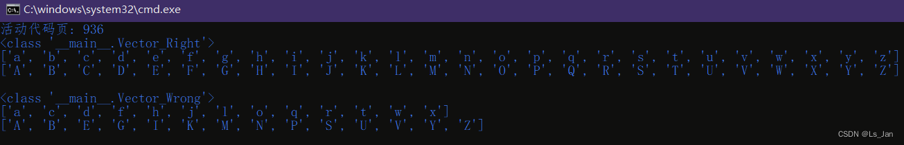
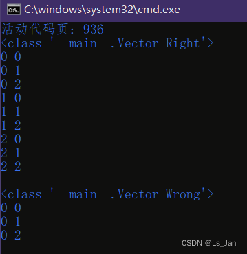
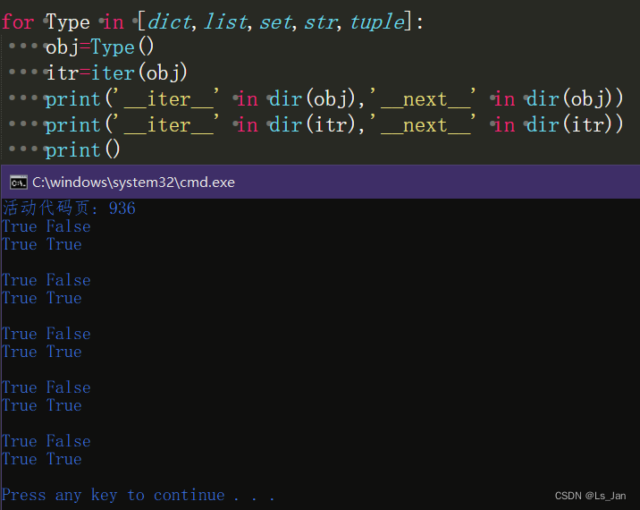

这里主要纠正迭代器的用法，因为一些教程传播错误示例让我很无语。

最大的错误就是，把``__iter__``和``__next__``写在同个类里，每每看见都感到诧异。不是说这方法不行，主要是，一旦出现预期之外的运行结果往往很难查到原因(因为它压根不是报错，也不是运行异常)。

<br>

***
# 0、先附上两个类Vector_Right和Vector_Wrong：
```python
class Vector_Right:#有迭代器类
    class __Iter:
        def __init__(self,lst):
            self.__lst=lst
            self.__pst=0
        def __next__(self):
            if(self.__pst>=len(self.__lst)):
                raise StopIteration
            else:
                val=self.__lst[self.__pst]
                self.__pst+=1
                return val
    def __init__(self,lst):
        self.__lst=list(lst) if lst else []
    def __iter__(self):#返回迭代器
        return self.__Iter(self.__lst)
```

```python
class Vector_Wrong:#无迭代器类
    def __init__(self,lst):
        self.__lst=list(lst) if lst else []
    def __iter__(self):#自己就是迭代器(黑人问号)
        self.__pst=0
        return self
    def __next__(self):
        if(self.__pst>=len(self.__lst)):
            raise StopIteration
        else:
            val=self.__lst[self.__pst]
            self.__pst+=1
            return val
```

<br>

*** 

# 1、首先，先来个简单的多线程：

```python
from threading import Thread
from time import sleep
from random import randint

def Traversal(vector,func,rst):
    for i in vector:
        rst.append(func(i))
        sleep(randint(1,10)/1000)

for Vector in [Vector_Right,Vector_Wrong]:
    vector=Vector(range(26))
    rst=[[],[]]
    th_1=Thread(target=lambda:Traversal(vector,lambda val:chr(ord('a')+val),rst[0]))#两条线程同时遍历vector
    th_2=Thread(target=lambda:Traversal(vector,lambda val:chr(ord('A')+val),rst[1]))
    th_1.start()
    th_2.start()
    th_1.join()
    th_2.join()

    print(Vector)
    for lst in rst:
        print(lst)
    print()
```



<br>

***
# 2、然后，再来个多层遍历同对象的操作：

```python
for Vector in [Vector_Right,Vector_Wrong]:
    print(Vector)
    vector=Vector(range(3))
    for x in vector:
        for y in vector:
            print(x,y)
    print()
```


<br>

***

# 3、结论：
以上结果都说明，Vector_Wrong未能顺利遍历，这就是把自身作为迭代器返回的弊端，因为无法保证同一时间内同个容器只有一个迭代器在使用。

而且对于Python原生的容器list、dict、str、set、tuple等，它们都没把\_\_next__写在容器类里而是写在迭代器类中：



