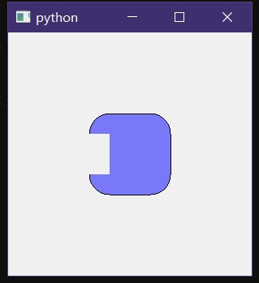
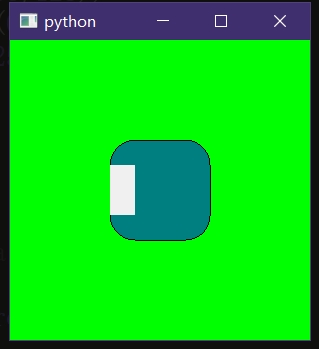
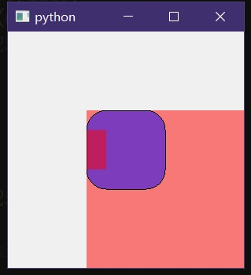
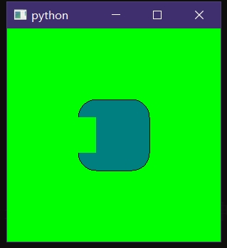

开发过程中需要对``paintEvent``进行重写，其中需要对一小块已绘制区域进行擦除，但无论如何设置参数都没法有效处理，无可奈何把整份代码单独拿出来，进行剃刀测试，最后竟然定位到``setStyleSheet('.XXX{background:transparent;}')``上，十分的可笑，


再进行多次的测试，和以及查阅``QPainter.eraseRect``的[用法](https://doc.qt.io/qt-6/qpainter.html#eraseRect)，发现该函数本质上是调用``fillRect(rectangle, background());``，也就是它根本没有“擦除”功能，单纯的颜色覆盖，再一次被喂shi，这个``eraseRect``函数在复杂的场合中是完全、根本派不上用场，原因看下面说明。

<br>

***


简单说一下场景，现在需要满足一个简单需求：擦除某块区域的绘制，例如使用``QPainter.fillRoundRect``绘制出一个带有缺口的矩形(但是，不能使用fill，因为``fill``非常是无脑的一个函数)，以下为Python示例代码

# Python示例代码
```py
import sys
from PyQt5.QtWidgets import *
from PyQt5.QtCore import *
from PyQt5.QtGui import *
class Test(QFrame):
	def paintEvent(self,event):
		ptr=QPainter(self)
		ptr.setBrush(QColor(0,0,255,128))
		ptr.drawRoundedRect(QRect(0,0,100,100),25,25)
		ptr.eraseRect(QRect(0,25,25,50))


if __name__ == '__main__':
	app = QApplication(sys.argv)
	win=QWidget()
	t=Test(win)
	t.show()
	t.setGeometry(100,100,200,200)
	# t.setStyleSheet('background:rgba(255,0,0,128)')#神仙难救，不建议对有繁琐绘制的控件进行样式表设置
	win.resize(300,300)
	# win.setStyleSheet('.QWidget{background:#00FF00}')
	win.show()
	sys.exit(app.exec_())
```


<br>

但，若是对上面代码中出现的win或者t进行样式设置，那么这个破``eraseRect``函数将会暴露出其无与伦比的弊端：





(其实如果在``paintEvent``进行了如本例一样复杂的绘制操作那么极不建议对相应控件设置样式表，理由就是上图中的控件红背景色将无法规避(一定会画在控件上)，无法擦除

<br>

***

# 解决方案

说来也可笑，虽然有限制绘制区域``QPainter.setClipRegion``但却没有反过来“保护绘制区域”的，至少我是没找到，而我也放弃在这泥坑中挣扎。
这边采用更为通用的方法，那就是间接绘制，不直接使用``QPainter(self)``进行绘制，而是使用``QPainter(QPixmap)``先在图片对象上绘制，然后再画到控件上。

```py
import sys
from PyQt5.QtWidgets import *
from PyQt5.QtCore import *
from PyQt5.QtGui import *

class Test(QFrame):
	def paintEvent(self,event):
		pix=QPixmap(self.size())
		pix.fill(Qt.transparent)
		ptr=QPainter(pix)
		ptr.setBrush(QColor(0,0,255,128))
		ptr.drawRoundedRect(QRect(0,0,100,100),25,25)
		ptr.setCompositionMode(QPainter.CompositionMode_Source)#这参数随便试的
		ptr.fillRect(QRect(0,25,25,50),QColor(0,0,0,0))#不使用eraseRect这个傻卵东西
		ptr.end()

		ptr=QPainter(self)
		ptr.drawPixmap(0,0,pix)
		ptr.end()

if __name__ == '__main__':
	app = QApplication(sys.argv)
	win=QWidget()
	t=Test(win)
	t.show()
	t.setGeometry(100,100,200,200)
	# t.setStyleSheet('background:rgba(255,0,0,128)')#神仙难救，不建议对有繁琐绘制的控件进行样式表设置
	win.resize(300,300)
	win.setStyleSheet('.QWidget{background:#00FF00}')
	win.show()
	sys.exit(app.exec_())
```



<br>
<br>
<br>
<br>


