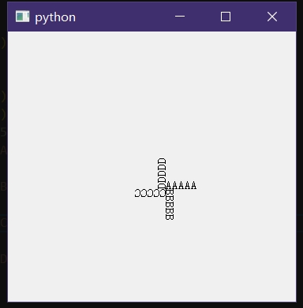

QPainter有多种灵活的参数方式，包括但不限于：
- 颜色、粗细设置、笔刷风格、字体风格，对应``setPen``、``setBrush``、``setFont``；
- 移动、缩放、旋转、剪切变换，对应``translate``、``scale``、``rotate``、``shear``；
- 设置变换矩阵，对应``setTransform``、``setWorldTransform``，与``QTransform``相关
- 设定范围约束(矩形范围外的绘制不会有实际作用)，对应``setViewport``、``setWindow``；
- 图象叠加方式(可以实现各种稀奇古怪的效果，例如将已有的绘制部分隐去之类的)``setCompositionMode``；


<br>


使用QPainter绘制：
- 见官网文档形如``drawXXX``的函数，不赘述，[QPainter-Function](https://doc.qt.io/qt-6/qpainter.html#public-functions)
- 复杂曲线，例如贝塞尔曲线等，对应``drawPath``，需使用``QPainterPath``；
- 文本的绘制是以左下角为基准而不是左上角，而绘制图片是左上角为基准，小细节问题不大；
- 绘制旋转文本建议是先移动画笔``QPainter.translate``然后再旋转``QPainter.rotate``最后才是绘制文本``QPainter.drawText(0,0,text)``；


<br>
<br>


## 简单使用QPainter绘制旋转文本：
```py
from PyQt5.QtCore import *
from PyQt5.QtWidgets import *
from PyQt5.QtGui import *

class Test(QLabel):
	class Status:
		icon1:QPixmap
		icon2:QPixmap
		text:str
		font:QFont
		color:QColor
		rotation:int
	def __init__(self):
		super().__init__()
	def paintEvent(self,event):
		x,y=200,200
		ptr=QPainter(self)
		ptr.translate(x,y)
		ptr.setBrush(QColor(255,0,0))
		ptr.drawText(0,0,"AAAAA")
		ptr.rotate(90)
		ptr.drawText(0,0,"BBBBB")
		ptr.rotate(90)
		ptr.drawText(0,0,"CCCCC")
		ptr.rotate(90)
		# ptr.translate(100,100)
		ptr.drawText(0,0,"DDDDD")

if True:
	app=QApplication([])

	lb=Test()
	lb.show()
	lb.resize(500,400)

	exit(app.exec())
```




# 参考：
- ``setCompositionMode``参数说明：[QPainter::CompositionMode](https://doc.qt.io/qt-6/qpainter.html#CompositionMode-enum)
- 贝塞尔曲线：[贝塞尔曲线|公孙二狗](https://qtdebug.com/qtbook-paint-bezier/)
- ``QPainter``类：[QPainter-Function](https://doc.qt.io/qt-6/qpainter.html#public-functions)


