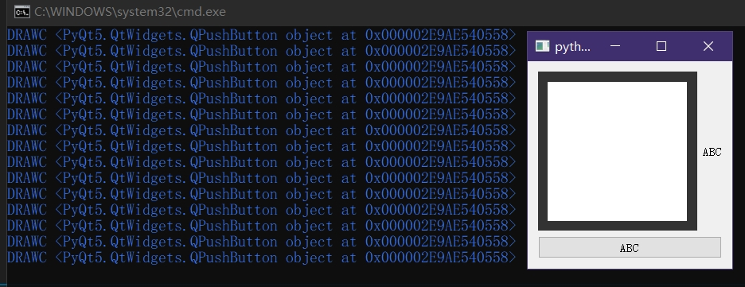

未实际确认，仅通过代码+运行结果判断得出的结论，不确定是不是根本原因。
只不过很多文章/博客都提及了这一点，就是**Qt 暂时不支持同时设置 QStyle 和 Qt样式表**。

补充：[官方手册](https://doc.qt.io/qt-6/qwidget.html#setStyle)的红色警告内容中实际提到“我们计划未来某个版本中解决这问题”。

<br>
<br>

***

``styleSheet``的效果会屏蔽``style``，简单来说就是如果调用``setStyleSheet``设置了非空的样式表(无论其是否有效)，``style.drawControl``一定不会生效，直到调用``setStyleSheet``设置了空的样式表后才会恢复。

```py
from PyQt5.QtWidgets import *
from PyQt5.QtCore import *
from PyQt5.QtGui import *

class Test_Style(QProxyStyle):
	def drawControl(self, element: QStyle.ControlElement, option: QStyleOption, painter: QPainter, widget: QWidget) -> None:
		print("DRAWC")
		return super().drawControl(element, option, painter, widget)
	
if True:
	app=QApplication([])
	style=Test_Style()

	cb=QCheckBox("ABC")
	qss='''
		QCheckBox::indicator{
			width: 200px;
			height: 200px;
		}
	'''
	cb.setStyle(style)
	cb.clicked.connect(lambda:cb.setStyleSheet(qss if cb.isChecked() else '') or print(f'当前已{"设置" if cb.isChecked() else "清除"}样式表',cb.style()))
	cb.show()
	cb.resize(250,250)
	app.exec()
```


<br>
<br>

***

特别的，哪怕只是父控件设置了样式表，由于样式表的传递性，一样有可能会干扰到``QStyle``类的正常生效。
这里提到“有可能”，是因为，父控件的样式表不一定会影响到子控件身上，尤其在使用了各种的选择器的时候。
因此，至少还有那么一点点的操作空间，可以合理设置样式表以避免一些qss样式作用到设置了``QStyle``的控件上面(虽然官方并不建议这样做，因为容易出现风格混乱并且导致管理难度增加)。

```py
from PyQt5.QtWidgets import *
from PyQt5.QtCore import *
from PyQt5.QtGui import *

class Test_Style(QProxyStyle):
	def drawControl(self, element: QStyle.ControlElement, option: QStyleOption, painter: QPainter, widget: QWidget) -> None:
		print("DRAWC",widget)
		return super().drawControl(element, option, painter, widget)
	
if True:
	app=QApplication([])
	style=Test_Style()

	cb=QCheckBox("ABC")
	qss='''
		QCheckBox::indicator{
			width: 200px;
			height: 200px;
		}
	'''

	btn=QPushButton("ABC")
	btn.setStyle(style)
	cb.setStyle(style)

	frame=QFrame()
	vbox=QVBoxLayout(frame)
	vbox.addWidget(cb)
	vbox.addWidget(btn)
	frame.show()
	frame.resize(250,250)
	frame.setStyleSheet(qss)
	
	app.exec()
```



