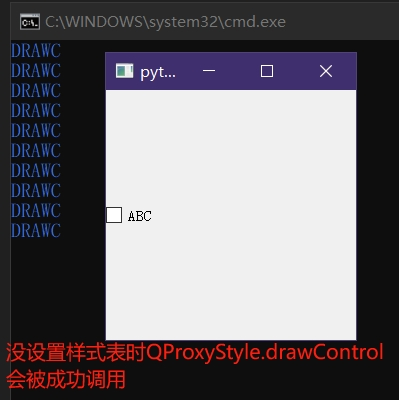
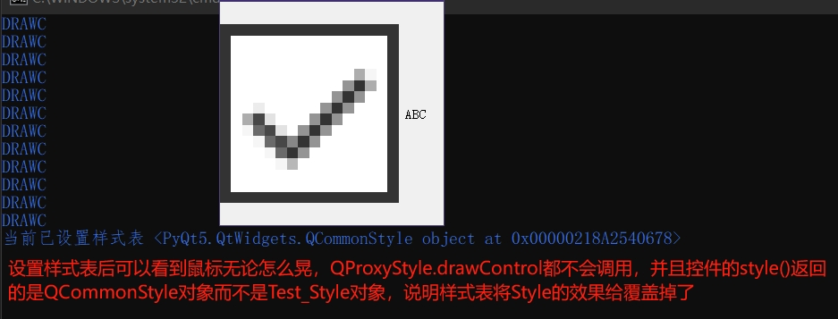
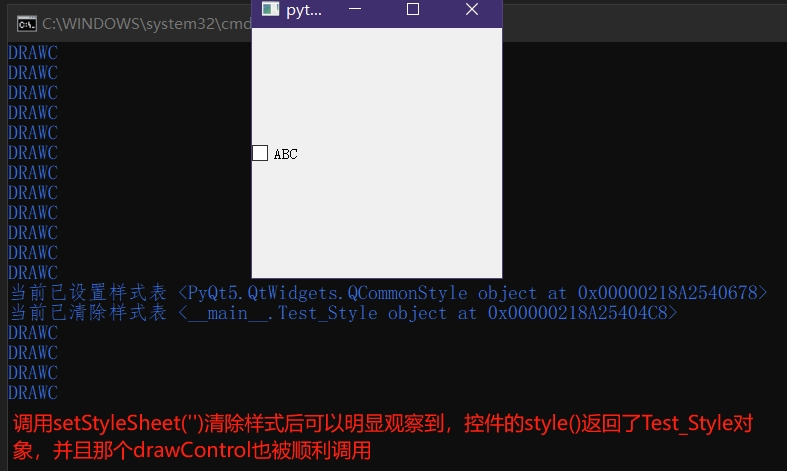

未实际确认，仅通过代码+运行结果判断得出的结论，不确定是不是根本原因。
只不过很多文章/博客都提及了这一点，就是**Qt 暂时不支持同时设置 QStyle 和 Qt样式表**

<br>

``styleSheet``的效果会屏蔽``style``，简单来说就是如果调用``setStyleSheet``设置了非空的样式表(无论其是否有效)，``style.drawControl``一定不会生效，直到调用``setStyleSheet``设置了空的样式表后才会恢复。


```py
from PyQt5.QtWidgets import *
from PyQt5.QtCore import *
from PyQt5.QtGui import *

class Test_Style(QProxyStyle):
	def drawControl(self, element: QStyle.ControlElement, option: QStyleOption, painter: QPainter, widget: QWidget) -> None:
		print("DRAWC")
		return super().drawControl(element, option, painter, widget)
	
if True:
	app=QApplication([])
	style=Test_Style()

	cb=QCheckBox("ABC")
	qss='''
		QCheckBox::indicator{
			width: 200px;
			height: 200px;
		}
	'''
	cb.setStyle(style)
	cb.clicked.connect(lambda:cb.setStyleSheet(qss if cb.isChecked() else '') or print(f'当前已{"设置" if cb.isChecked() else "清除"}样式表',cb.style()))
	cb.show()
	cb.resize(250,250)
	app.exec()
```






