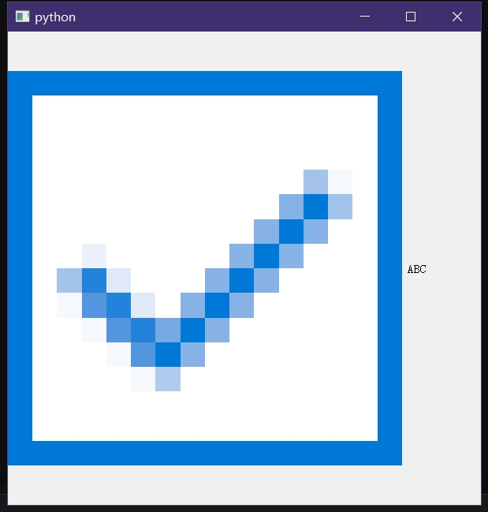
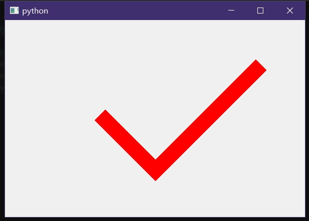
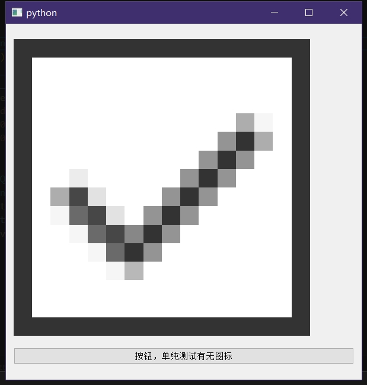
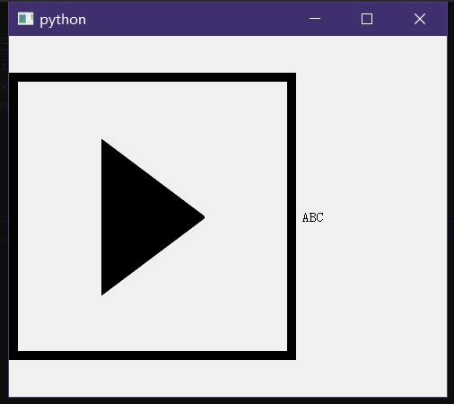

- 调整复选框大小
- 修改复选框颜色(会让图案丢失)
- 修改复选框背景色(会让图案丢失)

```py
from PyQt5.QtWidgets import *
from PyQt5.QtCore import *
from PyQt5.QtGui import *

if True:
	app=QApplication([])
	cb=QCheckBox("ABC")
	cb.setStyleSheet('''
		QCheckBox::indicator{
			width: 500px;
			height: 500px;
		}
	''')
	cb.show()
	cb.resize(600,600)
	app.exec()
```


1. 在上图中可以看出，图案是马赛克，也就是说，复选框里面的√并不是动态绘制的，只是一个图案而已，因为如果是实时绘制的话，绘制结果应该是下面示例代码的效果，而不是马赛克；
2. 如果猜想再大胆点，甚至可以认为复选框的边框也仅仅是个图案罢了，因为一旦对边框进行颜色、粗细等样式进行设置就会丢失内部的图案，而这也证实了“为什么无法在``QCheckBox.paintEvent``中通过参数的修改来调整复选框的绘制”，因为它没这个能力啊，它就纯一图标有啥好改的；
3. 哪怕在``QCheckBox.paintEvent``中，通过``opt=QStyleOptionButton()``和``self.initStyleOption(opt)``这个方式，获取的``opt.icon``也只是个无效值，特别逗；
4. 才发现``QCheckBox``这个玩意儿继承``QAbstractButton``，虽然如此也不能说明那个复选框就是图标，因为``QcheckBox.setIcon``和复选框屁关系都没有；

<br>

***

### QCheckBox的复选框就纯纯一图标罢了，如果是实绘那肯定不会马赛克的
```py
from PyQt5.QtGui import QPaintEvent
from PyQt5.QtWidgets import *
from PyQt5.QtCore import *
from PyQt5.QtGui import *

class Test(QWidget):
	def paintEvent(self, a0: QPaintEvent) -> None:
		ptr=QPainter(self)
		ptr.setPen(QPen(QColor(255,0,0),30))
		ptr.drawLine(QPoint(200,200),QPoint(300,300))
		ptr.drawLine(QPoint(500,100),QPoint(300,300))
		return super().paintEvent(a0)

if True:
	app=QApplication([])
	test=Test()
	test.show()
	test.resize(600,600)
	app.exec()
```




*** 

### 无法在``QCheckBox.paintEvent``中获取到复选框图标，同时也无法更改复选框图标

因为``QStyleOptionButton.icon``这个参数在这里压根就是没用的

```py
from PyQt5.QtGui import QPaintEvent
from PyQt5.QtWidgets import *
from PyQt5.QtCore import *
from PyQt5.QtGui import *

class Test(QWidget):
	def __init__(self):
		super().__init__()
		self.__cb=QCheckBox()
		self.__btn=QPushButton('按钮，单纯测试有无图标')
		vbox=QVBoxLayout(self)
		vbox.addWidget(self.__cb)
		vbox.addWidget(self.__btn)
		self.__cb.setStyleSheet('''
				QCheckBox::indicator{
					width: 500px;
					height: 500px;
				}
		''')
	def paintEvent(self, a0: QPaintEvent) -> None:
		opt=QStyleOptionButton()
		self.__cb.initStyleOption(opt)
		self.__btn.setIcon(opt.icon)
		return super().paintEvent(a0)

if True:
	app=QApplication([])
	test=Test()
	test.show()
	test.resize(600,600)
	app.exec()
```



***

### 可以在样式表中指定图案，只不过图案的大小不知道要怎么控制

这里就留给后人的智慧了。
我是不打算通过样式表控制的了，因为样式表除了这个弊端外还有个问题就是无法使用内存图片(至少我没找到相应实现方法)，我打算重写``QProxyStyle``以达到更稳定的效果。

```py
from PyQt5.QtGui import QPaintEvent
from PyQt5.QtWidgets import *
from PyQt5.QtCore import *
from PyQt5.QtGui import *

if True:
	app=QApplication([])
	cb=QCheckBox("ABC")
	cb.setStyleSheet('''
		QCheckBox::indicator{
			width: 300px;
			height: 300px;
			background:url(./三角形-002.png) no-repeat center ;
			border-style: solid;
			border-width: 10px;
			border-color: #000000;
		}
	''')
	cb.show()
	cb.resize(600,600)
	app.exec()
```



***

### 补充：

虽然这里没提，实际上这些样式可以追加伪类的，即``:hover``、``:checked``、``:unchecked``之类的，可以参考一下这篇写得很烂的博客：[QCheckBox设置复选框的大小](https://blog.csdn.net/qq_44723937/article/details/122815919)


