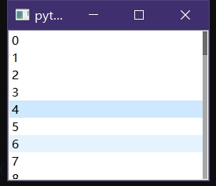

```css
	QScrollBar {
		background: rgba(255, 255, 255, 5%);
		width: 6px;
	}

	QScrollBar::add-line {
		width: 0;
		height: 0;
	}

	QScrollBar::sub-line {
		width: 0;
		height: 0;
	}

	QScrollBar::handle {
		background: rgba(64, 64, 64, 75%);
	}

	QScrollBar::sub-page {
		background: rgba(0, 0, 0, 30%);
	}

	QScrollBar::add-page {
		background: rgba(0, 0, 0, 30%);
	}
```

```py
from PyQt5.QtCore import *
from PyQt5.QtWidgets import *
from PyQt5.QtCore import *

qss_scrollbar='''
	QScrollBar {
		background: rgba(255, 255, 255, 5%);
		width: 6px;
	}

	QScrollBar::add-line {
		width: 0;
		height: 0;
	}

	QScrollBar::sub-line {
		width: 0;
		height: 0;
	}

	QScrollBar::handle {
		background: rgba(64, 64, 64, 75%);
	}

	QScrollBar::sub-page {
		background: rgba(0, 0, 0, 30%);
	}

	QScrollBar::add-page {
		background: rgba(0, 0, 0, 30%);
	}
'''

if True:
	app=QApplication([])
	model=QStringListModel([str(i) for i in range(50)])

	lv=QListView()
	lv.setModel(model)
	lv.setStyleSheet(qss_scrollbar)
	lv.show()

	app.exec()
```





