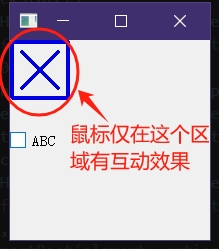

这里使用``QStyle``的方式实现效果。

```py
from PyQt5.QtWidgets import *
from PyQt5.QtCore import *
from PyQt5.QtGui import *

class Test_Style(QProxyStyle):
	class Pixmaps:
		checked:QPixmap
		unchecked:QPixmap
		partiallyChecked:QPixmap
		def __init__(self,iconChecked:QPixmap,iconUnchecked:QPixmap,iconPartiallyChecked:QPixmap) -> None:
			self.checked=iconChecked
			self.unchecked=iconUnchecked
			self.partiallyChecked=iconPartiallyChecked
	pixmaps_Normal:Pixmaps
	pixmaps_Hover:Pixmaps
	def __init__(self):
		super().__init__()
		w,h,t=64,64,4
		pix=QPixmap(w,h)
		
		lst=[]
		for col in [QColor(0,0,0),QColor(0,0,224)]:
			icons=[]
			lst.append(icons)
			pix.fill(QColor(0,0,0,0))
			ptr=QPainter()
			ptr.begin(pix)
			ptr.setPen(QPen(col,t))
			ptr.drawRect(QRect(t//2,t//2,w-t*2,h-t*2))
			ptr.end()
			icons.append(QPixmap(pix))

			ptr.begin(pix)
			ptr.setPen(QPen(col,t))
			val=t*3
			ptr.drawLine(QPoint(val,val),QPoint(w-val-t,h-val-t))
			ptr.drawLine(QPoint(w-val-t,val),QPoint(val,h-val-t))
			ptr.end()
			icons.append(QPixmap(pix))

			pix=QPixmap(icons[0])
			ptr.begin(pix)
			ptr.setPen(QPen(col,t))
			val_w=w//5
			val_h=h//5
			ptr.drawLine(QPoint(val_w,h//2),QPoint(w//2,h-val_h-t))
			ptr.drawLine(QPoint(w-val_w-t,val_h-t),QPoint(w//2,h-val_h-t))
			ptr.end()
			icons.append(QPixmap(pix))
		for i in range(len(lst)):
			icons=lst[i]
			lst[i]=[icons[2],icons[1],icons[0]]
		self.pixmaps_Normal=self.Pixmaps(*lst[0])
		self.pixmaps_Hover=self.Pixmaps(*lst[1])
	def drawControl(self, element: QStyle.ControlElement, option: QStyleOption, painter: QPainter, widget: QWidget) -> None:
		isHover=bool(option.state&QStyle.StateFlag.State_MouseOver)
		checkState=widget.checkState()
		pixmaps=self.pixmaps_Hover if isHover else self.pixmaps_Normal
		pix=pixmaps.checked if checkState==Qt.CheckState.Checked else pixmaps.unchecked if checkState==Qt.CheckState.Unchecked else pixmaps.partiallyChecked
		painter.drawPixmap(0,0,pix)
		return super().drawControl(element, option, painter, widget)
	def subElementRect(self, element: QStyle.SubElement, option: QStyleOption, widget: QWidget) -> QRect:
		isHover=bool(option.state&QStyle.StateFlag.State_MouseOver)
		checkState=widget.checkState()
		pixmaps=self.pixmaps_Hover if isHover else self.pixmaps_Normal
		pix=pixmaps.checked if checkState==Qt.CheckState.Checked else pixmaps.unchecked if checkState==Qt.CheckState.Unchecked else pixmaps.partiallyChecked
		return QRect(QPoint(0,0),pix.size())
		return super().subElementRect(element, option, widget)
	
if True:
	app=QApplication([])
	cb=QCheckBox("ABC")
	cb.setTristate(True)
	cb.show()
	cb.resize(200,200)
	style=Test_Style()
	cb.setStyle(style)

	app.exec()
```




