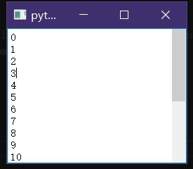

这里采用的是``QStyle``的方式实现效果，尽管可以选择继承``QScrollBar``的方式实现，但实际上会比较困难(个人认为是非常麻烦)，至少要重写``QScrollBar.mouseMoveEvent``和``QScrollBar.paintEvent``，而且用起来也没有那么方便

```py
from PyQt5.QtWidgets import *
from PyQt5.QtCore import *
from PyQt5.QtGui import *

class Test_Style(QProxyStyle):
	def subControlRect(self, cc: QStyle.ComplexControl, opt: QStyleOptionComplex, sc: QStyle.SubControl, widget: QWidget) -> QRect:
		rect=super().subControlRect(cc, opt, sc, widget)
		if(cc==QStyle.ComplexControl.CC_ScrollBar):
			#滑块大小以及位置的官方说明：https://doc.qt.io/qt-6/qscrollbar.html#details
			step=widget.pageStep()
			length=widget.maximum()-widget.minimum()+step
			value=widget.value()-widget.minimum()
			isVertical=widget.orientation()==Qt.Orientation.Vertical
			size=widget.height() if isVertical else widget.width()
			minSize=self.pixelMetric(QStyle.PixelMetric.PM_ScrollBarExtent,opt,widget)#用于避免滑块过窄。不确定这个值是不是固定的，反正是看源码无脑抄的：https://codebrowser.dev/qt5/qtbase/src/widgets/styles/qcommonstyle.cpp.html#4118
			valTop=value/length
			valSize=step/length
			if(isVertical):
				rect.setTop(valTop*size)
				rect.setHeight(max(minSize,valSize*size))
			else:
				rect.setLeft(valTop*size)
				rect.setWidth(max(minSize,valSize*size))
			if(sc==QStyle.SubControl.SC_ScrollBarAddLine):#下箭头
				return QRect()
			if(sc==QStyle.SubControl.SC_ScrollBarSubLine):#上箭头
				return QRect()
			elif(sc==QStyle.SubControl.SC_ScrollBarAddPage):#下槽
				if(isVertical):
					rect.setTop(rect.bottom())
					rect.setBottom(size)
				else:
					rect.setLeft(rect.right())
					rect.setRight(size)
			elif(sc==QStyle.SubControl.SC_ScrollBarSubPage):#上槽
				if(isVertical):
					rect.setBottom(rect.top())
					rect.setTop(0)
				else:
					rect.setRight(rect.left())
					rect.setLeft(0)
			elif(sc==QStyle.SubControl.SC_ScrollBarSlider):#滑块
				pass
			elif(sc==QStyle.SubControl.SC_ScrollBarGroove):#整槽
				if(isVertical):
					rect.setTop(0)
					rect.setBottom(size)
				else:
					rect.setLeft(0)
					rect.setRight(size)
			else:#剩下的两个属性SC_ScrollBarFirst和SC_ScrollBarLast没啥用，即使获取super().subControlRect也是空的QRect
				pass
		return rect

if True:
	app=QApplication([])
	style=Test_Style()

	te=QTextEdit()
	te.setText("\n".join((str(i) for i in range(20))))
	te.show()
	te.verticalScrollBar().setStyle(style)
	app.exec()
```



