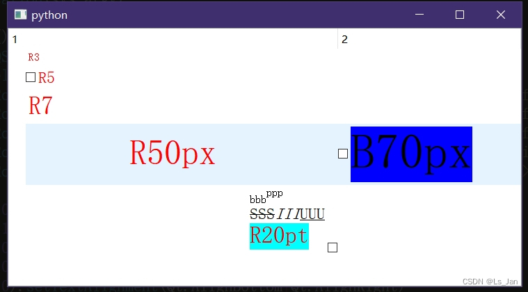

这是一篇老文章，仅作为参考




```py
import sys
from types import MethodType
from PyQt5.QtCore import Qt,QPoint,QSize,QRect,QEvent
from PyQt5.QtGui import QStandardItemModel, QStandardItem,QTextDocument,QTextCursor
from PyQt5.QtWidgets import QTreeView,QApplication,QItemDelegate,QStyle

class RichDelegate(QItemDelegate):#使用QItemDelegate进行单元格重绘：https://blog.csdn.net/Loc_Haoclass/article/details/106528047
	__cboxSize=QSize(14,14)#复选框大小
	__cboxAlignV=Qt.AlignVCenter#复选框位置-竖直(居中)
	__cboxAlignH=Qt.AlignLeft#复选框位置-水平(左对齐)

	__alignV=[Qt.AlignTop,Qt.AlignVCenter,Qt.AlignBottom]#【简化代码】
	__alignH=[Qt.AlignLeft,Qt.AlignHCenter,Qt.AlignRight]
	def __init__(self,parent=None,*,align=None,size=None):
		super().__init__(parent)
		if(align):
			self.SetCheckboxAlign(align)
		if(size):
			self.SetCheckboxSize(size)
	def SetCheckboxAlign(self,align):#设置复选框位置
		self.__cboxAlignH,self.__cboxAlignV=self.__DepartAlign(align)
	def SetCheckboxSize(self,size):#设置复选框大小
		self.__cboxSize=size
	def editorEvent(self,event,model,opt,index):#处理复选框点击逻辑：https://blog.csdn.net/xbnlkdbxl/article/details/51316424
		if(event.type()==QEvent.MouseButtonRelease):#仅处理鼠标抬起事件
			if(event.button()==Qt.LeftButton):#仅处理鼠标左键
				item=index.model().itemFromIndex(index)
				if(item.isCheckable()):#仅处理复选框存在的情况
					rect_cbox=self.__GetRect(opt.rect,self.__cboxAlignH,self.__cboxAlignV,self.__cboxSize)
					if(rect_cbox.contains(event.pos())):#仅复选框被点击时翻转状态
						item.setCheckState(Qt.Unchecked if item.checkState()==Qt.Checked else Qt.Checked)
						return True
		return False
	def drawCheck(self,ptr,opt,rect,state):#绘制复选框(这里直接默认绘制，有想法的可以改成其他绘制例如画个圈之类的
		super().drawCheck(ptr,opt,rect,state)#默认绘制的复选框总是正方形

	def paint(self,ptr,opt,index):
		style=opt.widget.style() if opt.widget else QApplication.style()
		style.drawControl(QStyle.CE_ItemViewItem, opt, ptr, opt.widget)#这条语句解决了行选中时背景色不变化的问题：https://blog.csdn.net/gongjianbo1992/article/details/108687172

		doc=QTextDocument()
		doc.setHtml(index.data())
		txDot='…'#省略号
		rect=QRect(opt.rect)
		item=index.model().itemFromIndex(index)
		if(item.isCheckable()):#绘制复选框：https://blog.csdn.net/xbnlkdbxl/article/details/51316424
			rect_cbox=self.__GetRect(rect,self.__cboxAlignH,self.__cboxAlignV,self.__cboxSize)
			if(rect.width()<self.__cboxSize.width()+1):#单元格过小，不予绘制
				rect=rect_cbox
				doc.setPlainText(txDot)
				ptr.save()
				ptr.translate(rect.topLeft())
				ptr.setClipRect(rect.translated(-rect.topLeft()))
				doc.drawContents(ptr)
				ptr.restore()
				return
			doc=QTextDocument()
			doc.setHtml(index.data())
			self.drawCheck(ptr,opt,rect_cbox,item.checkState())
			#计算剩余位置用于绘制文本内容
			if(self.__cboxAlignH==Qt.AlignRight):#只调整水平位置(应该不会有人那么异端把复选框放在单元格正中间的吧，不会吧不会吧
				rect.setRight(rect.right()-rect_cbox.width())
			else:
				rect.setLeft(rect.left()+rect_cbox.width())

		w=rect.width()
		s=set()
		#使用hitTest判断字符能否完全显示：https://blog.csdn.net/eiilpux17/article/details/118461445
		for h in range(1,int(doc.size().height()/10)):#逐行测试(该方法不严谨，小字体容易漏)
			h*=10
			testPoint=QPoint(w, h)
			pos = doc.documentLayout().hitTest(testPoint, Qt.ExactHit)
			s.add(pos)
		s=sorted(s,reverse=True)

		if(s[0]==-1):#只有一个结果，此时判断单元格是否过小
			if(w<doc.size().width()-10):#单元格大小不足以绘制
				return
		elif(0 in s):#空间不足，但又能够画个省略号
			doc.setHtml(txDot)
		else:
			for p in s:
				if(p==-1):
					continue
				cursor=QTextCursor(doc)
				cursor.setPosition(p-1)
				cursor.movePosition(QTextCursor.EndOfLine,QTextCursor.KeepAnchor)
				cursor.insertText(txDot,cursor.block().charFormat())

		rect=self.__GetRect(rect,*self.__DepartAlign(item.textAlignment()),doc.size())
		ptr.save()
		ptr.translate(rect.topLeft())
		ptr.setClipRect(rect.translated(-rect.topLeft()))
		# doc.setDefaultTextOption(doc.defaultTextOption())
		doc.drawContents(ptr)
		ptr.restore()

	def sizeHint(self,opt,index):#设置行高函数：https://blog.csdn.net/Lutx/article/details/6641353
		tx=index.data()
		doc=QTextDocument()
		doc.setHtml(tx)
		size=doc.size()
		return QSize(size.width(),size.height())

	def __GetRect(self,rect,alignH,alignV,size):#根据align返回确切位置
		posV=[rect.top(),rect.bottom()]
		posH=[rect.left(),rect.right()]
		lenH,lenV=size.width(),size.height()
		for nape in [[alignV,self.__alignV,posV,lenV],
					[alignH,self.__alignH,posH,lenH]]:
			align,alignLst,pos,width=nape
			index=alignLst.index(align)
			if(index==0):#靠左/靠上
				pos[1]=pos[0]+width
			elif(index==1):#居中
				pos[0]=pos[0]+int((pos[1]-pos[0]-width)/2)
				pos[1]=pos[0]+width
			elif(index==2):#靠右/靠下
				pos[0]=pos[1]-width
		r=QRect(posH[0],posV[0],posH[1]-posH[0],posV[1]-posV[0])
		if(r.width()>rect.width()):
			r.setWidth(rect.width())
		return r
	def __DepartAlign(self,align):#将align拆解为水平和竖直并依次返回
		alignV=self.__alignV.copy()
		alignH=self.__alignH.copy()
		alignV=list(filter(lambda a:int(align) & int(a)!=0,alignV))
		alignH=list(filter(lambda a:int(align) & int(a)!=0,alignH))
		alignV.append(Qt.AlignVCenter)
		alignH.append(Qt.AlignLeft)
		return alignH[0],alignV[0]

if __name__ == '__main__':
	app = QApplication(sys.argv)

	tv=QTreeView()
	tv.setModel(QStandardItemModel(tv))
	model=tv.model()
	model.appendRow([QStandardItem(d) for d in ['<font color="red" size=3> R3 </font>']])
	model.appendRow([QStandardItem(d) for d in ['<font color="red" size=5> R5 </font>']])
	model.appendRow([QStandardItem(d) for d in ['<font color="red" size=7> R7 </font>']])
	model.appendRow([QStandardItem(d) for d in ['<font color="red" style="font-size:50px"> R50px </font>','<font style="background:#0000FF;font-size:70px">B70px</font>']])
	model.appendRow([QStandardItem(d) for d in ['<font size=5><sub>bbb</sub><sup>ppp</sup><br><s>SSS</s><i>III</i><u>UUU</u></font><br><font color="red" style="background:#00FFFF;font-size:20pt">R20pt</font>']])

	model.item(1,0).setCheckable(True)
	model.item(3,1).setCheckable(True)
	model.item(4,0).setCheckable(True)
	model.item(3,0).setTextAlignment(Qt.AlignCenter)#文本对齐：居中
	model.item(4,0).setTextAlignment(Qt.AlignBottom|Qt.AlignRight)#文本对齐：右下
	rich_1=RichDelegate()
	rich_2=RichDelegate(align=Qt.AlignBottom|Qt.AlignRight)#复选框右对齐是什么邪道行为，太怪了（感觉除了左居中以外的对齐都是邪道
	tv.setItemDelegateForRow(0,rich_1)
	tv.setItemDelegateForRow(1,rich_1)
	tv.setItemDelegateForRow(2,rich_1)
	tv.setItemDelegateForRow(3,rich_1)
	tv.setItemDelegateForRow(4,rich_2)
	tv.show()
	tv.resize(1200,700)

	sys.exit(app.exec())
```


# 参考资料：
- 使用QItemDelegate显示富文本：[[CSDN]https://blog.csdn.net/Loc_Haoclass/article/details/106528047](https://blog.csdn.net/Loc_Haoclass/article/details/106528047)
- QItemDelegate实现CheckBox复选框功能：[[CSDN]https://blog.csdn.net/xbnlkdbxl/article/details/51316424](https://blog.csdn.net/xbnlkdbxl/article/details/51316424)
- QStyledItemDelegate单元格数据渲染与编辑：[[CSDN]https://blog.csdn.net/gongjianbo1992/article/details/108687172](https://blog.csdn.net/gongjianbo1992/article/details/108687172)
- 精确获取字符完整显示个数：[[CSDN]https://blog.csdn.net/eiilpux17/article/details/118461445](https://blog.csdn.net/eiilpux17/article/details/118461445)
- QItemDelegate单元格设置行高：[[CSDN]https://blog.csdn.net/Lutx/article/details/6641353](https://blog.csdn.net/Lutx/article/details/6641353)

