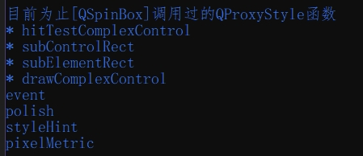
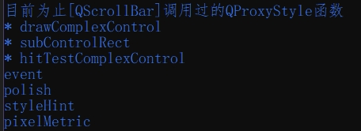

很多网上代码都是逮着个``QProxyStyle.drawContorl``说个不停，我直接原地爆炸，最后还是自己试出来一些关键函数，就特别逗。

``QStyle``除了控制重绘外，还控制点击范围(虽然“点击范围”实际上该怎么称呼我也拿不准)，要不然有些问题就说不过去了，例如``QCheckBox``设置``QStyle``时绘制出的东西并没有点击效果，而通过样式表设置的话却没有这个问题，明明设置样式表本质就是和设置``QStyle``一样。


``QStyle``不少地方透露着搞笑与捉摸不透。

<br>
<br>

***


在测试的过程中根据控件所需的函数粗略分成三大类，这里不得不让人吐槽的是，这些函数名都什么鬼。
- 一类是简单型控件，由``subElementRect``和``drawControl``控制，例如``QLabel``、``QPushButton``等；
- 一类是复杂型控件，由``subControlRect``和``drawComplexControl``控制，例如``QScrollBar``等；
- 其余是大量数不清的破坑，例如``QSpinBox``、``QComboBox``等，让人感受到藕断丝连的美，人话就是``QStyle``概念混乱，直到代码运行前，你完全无法预知某个Qt原生控件到底需要重写``QProxyStyle``的哪些函数(而且有些绘制甚至是``QStyle``无法约束的)，当然，你也可以慢慢翻阅官方手册：[Member Type Documentation-QStyle](https://doc.qt.io/qt-6/qstyle.html#ComplexControl-enum)

关于``QStyle``的更多详细说明可参考官方文档：[Styles and Style Aware Widgets](https://doc.qt.io/qt-6/style-reference.html)，这里附上对应的机翻内容：[样式和样式感知小部件](https://runebook.dev/zh/docs/qt/style-reference)

<br>
<br>

### 简单型控件的重绘(QCheckBox)
跳转至：[QCheckBox重绘](./QCheckBox重绘复选框/Readme.md)

### 复杂型控件的重绘(QScrollBar)
跳转至：[QScrollBar重绘](./QScrollBar去除箭头/Readme.md)

### 检测``QProxyStyle``中被调用的函数
实在是疲于踩坑，此处写下一个Python脚本专门抓出``QProxyStyle``中的那些被调用的函数，可能没什么用，但至少作为参考。

```py
from PyQt5.QtWidgets import *
from PyQt5.QtCore import *
from PyQt5.QtGui import *
import types

class Test_Style(QProxyStyle):
	__keys=set()
	def __init__(self):
		super().__init__()
		for key in dir(self):
			if(key[0].islower()):
				if(isinstance(getattr(self,key),types.BuiltinMethodType)):
					try:
						def Maker(key):
							inner=getattr(self,key)
							def func(*argc):
								print(key)
								self.__keys.add(key)
								return inner(*argc)
							return func
						setattr(self,key,Maker(key))
					except:
						pass
		self.__keys=set()
	def Get_Keys(self):
		return self.__keys

class MouseTracker(QComboBox):
	def eventFilter(self, obj: QObject, event: QEvent) -> bool:
		if(event.type()==QEvent.MouseMove):
			print()
		return super().eventFilter(obj,event)

if True:
	app=QApplication([])
	lst=[
		QComboBox,
		QTextEdit,
		QLineEdit,
		QScrollBar,
		# QSpinBox,
	]
	
	test=lst[-1]()
	test.show()

	style=Test_Style()
	test.setStyle(style)
	app.installEventFilter(MouseTracker())
	app.exec()
	
	keys=style.Get_Keys()
	print(f"\n\n目前为止[{lst[-1].__name__}]调用过的QProxyStyle函数")
	extend=['event','polish','styleHint','pixelMetric']
	for key in keys.difference(extend):
		print('*',key)
	for key in extend:
		if key in keys:
			print(key)
	print()
```





# 其他参考：
[Qt 自定义组件风格说明（QStyle和paintEvent）](https://www.cnblogs.com/whwywzhj/p/13542125.html)
[Qt 自定义QStyle——实现QProgressBar自定义样式](https://www.cnblogs.com/During/p/13337945.html)
[QStyle介绍](https://zhuanlan.zhihu.com/p/648198611)
[QStyle Functions 样式函数（五）](https://www.cnblogs.com/svenzhang9527/p/13922809.html)
