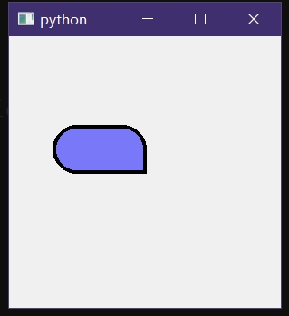
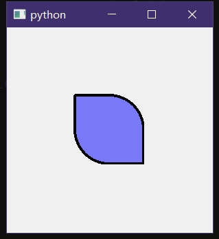
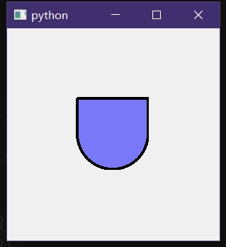
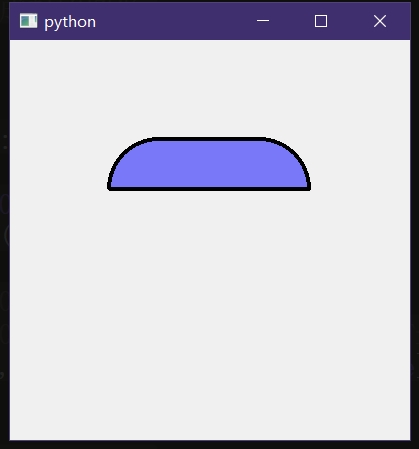

如题，起因是看到有个哥们提出疑问“如何绘制三方一圆的圆角矩形：[QPainter.drawRoundRect-评论](https://blog.csdn.net/liushuaitong/article/details/122117384)


对于复杂图形，需要使用``QPainterPath``进行绘制，因为通过这个类还能顺手填充内部颜色，而且如果不需要填充的话仅需对画笔的刷子进行设置``QPainter.setBrush(Qt.transparent)``即可，适用性更高


# Python代码+运行结果：
```python
from PyQt5.QtWidgets import QWidget
from PyQt5.QtCore import QRect,QRectF,QPoint
from PyQt5.QtGui import QPainter,QColor,QPen,QPainterPath
import math

class Test(QWidget):
	def paintEvent(self,event):
		ptr=QPainter(self)
		ptr.setBrush(QColor(0,0,255,128))
		ptr.setPen(QPen(QColor(0,0,0),4))

		ptr.drawPoint(150,150)
		path=QPainterPath()
		path.moveTo(150,150)
		path.arcTo(QRectF(100,100,50,50),0,90)
		path.arcTo(QRectF(50,100,50,50),90,180)
		path.lineTo(150,150)
		ptr.drawPath(path)

import sys
from PyQt5.QtWidgets import QApplication

if __name__=='__main__':
	app = QApplication(sys.argv)

	win=QWidget()
	t=Test(win)
	t.show()
	t.setGeometry(0,0,200,200)
	win.resize(300,300)
	win.show()

	sys.exit(app.exec_())
```



当然，上面代码仅作为测试样例，并不可能直接投入生产开发使用。
对绘制操作进行抽象优化后得到下面一份新代码

<br>


# Python代码2+运行结果：
```python
from PyQt5.QtWidgets import QWidget
from PyQt5.QtCore import QRect,QRectF,QPoint
from PyQt5.QtGui import QPainter,QColor,QPen,QPainterPath
import math

def DrawRect(ptr,rect,roundLst=[False,False,False,False],radius=50,*,start=0):#roundLst控制圆角直角，右上角开始(可以通过start控制起始点)，逆时针依次绘制
	path=QPainterPath()
	angle=start*90
	rw=rect.width()/2
	rh=rect.height()/2
	rx=rect.center().x()
	ry=rect.center().y()

	startPoint=QPoint(rx+math.cos(math.radians(angle))*rw,ry-math.sin(math.radians(angle))*rh)
	path.moveTo(startPoint)
	roundLst.extend([False]*4)#默认直角
	for flag in roundLst[:4]:#逆时针，右上开始绘制
		rangle=math.radians(angle+45)
		sinR=-math.sin(rangle)
		cosR=math.cos(rangle)
		x=rx+math.copysign(rw,cosR)
		y=ry+math.copysign(rh,sinR)
		if(flag):#圆角
			cx=rx+math.copysign(1,cosR)*(rw-radius)
			cy=ry+math.copysign(1,sinR)*(rh-radius)
			path.arcTo(QRectF(QPoint(x,y),QPoint(cx,cy)).normalized(),angle,90)
		else:#直角
			path.lineTo(x,y)
		angle+=90
	path.lineTo(startPoint)#形成封闭图形
	ptr.drawPath(path)

class Test(QWidget):
	def paintEvent(self,event):
		ptr=QPainter(self)
		ptr.setBrush(QColor(0,0,255,128))
		ptr.setPen(QPen(QColor(0,0,0),4))

		# DrawRect(ptr,QRect(100,100,100,100))
		# DrawRect(ptr,QRect(100,100,100,100),[True,False,True,False],100)
		DrawRect(ptr,QRect(100,100,200,50),[False,True,True],100,start=3)

import sys
from PyQt5.QtWidgets import QApplication

if __name__=='__main__':
	app = QApplication(sys.argv)

	win=QWidget()
	t=Test(win)
	t.show()
	t.setGeometry(0,0,500,500)
	win.resize(400,400)
	win.show()

	sys.exit(app.exec_())
```







