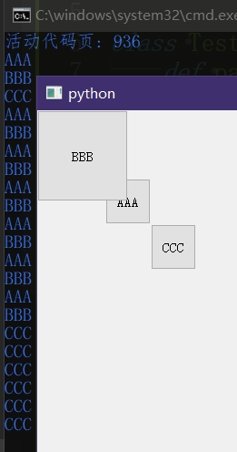
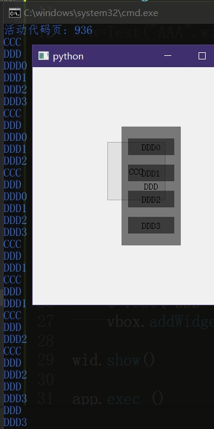

# 控件叠罗汉时的绘制问题

Qt会根据变化发生的区域来决定哪些控件进行重绘，因此发生重叠的控件或许会带来一定程度上的性能浪费。

至于说“或许”，是因为这个性能浪费或许是微不足道的，但若是复杂控件被覆盖的话，频繁的重绘可能会带来明显的卡顿问题(?)

额外补充：窗口之间的叠罗汉并不会互相影响，哪怕上方窗口是半透明的

### Python代码 和 运行截图：

```py
from PyQt5.QtWidgets import *
from PyQt5.QtCore import *

app = QApplication([])

class Test(QPushButton):
	def paintEvent(self,event):
		super().paintEvent(event)
		print(self.text())
wid=QWidget()
wid.show()

a=Test("AAA",wid)
a.setGeometry(QRect(75,75,50,50))
b=Test("BBB",wid)
b.setGeometry(QRect(0,0,100,100))
c=Test("CCC",wid)
c.setGeometry(QRect(125,125,50,50))

a.show()
b.show()
c.show()

app.exec_()
```

```py
from PyQt5.QtWidgets import *
from PyQt5.QtCore import *

app = QApplication([])

class Test(QPushButton):
	def paintEvent(self,event):
		super().paintEvent(event)
		print(self.text())
wid=QWidget()

# a=Test("AAA",wid)
# a.setGeometry(QRect(75,75,50,50))
# b=Test("BBB",wid)
# b.setGeometry(QRect(0,0,100,100))

c=Test("CCC",wid)
c.setGeometry(QRect(125,125,100,100))
d=Test("DDD",wid)
# d=QWidget(wid)
d.setStyleSheet('.Test{background:rgba(0,0,0,128)}')
d.setGeometry(QRect(150,100,100,200))

vbox=QVBoxLayout(d)
for i in range(4):
	t=Test('DDD'+str(i))
	vbox.addWidget(t)

wid.show()

app.exec_()
```






### 简单结论

经过简单的测试，主动更新的控件会更新与之重合的所有控件，而被动更新的控件不会进一步连锁，而细想也十分合理。

因此不必过分担心空白控件覆盖其他控件时带来的问题，除非是这个情况：用来覆盖其他控件的是一个会频繁更新的玩意儿，例如动图。

如果动图很大的话那的确会造成很大的问题，因为动图每秒十几次更新，被盖住的控件也会被连动频繁更新，

但说实话出现“动图覆盖控件”的场景基本就是“加载动画蒙版”，而且加载动画的``QLabel``也就那么一点大，最多也就带动几个控件的重绘罢了，因此结论依旧是：不必过分担心。

反倒是该担心其他会造成重绘的行为，例如调用``setGeometry``，或者使用动画``QPropertyAnimation``，尤其是动画，如果对复杂控件频繁“搬家”的话那破坏力可不比动图的影响小。


