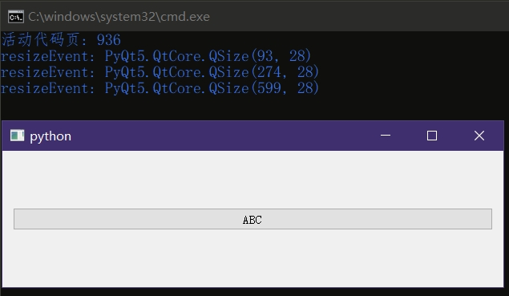
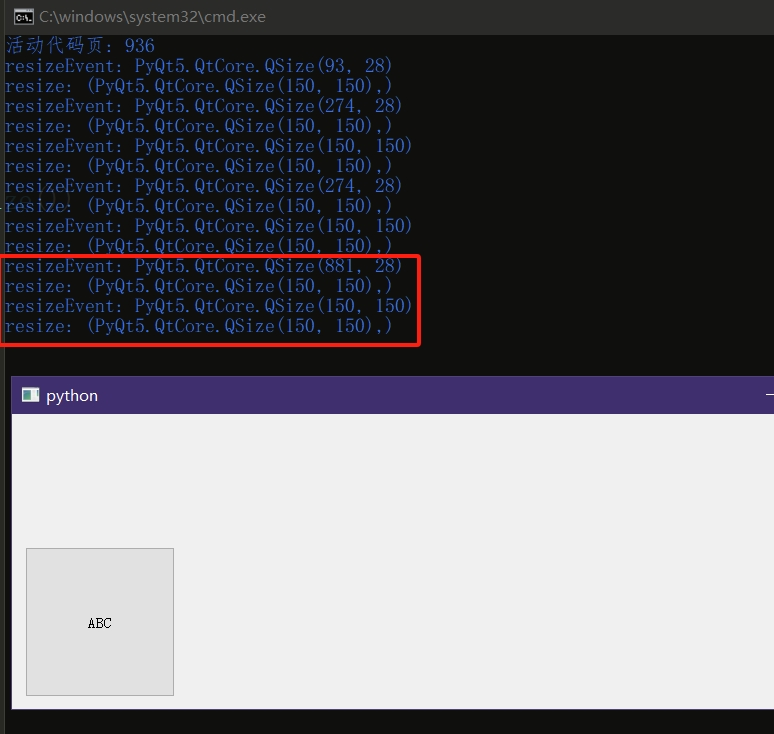

在调用``resize``以及``setGeometry``时会发送``QResizeEvent``，这将触发对应的控件事件``QWidget.resizeEvent``。


# 特别的：

1. 并不是只有这两种方法才会触发``resizeEvent``
2. 发送``QResizeEvent``并不会如愿调整目标控件大小：
``QApplication.postEvent(wid,QResizeEvent(QSize(200,200),QSize()))``
3. ``resizeEvent``是在控件已经发生大小变化后才触发的
4. 重写``resize``和``setGeometry``方法并不能兼顾那些被扔进布局中的情况(因为布局中的控件大小变化并不会调用这两个函数)，需要额外重写``resizeEvent``
5. ``resize``/``setGeometry``多次但大小都一样的情况下是不会重复触发``resizeEvent``事件的


# Python示例代码 + 运行结果
```py
from PyQt5.QtWidgets import *
from PyQt5.QtCore import *
from PyQt5.QtGui import *

class Test(QPushButton):
	def resizeEvent(self,event):
		print("resizeEvent:",event.size())
		# self.resize(QSize(150,150))
	def resize(self,*size):
		print("resize:",size)
		super().resize(*size)
	def setGeometry(self,*rect):
		print("setGeometry:",rect)
		super().setGeometry(*rect)

if True:
	app = QApplication([])

	win=QWidget()
	t=Test("ABC")
	vbox=QVBoxLayout(win)
	vbox.addWidget(t)
	win.show()
	win.resize(300,300)

	app.exec_()
```






可以看到在布局中的控件是完全不会调用``resize``和``setGeometry``方法，但在``resizeEvent``中调用``resize``时控件大小发生了变化(而且也没陷入死循环)，只不过这也容易造成控件脱离布局控制的问题

为什么要提到这一点，因为重写控件有时会关心它大小调整后的行为(特殊情况下还要强制其大小在某个范围内)，重写``resize``或是``setGeometry``是没有效果的，得重写``resizeEvent``事件函数。


