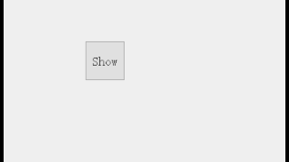

超，顶，的

谁也没有想到，``paintEvent``竟然会立大功(笑嘻了

现在，有个需求：点击按钮，弹出某个控件，然后，点击其他地方后这个控件需要消失(就像点击复选框弹出的列表一样)。
额外的，本控件可以添加布局，或者说是可以添加子控件，因此不能出现点击子控件时本控件消失的问题。

<br>

***


如果使用``focusInEvent``和``focusOutEvent``时，点击子控件时会触发``focusOutEvent``，这是我所不愿意的，因为会出现这种情况：点击子控件时本控件立马消失，这效果好比点击复选框列表选项后复选框列表消失(而我需要这个列表长时间显示，直至我点击列表之外的地方)


在不断的测试中，发现重绘事件``paintEvent``会对非常多的用户行为做出响应(效果不亚于``self.installEventFilter(self)``)，再结合``QApplication.focusWidget()``以及``self.focusWidget()``就可以判断鼠标有无点击到控件外部，虽然也可以通过鼠标位置来进行判断，但没有本方法来的那么干脆利落


<br>
<br>
<br>


***


# Python代码1 和 运行结果：
这份是不完善的代码，在运行结果中反复点击“Show”按钮，弹窗会反复出现，这效果并不理想
``` py
#XJQ_PopupBox.py
from PyQt5.QtWidgets import QCompleter,QFrame
from PyQt5.QtCore import Qt,QEvent
class XJQ_PopupBox(QFrame):
	def __init__(self,*arg):
		super().__init__(*arg)
	def paintEvent(self,event):
		wid=QApplication.focusWidget()
		if(wid!=self.focusWidget()):
			self.hide()
	def show(self):
		self.setFocus(Qt.MouseFocusReason)
		super().show()
```

```py
#Main.py
from PyQt5.QtWidgets import QApplication,QVBoxLayout,QPushButton,QWidget
from XJQ_PopupBox import XJQ_PopupBox
if __name__ == '__main__':
	app = QApplication([])

	win=QWidget()

	win.show()
	win.resize(500,200)
	win.setFocusPolicy(Qt.ClickFocus)

	pb = XJQ_PopupBox(win)
	btn=QPushButton("Show",win)
	btn.clicked.connect(lambda:pb.show())
	btn.setGeometry(100,50,50,50)
	pb.setGeometry(160,50,100,100)
	btn.show()

	vbox=QVBoxLayout(pb)
	vbox.addWidget(QPushButton("PB1"))
	vbox.addWidget(QPushButton("PB2"))
	pb.setStyleSheet('.XJQ_PopupBox{background:#FF0000}')

	app.exec_()
```


# Python代码2 和 运行结果：
在代码1的基础上，继续完善XJQ_PopupBox，至此代码已完成基础的弹窗功能。
```py
#XJQ_PopupBox.py
class XJQ_PopupBox(QFrame):
	__wid=None#触发者，记录调用show的对象
	def __init__(self,*arg):
		super().__init__(*arg)
	def paintEvent(self,event):
		wid=QApplication.focusWidget()
		if(wid!=self.focusWidget()):
			self.hide()
			if(wid!=self.__wid):
				self.__wid=None
	def show(self,force=False):
		wid=QApplication.focusWidget()
		if(not force):
			if(wid==self.__wid):
				self.__wid=None
				return
		self.__wid=wid
		self.setFocus(Qt.MouseFocusReason)
		super().show()
```



