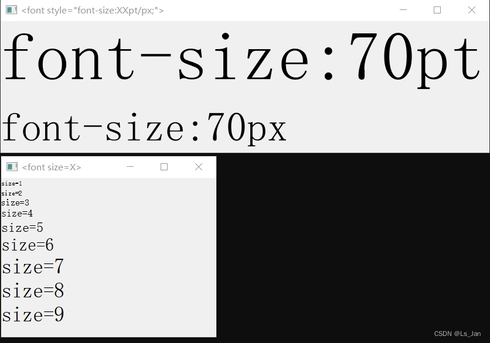

使用``size``属性只能生成7个等级的字号，超过7的都视作为7。
当需要更加夸张的字号时则需要使用``style``属性，除此之外利用该属性可以生成更加~~逆天~~丰富的样式，(``style``属性是CSS样式表。

稍微跑题一下：似乎有安全性的考量，不少Markdown编辑器并不支持超格的HTML标签，例如在Markdown出场频率极高的博客/专栏中没法使用CSS样式，因此在博客中无法创建出一个特别大的字，(只不过一般情况下``<font size=7>``都已经足够大的了

***
# Python代码：

```python
import sys
from PyQt5.QtWidgets import QApplication,QLabel

if __name__ == '__main__':
	app = QApplication(sys.argv)

	lb_size=QLabel()
	lb_style=QLabel()
	lb_size.setText('''
		<font size=1>size=1</font><br>
		<font size=2>size=2</font><br>
		<font size=3>size=3</font><br>
		<font size=4>size=4</font><br>
		<font size=5>size=5</font><br>
		<font size=6>size=6</font><br>
		<font size=7>size=7</font><br>
		<font size=8>size=8</font><br>
		<font size=9>size=9</font><br>
		''')
	lb_style.setText('''
		<font style="font-size:70pt">font-size:70pt</font><br>
		<font style="font-size:70px">font-size:70px</font><br>
		''')#其实style属性可以用于其他标签，例如p标签
		
	lb_size.setWindowTitle('<font size=X>')
	lb_style.setWindowTitle('<font style="font-size:XXpt/px;">')
	lb_size.show()
	lb_style.show()
	sys.exit(app.exec())
```

# 运行截图：




***

- 【W3School】HTML <font> 标签的 size 属性：[https://www.w3school.com.cn/tags/att_font_size.asp](https://www.w3school.com.cn/tags/att_font_size.asp)
- 【md官方】Markdown 内嵌 HTML 标签：
[https://markdown.com.cn/basic-syntax/htmls.html#html-用法最佳实践](https://markdown.com.cn/basic-syntax/htmls.html#html-%E7%94%A8%E6%B3%95%E6%9C%80%E4%BD%B3%E5%AE%9E%E8%B7%B5)
- 【Qt官网】支持的富文本标签以及CSS样式表属性：[https://doc.qt.io/qt-5/richtext-html-subset.html](https://doc.qt.io/qt-5/richtext-html-subset.html)

