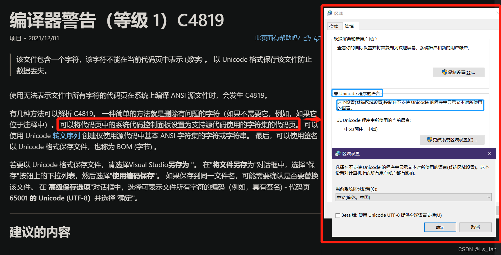

VS2019中新添加的文件，默认编码为ANSI(936)，可以去**扩展→管理扩展**安装插件以强制设置为utf-8。安装这个插件可能会出现这个问题 [VS2019插件“Force UTF-8(No Bom)”造成输出乱码](https://blog.csdn.net/qq_35353673/article/details/121133020)，这个我目前没啥好的解决方法，我在代码中加入简单粗暴的一句 **system("chcp 65001")** 修改程序当前代码页让程序不输出乱码。

 
 

Windows的软件分为两类，一类是Unicode的，另一类是非Unicode的。

个人观点是VS2019是非Unicode软件，程序运行时采用的代码页已经锁死在ANSI(936代码页)上了，这想改也不好改，因为这是和系统设置关联的。反复咀嚼官方给出的C4819的解决方法，直接得出结论：如果你的文件，编码是utf-8，那趁早改成别的编码，或者改用VSCode，因为VS2019对utf-8代码文件不友好(可能可以添加插件以解决类似问题?)

 

