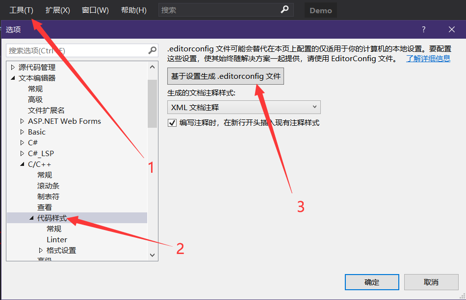
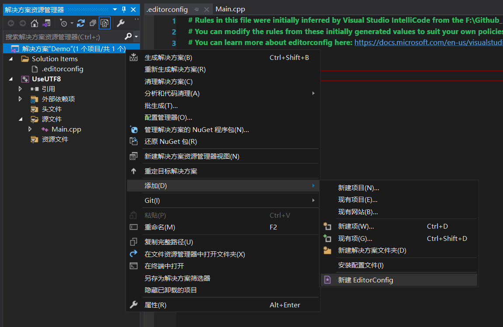
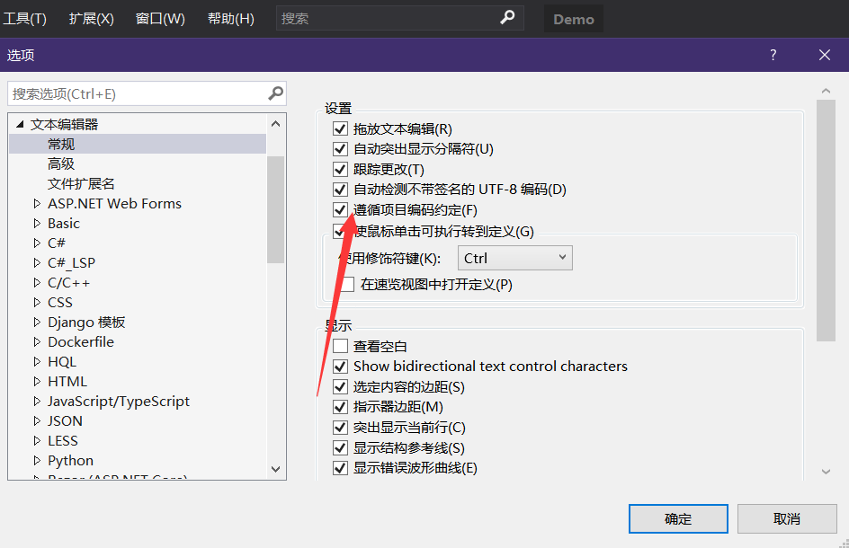
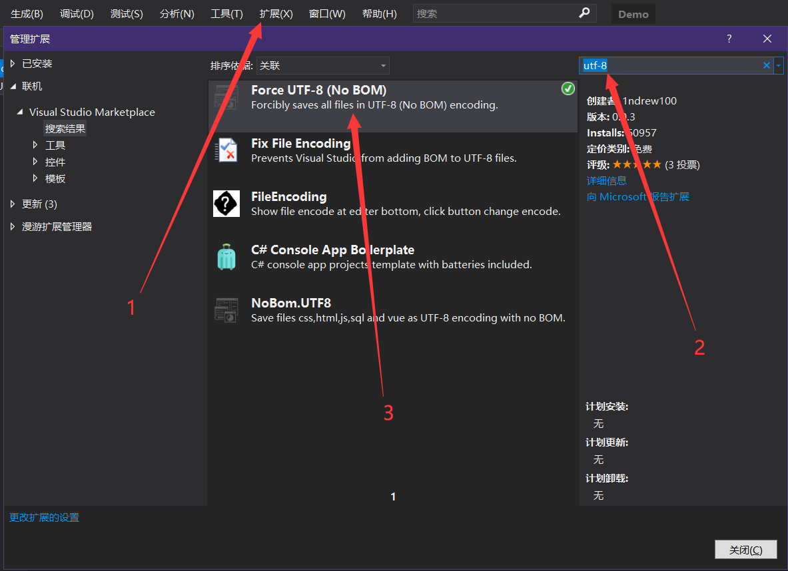
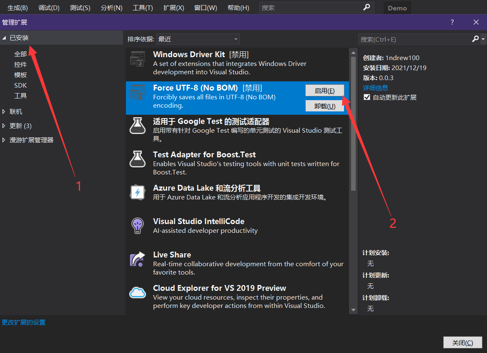
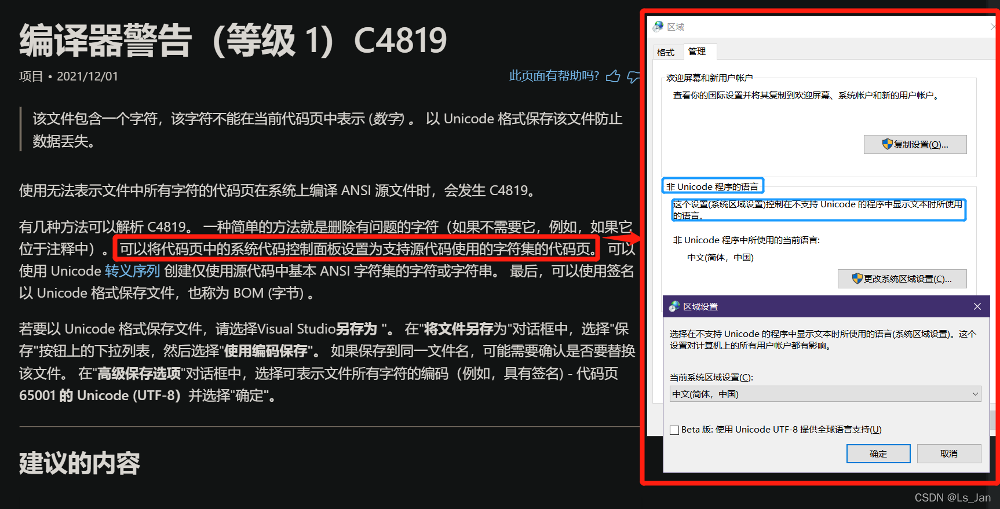
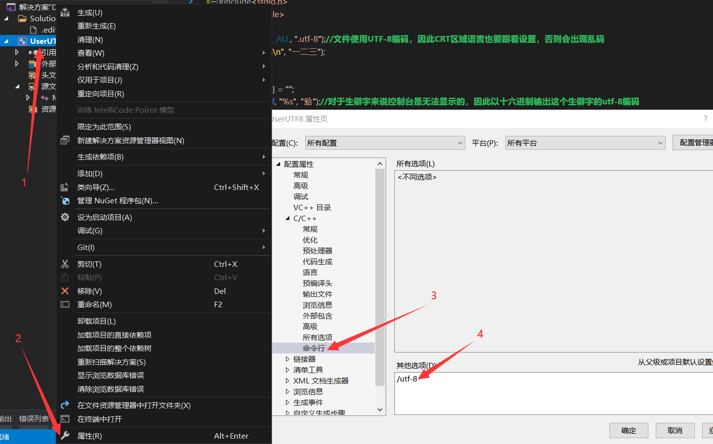

这篇文章说得很详尽：[Visual Studio C++ 默认 UTF-8 编码及 *.editorconfig 统一代码格式 ](https://www.cnblogs.com/mechanicoder/p/16894144.html)。
以下内容均是参考这篇文章进行编写。


<br>


# 1、源文件使用UTF-8编码：
有三种做法：
- 使用``*.editorconfig``编辑器配置文件；
- 使用插件；
- 设置系统区域语言；

### 编辑器配置文件：
- 最推荐的做法；
- 在项目路径或者解决方案路径下创建一个``*.editorconfig``文件，即可生效；
- 不会污染其他的项目；
- 还有个好处是鼠标指向形如``"ABC"``和``L"ABC"``这样的常量字符串时能够正确显示字符数以及

在**工具 > 选项**中打开**文本编辑器 > C/C++ > 代码样式**，
然后点击生成VS2019默认的``*.editorconfig``文件，
实际上你也可以直接创建这样的一个文件而不需要进行上述操作。



<br>

其实还有另一种方法创建这样的文件，通常来说更建议使用这个方式进行创建。
对项目或者解决方案右键添加，其中就有一项名为**新建 EditorConfig**的选项。


<br>

``*.editorconfig``文件仅会作用于本路径下的项目或是解决方案。
项目会优先使用自己的``*.editorconfig``文件，没有才会使用解决方案的``*.editorconfig``文件，都没有那就使用默认配置。
创建好这个文件后重启VS2019即可生效。

什么？你竟然说它不生效？那你肯定动过了VS2019中的某些配置，去看看这个功能是不是被关了？


<br>

关于``*.editorconfig``文件的内容，如果只是想要文件均以UTF-8保存的话直接简单粗暴地使用这个就行了，
没错，只需要这两行内容即可。
```python
[*]
charset = utf-8 # 文件编码字符集为 UTF-8
```

这里再补充一些这个编辑器配置文件的可用属性，更多内容请网上搜索相关资料：

```python
[py,js]
end_of_line = lf                    # 行尾 UNIX 格式 LF
charset = utf-8                     # 文件编码字符集为 UTF-8
trim_trailing_whitespace = true     # 删除文件末尾空格
insert_final_newline = true         # 末尾插入新行
indent_style = space                # 以空格代替 tab
indent_size = 4                     # 代替 tab 的空格数量
```

### 插件：
- 不建议使用，因为保不住以前能用的项目因为源文件被强制转为UTF-8而导致损坏；
- 不一定奏效，我现在装了几个这样的插件但都没有给我保存为UTF-8；

在**扩展 > 管理扩展**搜索关键词**utf-8**并进行安装。
可以在已安装中启用/禁用插件。





### 系统区域语言：
- 为什么要这么做？
- 由于改动了ANSI，那些中文软件大概率出现乱码，而且读写文件极大可能会出现异常；
- 如果你不想你现在电脑上跑的软件发生奇怪的问题，就别尝试做这种事；




<br>
<br>

# 2、编译器使用UTF-8编码：
仅源文件保存UTF-8自然是不行的，因为编译器并不知道这个文件到底是什么编码，
不对其进行配置就直接编译的话编译器会默认使用ANSI进行编译，此时将会出现运行乱码甚至连编译都无法通过。

进入项目的属性页面，在**配置属性 > C/C++ > 命令行**中可设置编译器使用的编码，通常直接塞一个``/utf-8``即可。



<br>

如果每个项目都要这么搞，那岂不是很麻烦？
事实上有个叫做**项目属性表**的东西就是为了简化每次项目创建后的属性配置行为。
还有个更高级的做法就是使用**项目模板**。
关于它们的用法这里并不打算展开说明。


<br>

# 参考：
- VS2019-“选项”对话框：“文本编辑器”>“常规”：[https://learn.microsoft.com/zh-cn/visualstudio/ide/reference/options-text-editor-general](https://learn.microsoft.com/zh-cn/visualstudio/ide/reference/options-text-editor-general)
- EditorConfig:[https://editorconfig.org/](https://editorconfig.org/)
- 探究Visual Studio中的乱码问题：[https://blog.csdn.net/no_say_you_know/article/details/126695461](https://blog.csdn.net/no_say_you_know/article/details/126695461)
- /source-charset（设置源字符集）：[https://learn.microsoft.com/zh-cn/cpp/build/reference/source-charset-set-source-character-set?view=msvc-170](https://learn.microsoft.com/zh-cn/cpp/build/reference/source-charset-set-source-character-set?view=msvc-170)
- How to config visual studio to use UTF-8 as the default encoding for all projects?：[https://stackoverflow.com/questions/41335199/how-to-config-visual-studio-to-use-utf-8-as-the-default-encoding-for-all-project](https://stackoverflow.com/questions/41335199/how-to-config-visual-studio-to-use-utf-8-as-the-default-encoding-for-all-project)

