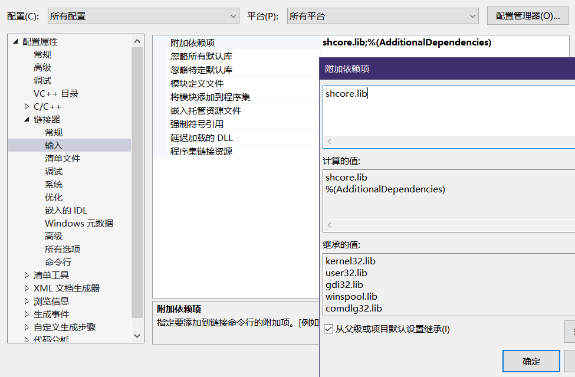
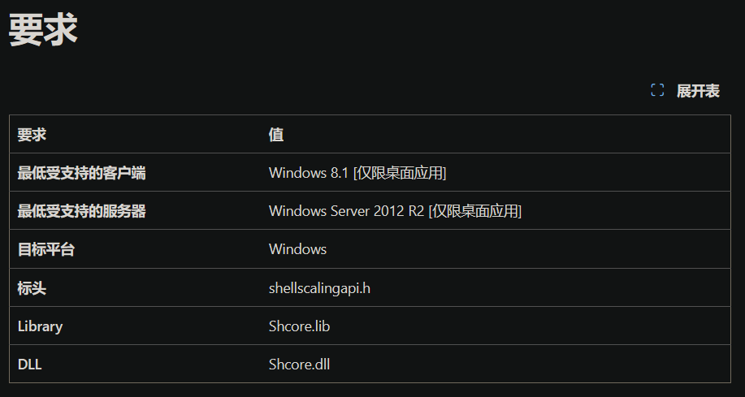

通常，可以以代码的方式链接静态库，但这样做说实在的有一些麻烦。
实际上还有另一种方式链接静态库，那就是在项目的属性页面中进行设置。

 

# 示例：

#### win8.1的API``SetProcessDpiAwareness``无定义：

这里以win10平台为例，在代码中引入头文件[``<shellscalingapi.h>``](https://learn.microsoft.com/zh-cn/windows/win32/api/shellscalingapi/)并使用``SetProcessDpiAwareness``，但在链接阶段中会提示错误。

函数无定义，说明库链接失败。

那么该思考一个问题，平时引入头文件诸如``<windows.h>``、``<stdio.h>``这些头文件，为什么能够丝滑无阻地使用像是``Sleep``、``printf_s``之类的API？而上面那个win8.1的API反倒无法顺利调用？

原因很明显，那就是在项目中存在一个属性设置，能够对需要的库自动进行链接，而不需要显式地添加一段代码``#pragma comment(lib,'XXX.lib')``链接静态库。

 

#### 项目设置中配置静态库：
在对应项目进行右键选择``[属性]``，弹出的属性页中选择**配置属性-链接器-输入**，有个叫“**附加依赖项**”的属性就是我们所找的，如图：

对其进行<**编辑**>，加入所需的静态库，确认后重新生成程序，无意外通常能够正常执行。
意外情况即为环境配置中没有这个静态库文件，通常做法是使用软件``everything``查看本机有无其他路径上的文件，不太建议的做法是在网上下载一份(不建议是怕有人埋毒，因为很难判断调用dll的过程中有无进行其他行为)，然后复制一份到项目路径中即可。

这里说明一下为什么使用的是``shcore.lib``这个文件。
在``SetProcessDpiAwareness``的[官方文档](https://learn.microsoft.com/zh-cn/windows/win32/api/shellscalingapi/nf-shellscalingapi-setprocessdpiawareness)的文末有说明这个API需要使用哪些东西。

# 参考：
- ``SetProcessDpiAwareness``：[https://learn.microsoft.com/zh-cn/windows/win32/api/shellscalingapi/nf-shellscalingapi-setprocessdpiawareness](https://learn.microsoft.com/zh-cn/windows/win32/api/shellscalingapi/nf-shellscalingapi-setprocessdpiawareness)
- vs报错“错误 LNK2019 无法解析的外部符号”的几种原因及解决方案：[https://blog.csdn.net/weixin_44120025/article/details/115279563](https://blog.csdn.net/weixin_44120025/article/details/115279563)
- vs2019设置及第三方库的使用：[https://www.cnblogs.com/wanghzh/p/12458006.html](https://www.cnblogs.com/wanghzh/p/12458006.html)
- VS2019 VC++ 静态库的开发与使用：[https://www.codenong.com/cs106026541/](https://www.codenong.com/cs106026541/)

