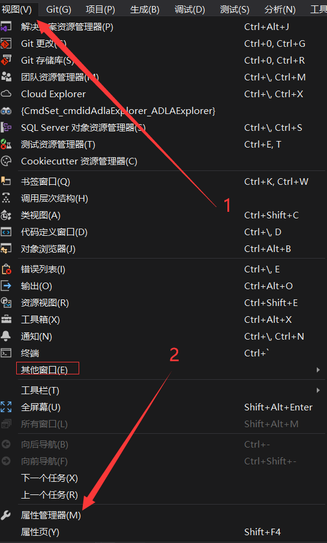
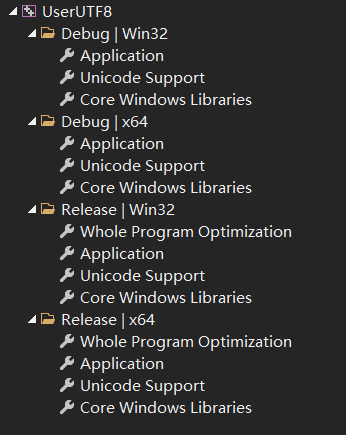
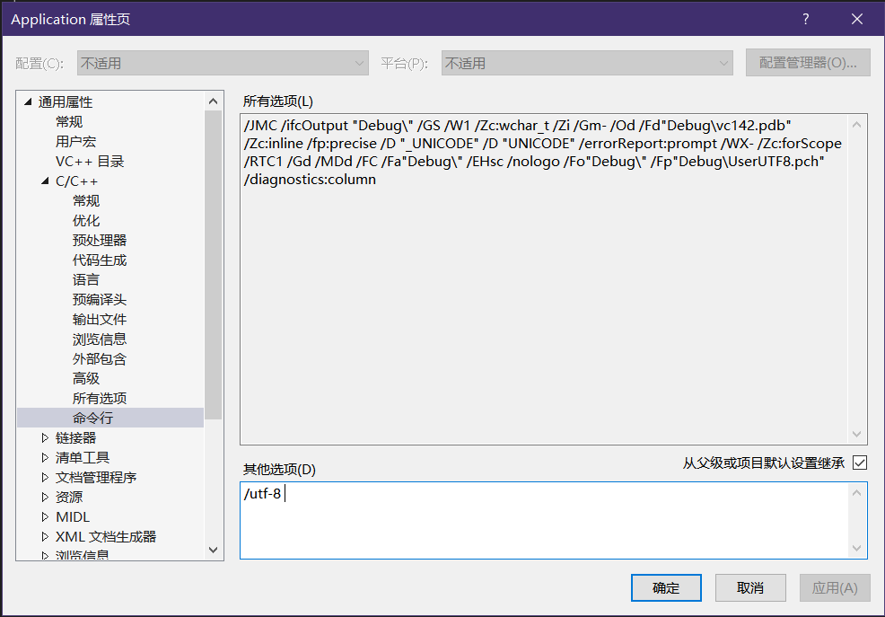
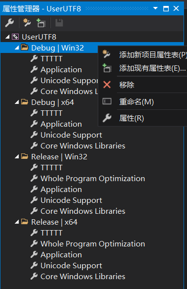

如果只是一个两个项目倒还好，
假如大量的项目都要配置同样的属性，这种繁琐的操作自然是相当的麻烦。

Visual Studio提供了一个项目属性的管理方法，那就是使用项目属性表，
这玩意儿并不会自动创建，必须在项目属性器中手动创建。

 

***

通过**视图 > 属性管理器**打开。
有些VS会放在“其他窗口”里头，自己仔细找找。

 

这个视图罗列着所有项目的配置信息，
它们以**方案(Debug/Release)+平台(x86/x64)**的方式进行显示，
其中的每个项都能进行右键打开设置属性(或者左键双击打开)。

 

如果你胆子够肥，你是可以改动那些带有小扳手图标的系统默认属性表，搞坏了其他项目自己负全责，
虽然这些系统属性表只能改“命令行”的数据，但这种改动系统环境的行为依旧是一种很危险的做法。

 

在属性管理器中，对着指定项右键可以添加自己的项目属性表(``*.props``文件)。
其中的TTTTT是我随手弄的。

 

创建完后就能以这个属性表为核心，对项目进行各种属性配置。
对这个属性表的所有修改都会保存到``*.props``文件，这个文件拉到其他项目下依旧生效。
当然，这个属性表需要创建在当前项目/解决方案路径下(当然你也可以不这么做)。

如果那些个人添加的属性表所对应的``*.props``文件以某种手段(例如移动删除，或是仓库pull下来时并没有带上这文件)造成丢失，
VS并不会弹出任何信息的，这一点需注意，因此为了避免这样的问题出现，属性表应尽量位于当前目录/解决方案路径下。

那些配置好的属性表(``*.props``文件)你可以选择将其复制一份到桌面(或是其他工作路径)，
然后下次创建新项目时就可以将这个文件拉进项目路径中，然后在属性管理器中将这个文件右键添加进项目中，以简化传统广播体操^(梗，指的是开始做某件事之前需要完成一套流程操作)^。

 
 

# 参考：

- Visual Studio项目属性配置：[https://blog.csdn.net/y24283648/article/details/109517407](https://blog.csdn.net/y24283648/article/details/109517407)

