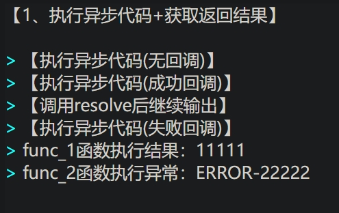
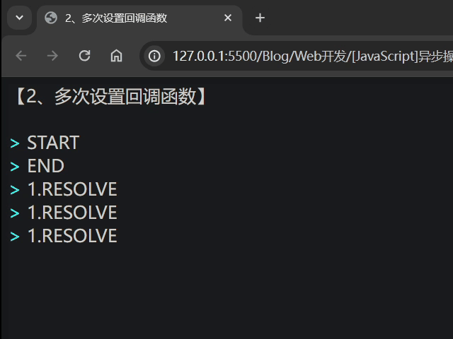
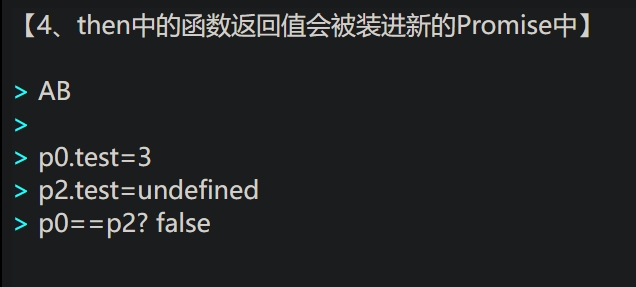
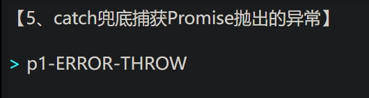
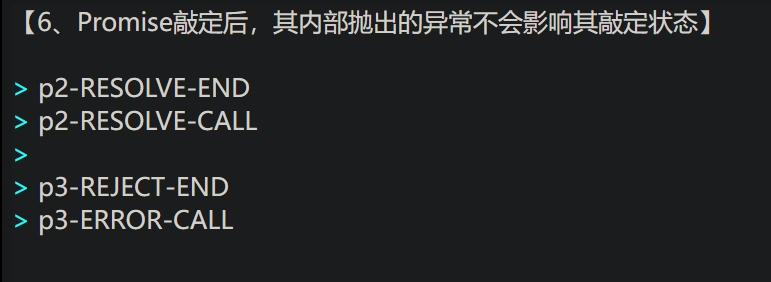

# Promise

#### 首先：

- ``Promise``是个类，接受一个函数，行为类似于创建线程``Thread(target=func)``，将一些“费时”操作丢到别的地方执行

- 一个``Promise``对象有三种状态：***待定***、***已兑现***、***已拒绝***，除待定状态外的另外俩状态可以合称***敲定***，只不过知道这个也没多大意义，因为无法(且没有必要)获取``Promise``对象的状态，除非Debug需要

- ``Promise``接受的函数格式为``function (resolve, reject)``，其中的``resolve``和``reject``相当于回调函数，函数体中能且仅能调用一次``resolve``或``reject``，一旦调用这两函数的任一个，``Promise``状态都会从“待定”切换为“敲定”

- 虽说函数格式为``function (resolve, reject)``，但实际上也可以传入一参或者无参的函数，但更多时候是传入一参或者二参，无参的实际意义并不大，就好比在其他编程语言中将一个函数丢去线程中执行而不管不问

- ``Promise``对象后接的``.then``和``.catch``将返回新的``Promise``对象，以形成链

#### 特别的：

- ``Promise(function(resolve,reject){})``中的``resolve``和``reject``与``Promise``对象是一个整体，或者说每个``Promise``对象都有总会有``resolve``和``reject``这俩回调函数。

- ``.then``和``.catch``中传入的参数是个函数，实际就是对应``Promise``对象的回调函数``resolve``和``reject``，或者说就是通过``.then``和``.catch``为``Promise``对象绑定回调函数

- ``.then``和``.catch``中传入的函数，无论该函数是否有返回值(无返回值相当于返回``undefined``)，亦或是返回的是否为``Promise``对象，***一定会***被塞进一个**新的**``Promise``对象，以作为 ``.then``和``.catch``的返回结果(要不然怎么成链？)

- ``Promise``中执行``resolve``又或是``reject``并不会直接结束，也不会直接调用``.then``和``.catch``设置的回调函数。


<br>
<br>

***

# 总结：

1. ``Promise``接受一个执行函数，请类比于创建线程
2. ``Promise``创建后立即生效，有如脱缰野马
3. ``Promise``中调用的``resolve``和``reject``并不会立即调用对应的函数，或者说，“可以晚点”
4. ``Promise``内部只要调用``resolve``、``reject``或是抛出异常便会立即敲定，且后续继续调用``resolve``、``reject``或是抛出异常都不会影响它的敲定状态以及敲定结果
5. ``.then``和``.catch``接受一个函数，为``Promise``绑上对应的回调函数。``.then``对应``resolve``，而``.catch``对应``reject``，除此之外``.catch``还能捕获``Promise``中扔出来的异常(作为兜底)
6. ``.then``和``.catch``接受的函数，其返回值将会被装进新的``Promise``对象并作为返回，以形成``Promise``链
7. ``.then``和``.catch``可为一个``Promise``多次绑定回调(无论``Promise``是否完成敲定)，且不会覆盖前一次的绑定

<br>
<br>


***


# 示例代码：

可以在线打开本目录下的``./source/*.html``以查看运行结果。

<br>

#### 执行异步代码+获取返回结果

```js
let print = console.log;
function func_0() {
	print('【执行异步代码(无回调)】');
}
function func_1(resolve) {
	print('【执行异步代码(成功回调)】');
	resolve('11111');
	print('【调用resolve后继续输出】');//说明调用resolve后不会结束，仍会继续向下执行
}
function func_2(resolve, reject) {
	print('【执行异步代码(失败回调)】');
	reject('ERROR-22222');
	resolve('22222');//只会调用一次回调函数，后面的回调都不会真正调用
}

new Promise(func_0);
new Promise(func_1).then((data) => {
	print('func_1函数执行结果：' + data);
});
new Promise(func_2).then((data) => {
	print('func_2函数执行结果：' + data);
}).catch((err) => {
	print('func_2函数执行异常：' + err);
});
```



<br>

#### 多次设置回调函数
```js
let print = console.log;
let p = new Promise((resolve) => resolve("RESOLVE"));
p.then((val) => print('1.' + val));
p.then((val) => print('1.' + val));
p.then((val) => print('1.' + val));
print("START");
setTimeout(() => { p.then((val) => print('2.' + val)) }, 2000);
setTimeout(() => { p.then((val) => print('2.' + val)) }, 3000);
setTimeout(() => { p.then((val) => print('2.' + val)) }, 4000);
print("END");
```



<br>

#### Promise链-连续
```js
let print = console.log;
new Promise((reso) => { reso("Promise链：") })
	.then((value) => `${value}` + '1')
	.then((value) => `${value}` + '2')
	.then((value) => `${value}` + '3')
	.then((value) => {
		print(value);
	})
	.catch((err) => {
		print(err);
	});
```


<br>

#### Promise链-多级延时
```js
//通常的写法
let print = console.log;
new Promise((resolve) => {
	setTimeout(function () {
		print();
		print("1级输出");
		resolve("1级结束");
	}, 700);
}).then((val) => {
	let p = new Promise((resolve) => {
		setTimeout(function () {
			print(val);
			print();
			print("2级输出");
			resolve("2级结束");
		}, 600);
	});
	return p;//注释这一条语句将会使下一个then提早执行
}).then((val) => {
	let p = new Promise((resolve) => {
		setTimeout(function () {
			print(val);
			print();
			print("3级输出");
			resolve("3级结束");
		}, 500);
	});
	return p;//注释这一条语句将导致下一个then提早执行，并且接不到参数
}).then((val) => {
	print(val);
})
```

```js
//简单封装，将setTimeout装进一个Promise中
//优化后的代码更加易读
let print = console.log;
function EasyDelay(delay, val) {//简单的函数，将回调型定时改成Promise型罢了
	return new Promise((reso) => {
		setTimeout(() => {
			reso(val);
		}, delay);
	})
}
EasyDelay(0, '').then((val) => {
	print(val);
	print();
	print("1级输出");
	return EasyDelay(700, "1级结束");
}).then((val) => {
	print(val);
	print();
	print("2级输出");
	return EasyDelay(600, "2级结束");
}).then((val) => {
	print(val);
	print();
	print("3级输出");
	return EasyDelay(500, "3级结束");
}).then((val) => {
	print(val);
});
```
.gif)

<br>

#### .then中的函数返回值一定会被装进新的Promise中
```js
let print = console.log;

let p0 = null;
let p1 = new Promise((f1) => f1("A"));
let p2 = p1.then((val) => {
	p0 = new Promise((f2) => f2(val + "B"));
	p0.test = 3;
	return p0;//返回的p0不会因为它是Promise而免于一装，它还是会被装进新的Promise中的
});
let p3 = p2.then((val) => print(val));

setTimeout(() => {
	print();
	print('p0.test=' + p0.test);
	print('p2.test=' + p2.test);
	print('p0==p2? ' + String(p0 == p2));//可以看到p0和p2是不一致的
})
```


<br>

#### catch兜底捕获Promise抛出的异常
```js
let print = console.log;
let p1 = new Promise((resolve, reject) => {
	// reject('p1-REJECT-CALL');
	throw 'p1-ERROR-THROW';
});
p1.then(val => print(val)).catch(err => print(err));
```



<br>

#### Promise敲定后，其内部抛出的异常不会影响其敲定状态
```js
let print = console.log;
setTimeout(() => {
	let p2 = new Promise((resolve, reject) => {
		resolve('p2-RESOLVE-CALL');
		print('p2-RESOLVE-END');
		throw 'p2-ERROR-THROW';
		print('p2-ERROR-THROW-END');
	});
	p2.then(val => print(val)).catch(err => print(err));
}, 500)

setTimeout(() => {
	print();
	let p3 = new Promise((resolve, reject) => {
		reject('p3-ERROR-CALL');
		print('p3-REJECT-END');
		throw 'p3-ERROR-THROW';
		print('p3-ERROR-THROW-END');
	});
	p3.then(val => print(val)).catch(err => print(err));
}, 1000)
```



<br>
<br>
<br>


# 参考：

- 菜鸟教程-Promise：[https://www.runoob.com/js/js-promise.html](https://www.runoob.com/js/js-promise.html)

- MDN-Promise：[https://developer.mozilla.org/zh-CN/docs/Web/JavaScript/Reference/Global_Objects/Promise](https://developer.mozilla.org/zh-CN/docs/Web/JavaScript/Reference/Global_Objects/Promise)

- MDN-使用Promise：[https://developer.mozilla.org/zh-CN/docs/Web/JavaScript/Guide/Using_promises](https://developer.mozilla.org/zh-CN/docs/Web/JavaScript/Guide/Using_promises)

- MDN-async函数：[https://developer.mozilla.org/zh-CN/docs/Web/JavaScript/Reference/Statements/async_function](https://developer.mozilla.org/zh-CN/docs/Web/JavaScript/Reference/Statements/async_function)


