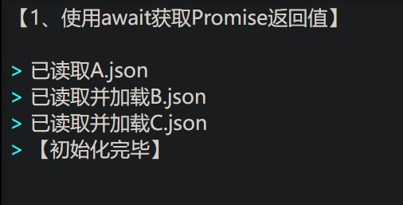
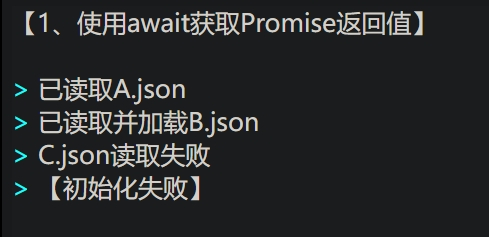
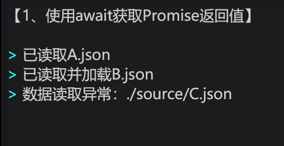

# await

说到``Promise``就不得不提到``await``，这个关键词是专门针对``Promise``以及异步函数``async``的，作用很简单，阻塞、同步、获取异步结果

使用``await``后不必再勉强调用``Promise.then``，让代码更加扁平化

特别补充：``await``必须用在``async``异步函数内，别问，自己领会


<br>


# 示例代码：

可以在线打开本目录下的``./source/*.html``以查看运行结果。

```js
let print=console.log;
function RequestUrl(url, flag) {//模拟数据请求，flag确定假定的3种请求结果
	return new Promise((resolve, reject) => {
		setTimeout(() => {
			if (flag > 0) {
				let lst = url.split('/');
				resolve(String(flag) + '、' + lst[lst.length - 1]);
			}
			else if (flag == 0)
				resolve(null);
			else
				reject('数据读取异常：' + url);
		}, 500);
	});
}

async function Init(testFlag = [1, 0, -1]) {
	let A = await RequestUrl('./source/A.json', testFlag[0]);
	let flag = true;
	if (A) {//模拟在A请求成功后的行为
		print('已读取A.json');
		let B = await RequestUrl('./source/B.json', testFlag[1]);
		if (B) {
			print('已读取并加载B.json');
		}
		else {
			print('B.json读取失败');
			flag = false;
		}
		let C = await RequestUrl('./source/C.json', testFlag[2]);
		if (C) {
			print('已读取并加载C.json');
		}
		else {
			print('C.json读取失败');
			flag = false;
		}
	}
	else {
		print('A.json读取失败');
		flag = false;
	}
	return flag ? '【初始化完毕】' : '【初始化失败】';
}

let testFlag = [//依次注释，观察运行结果
	// [1, 1, 1],
	// [1, 1, 0],
	[1, 1, -1],
	[1, 0, 1],
	[1, 0, 0],
	[1, 0, -1],
	[0, 1, 1],
	[-1, 1, 1],
][0];
let rst = Init(testFlag);
rst.then((val) => { print(val) }).catch((err) => print(err))
```






# 参考：
- async函数：[https://developer.mozilla.org/zh-CN/docs/Web/JavaScript/Reference/Statements/async_function](https://developer.mozilla.org/zh-CN/docs/Web/JavaScript/Reference/Statements/async_function)

- await：[https://developer.mozilla.org/zh-CN/docs/Web/JavaScript/Reference/Operators/await](https://developer.mozilla.org/zh-CN/docs/Web/JavaScript/Reference/Operators/await)

- 理解 JavaScript 的 async/await：[https://segmentfault.com/a/1190000007535316](https://segmentfault.com/a/1190000007535316)


