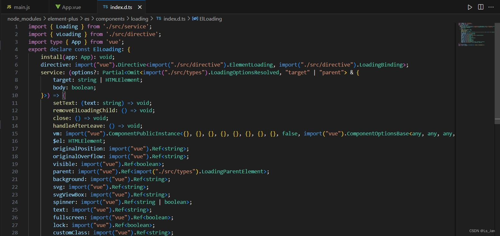
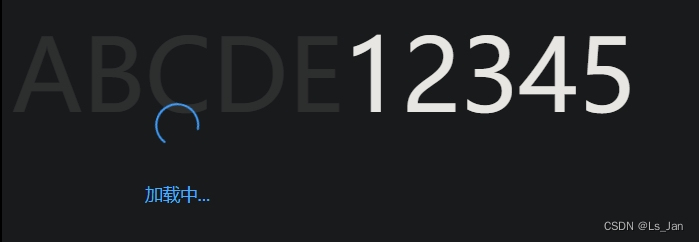

>【新增：2024/1/18】
>除了本例的中通过``app.directive``注册指令的方式外，还有另一种方法，使用``app.use``的方式安装插件
>```js
>import ElementPlus from 'element-plus'
>app.use(ElementPlus)
>```
>``app.directive``：[https://cn.vuejs.org/api/application.html#app-directive](https://cn.vuejs.org/api/application.html#app-directive)
>``app.use``：[https://cn.vuejs.org/api/application.html#app-use](https://cn.vuejs.org/api/application.html#app-use)
>
> 上面两个对``app``的操作都是全局性的。

<br>

***


<font size=7 face="cursive">
<font color=#FF8800>快</font>
<font color=#FF0000>来</font>
<font color=#0000FF>品</font>
<font color=#FF00FF>shi</font>
<font color=#44FF44>！</font>
</font>

***
# 辛路历程：

&emsp;&emsp;[ElementPlus官方文档#Loading加载](https://element-plus.org/zh-CN/component/loading.html)中使用``v-loading``实现加载效果，但只字不提``v-loading``是哪来的，而且因为刚入门，我也不清楚``v-loading``到底是个什么东西。
&emsp;&emsp;搜索v-loading得到的基本是没有帮助的结果，在痛苦品shi数小时后，才知道原来有个“指令”的东西[Vue官方文档#自定义指令](https://cn.vuejs.org/guide/reusability/custom-directives.html)，然后又摸索了一段时间，才知道原来<b><font color=#00FFFF size=4>v-loading是个自定义指令</font></b>，但依旧不清楚这个指令要通过什么方式来注册(想想就火大，这shi是真恶心，官方文档写的什么垃圾，对新手完全不友好)

&emsp;&emsp;在Vue中继续找，找到一个与注册指令有关的函数``directive``，估计这就是我想要的，然后再找找``v-loading``指令的位置，但找不到，然后想到和它有关联的组件``ElLoading``，Ctrl+左键点击跳转<font size=1>(我用的IDE是VSCode)</font>，理所当然地出现了我完全看不懂的代码


&emsp;&emsp;但哪怕在这片陌生代码中，我至少发现了关键词``install``、``directive``、``service``，而``directive``和Vue注册自定义指令用到的函数名一模一样，于是猜想多半就是这玩意儿了。


<br>

***

# 注册自定义指令loading：

在``main.js``中导入``ElLoading``组件，并在app应用实例挂载``app.mount``之前加上一条指令注册语句``app.directive('loading',ElLoading.directive)``，然后``v-loading``指令就能正常使用了

### main.js
```javascript
//main.js
import { createApp } from 'vue'
import App from './App.vue'
import 'element-plus/dist/index.css'
import 'element-plus/theme-chalk/dark/css-vars.css'
import { ElLoading } from 'element-plus'//【新增】

const app=createApp(App);
app.directive('loading',ElLoading.directive)//【新增】
app.mount('#app');
```


<br>

***

# 运行结果：
### App.vue

```html
<!-- App.vue -->
<script setup>
import { ref } from 'vue'
const isLoading=ref(true)
</script>

<template>
  <div v-loading="isLoading" element-loading-text="加载中...">
    <p style="font-size:5rem">ABCDE</p>
  </div>
  <div >
    <p style="font-size:5rem">12345</p>
  </div>
</template>
```



<br>

***
# 补充：
- 或许[ElementPlus#快速开始](https://element-plus.org/zh-CN/guide/quickstart.html)提到的“自动导入”能够解决这个问题？但可惜我手导的。
- 大概率是有其他解决方法，但我压根就不想再找了。有其他解决方法的欢迎评论补充。

