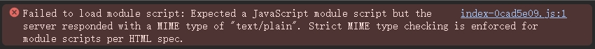
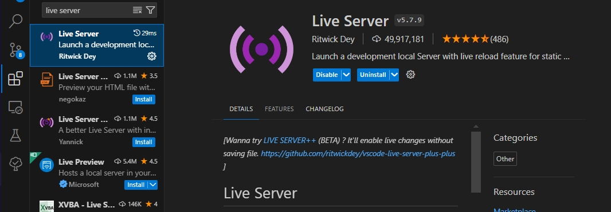

有多种方式设置并启动本地服务器，而我只会最简单的python启动，其他方式搭建本地服务器。


# 1、Python启动：
使用``python -m http.server``这个方式启动服务器的一个问题就是，容易出现MIME类型错误。


因此需要通过脚本配置参数的方式来启动本地服务器。

```py
#如果直接使用python -m http.server启动本地服务器的话会出现一个问题就是MIME错误，
#不懂网页前端开发，也不怎么想动Vue项目的配置，因为打出来的项目挂在github.io主页是能正常使用的，所以怎么都感觉不该是Vue项目配置的问题，
#然后我半懂不懂地去搜本地服务器如何携带MIME信息，于是找到这份代码。
#源码：https://dev.to/gavi/custom-mime-type-with-python-3-httpserver-530l

# Set the server address and port
server_address = ("localhost", 8000)
print(f"Serving on http://{server_address[0]}:{server_address[1]}")

# 【打开网页】
if True:
	import os
	os.system(f'explorer http://{server_address[0]}:{server_address[1]}')

import http.server
import socketserver
from urllib.parse import urlparse

# Define the custom MIME types
custom_mime_types = {
    ".js": "text/javascript",
	# ".wgsl": "text/javascript",
    # Add more custom MIME types here as needed
}

class CustomMimeTypesHTTPRequestHandler(http.server.SimpleHTTPRequestHandler):
    def guess_type(self, path):
        url = urlparse(path)
        file_ext = url.path
        pos = file_ext.rfind('.')
        if pos != -1:
            file_ext = file_ext[pos:]
        else:
            file_ext = ""

        # Check if the file extension has a custom MIME type
        if file_ext in custom_mime_types:
            return custom_mime_types[file_ext]

        # Fallback to the default MIME type guessing
        return super().guess_type(path)

# Set the handler to use the custom class
handler = CustomMimeTypesHTTPRequestHandler
# Create the server and bind the address and handler
httpd = socketserver.TCPServer(server_address, handler)
httpd.serve_forever()
```


<br>

# 2、VsCode启动
VsCode有个叫**Live Server**的插件，安装这个插件后就能在VSCode中边修改网页代码边查看效果。



<br>

# 3、npm启动
使用``npm run dev``启动开发服务器，主要用于网页项目开发(例如Vue项目)。
只不过好像还有个命令也是启动开发服务器的，``npm run dev``，不是很懂。
- npm run dev，深入了解其背后的工作原理：[https://developer.baidu.com/article/detail.html?id=2884796](https://developer.baidu.com/article/detail.html?id=2884796)
- Vue.js中”npm run serve”和”npm run dev”的区别：[https://geek-docs.com/vuejs/vue-js-questions/435_vuejs_difference_between_npm_run_serve_and_npm_run_dev_in_vuejs.html](https://geek-docs.com/vuejs/vue-js-questions/435_vuejs_difference_between_npm_run_serve_and_npm_run_dev_in_vuejs.html)


<br>
<br>
<br>


