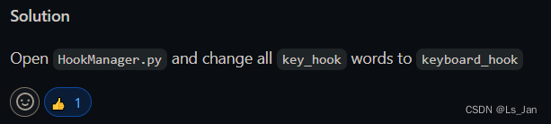

# 1、建议先把```PyHook3.HookManager```的一个小bug修好
这是类对象的析构bug，被析构(del)时触发：```AttributeError: 'HookManager' object has no attribute 'keyboard_hook'```
如果没修过的话下面代码运行时会触发该bug(我修过了所以就不发截图)
```python
from PyHook3 import HookManager
def Func():
    hm = HookManager()
Func()    
```
解决方法如图(点击图片跳转github链接)：
<a href="https://github.com/Tungsteno74/pyWinhook/issues/11"></a>

<br>

***

# 2、```PyHook3.HookManager```的挂钩行为要在单个线程内完成，不允许跨线程
提到钩子，就不得不提到伟大的win32编程中的一个~~坑爹~~伟大的API，没错就是[SetWindowsHookEx 函数 (winuser.h)](https://learn.microsoft.com/zh-cn/windows/win32/api/winuser/nf-winuser-setwindowshookexa)
虽然它提到了调用```SetWindowsHookEx```之后需要调用```UnhookWindowsHookEx```卸载钩子，但是它只字不提跨线程的事，说的简单点就是，<font size=4 color=#CCFFAA>钩子的挂上和取下，都要在同一个函数内完成，不能跨线程</font>，要不然你就能切身体会到什么叫“摸不着的痛苦”。关于win32的钩子使用方法我有空再写。

回到这里，同样的，PyHook3的全局钩子，怎么可能绕得开底层API，既然底层API都要在同个线程里完成钩子的挂上和取下，那么在Python更不用提了。<font size=4 color=#CCFFAA>如果不在同个生命周期内完成钩子的安装和卸载，那么这个钩子就直接废掉无法正常使用</font>。

测试代码如下：
```python
from threading import Thread
from PyHook3 import HookManager
from time import sleep
import pythoncom

def onMouseEvent(event):#回调函数-鼠标
    print(event.Position)
    return True

hm=None#HookManager对象，由函数ThreadFunc创建生成
def ThreadFunc():
    global hm
    hm=HookManager()
    hm.MouseAll = onMouseEvent
    hm.HookMouse()
    # hm.UnhookMouse()#取消这条注释，或者注释掉上一条的“hm.HookMouse()”，都能成功运行钩子函数
    
if __name__=='__main__':
    Thread(target=ThreadFunc).start()
    sleep(0.1)
    hm.UnhookMouse()
    hm.HookMouse()
    pythoncom.PumpMessages()#进入消息循环
```

然后就是，顺便说一下“全局钩子”。以下为简短的科普时间，不感兴趣的可以跳过。

在win32编程中，全局钩子指的是鼠标和键盘，全局钩子是个挂上后到哪都能成功生效的玩意儿(而不只是局限于某个进程)。其中，钩子的枚举值为```WH_KEYBOARD_LL```和```WH_MOUSE_LL```，[<font color=#DDDDFF size=1>(点此查看所有钩子枚举值)</font>](https://learn.microsoft.com/zh-cn/windows/win32/api/winuser/nf-winuser-setwindowshookexa#remarks)，其中“LL”的意思是“Low-Level”，也就是“低级”的意思，但这并不是通俗意义上的“差”的意思，而是“底层”的那种，说白了就是，它优先级高，而且生效范围广。一般情况下Low-Level函数会更加难用、更易受限一点(例如适用系统受限)，例如[Low-Level控制台输出函数](https://learn.microsoft.com/zh-cn/windows/console/low-level-console-output-functions)


<br>
<br>

***

# 3、钩子挂上后必须进入消息循环
钩子必须进入消息循环才能正常生效，想通过```time.sleep()```、```threading.Event.wait()```等方法替代消息循环让钩子只运行一段时间的白日梦实际上只会徒增痛苦。这里和<font size=4 color=#CCFFAA>“一般线程不允许修改UI元素，想修改UI元素必须使用UI线程”</font>有点像，也就是“用特定的API完成特定的行为”，在这里的话就是挂上钩子后必须进入消息循环，(我可没说进入消息循环只能用```pythoncom.PumpMessages```这个函数)
```python
from threading import Event#信号量
from threading import Thread
from PyHook3 import HookManager
from time import sleep
import pythoncom

def onMouseEvent(event):#回调函数-鼠标
    print(event.Position)
    return True

event=Event()#信号量
def ThreadFunc():
    hm=HookManager()
    hm.MouseAll = onMouseEvent
    hm.HookMouse()
    pythoncom.PumpMessages()#进入消息循环，只有这个才能成功运行，但是无法退出
    # sleep(1)#使用sleep，无端的挣扎并且钩子函数并没有成功调用
    # event.wait()#使用Event.wait等待信号，也是无端的挣扎
    hm.UnhookMouse()
    
if __name__=='__main__':
    event.clear()#清除状态
    Thread(target=ThreadFunc).start()
    sleep(2)
    event.set()#设置状态
```


<br>
<br>

***

# 4、建议使用```win32gui.PumpMessages```进入消息循环
这里先说一下，win32gui和pythoncom应该是一家人，为什么说是“应该”呢，因为我也没去细查。
```pythoncom的API：```[http://www.markjour.com/docs/pywin32-docs/pythoncom.html](http://www.markjour.com/docs/pywin32-docs/pythoncom.html)
```win32gui的API：```[http://www.markjour.com/docs/pywin32-docs/win32gui.html](http://www.markjour.com/docs/pywin32-docs/win32gui.html)
这俩模块均在同一个网站中，只不过这网站我也不敢说它是官网，虽然文档是英文的，但是文档不全(有些API只有签名没有说明功能和用法)，而且网页的标签图标居然是中文的“码”字...

然后就是，```pythoncom.PumpMessages```和```win32gui.PumpMessages```可以说是一模一样了，API一样，功能也一样的说，而且更主要的是，使用win32gui的API能让代码更加可控，让你随时退出消息循环取下钩子。运行下面测试代码，带你开辟新世界。<font size=1>(编程老手请绕道，容我在此装杯)</font>
```python
#代码运行的1秒内，移动鼠标将输出鼠标坐标
#代码运行1秒后，钩子取下
#代码运行2秒后，结束运行

import win32gui as WG#喜闻乐见的消息循环PumpMessages
import win32api as WA#获取当前线程tid
import win32con as WC#获取枚举值WM_QUIT
from threading import Thread
from PyHook3 import HookManager
from time import sleep

def onMouseEvent(event):#回调函数-鼠标
    print(event.Position)
    return True

tid=0#线程id
def ThreadFunc():#线程
    global tid
    hm = HookManager()
    hm.MouseAll = onMouseEvent
    hm.HookMouse()
    tid=WA.GetCurrentThreadId()
    WG.PumpMessages()


if __name__=='__main__':
	print("Start Tracking")
	Thread(target=ThreadFunc).start()

	sleep(1)
	print("Stop Tracking")
	WG.PostThreadMessage(tid,WC.WM_QUIT,0,0)#偶然找到的API：https://www.cnblogs.com/strive-sun/p/14487576.html

	sleep(1)
	print("Exit")
	exit()

```

<br>
<br>

***

# 5、[新坑]```PyHook3```和```PyQt```和```win32ui```之间的奇妙制约
在```PyHook3```和```PyQt5```之间结合的好好的，然后导入```win32ui```时立马臭了，而且很奇妙的是，这仨，俩俩相互结合使用时都没问题，但仨一起的时候真的立马恶心了起来，<b>不知道锅是谁的</b>。
至于为什么我要用到```win32ui```，那是因为我的一段代码需要使用屏幕截取，结果一下就臭了，之后得绕开使用别的方法截取屏幕。

下面代码在运行时，只要Qt窗口具有窗口焦点，那么鼠标移到该窗口时必然出现严重卡顿+无响应，注释掉```import win32ui```可正常运行
```python
import win32ui #该语句一旦运行，那么鼠标移至Qt窗口时必然会出现卡顿情况

import sys
from PyQt5.QtWidgets import QWidget,QApplication
from threading import Thread

from PyHook3 import HookManager
import win32gui as WG#喜闻乐见的消息循环PumpMessages
import win32api as WA#获取当前线程tid
import win32con as WC#获取枚举值WM_QUIT

class MouseHook:
    __tid=None#线程id
    def Start(self):
        if(not self.__tid):
            Thread(target=self.__ThreadFunc).start()
    def Stop(self):
        if(self.__tid):
            WG.PostThreadMessage(self.__tid,WC.WM_QUIT,0,0)

    def __ThreadFunc(self):#线程函数
        self.__tid=WA.GetCurrentThreadId()
        hm = HookManager()
        hm.MouseAll = self.__OnMouseEvent#设置挂钩函数
        hm.HookMouse()#启动挂钩
        WG.PumpMessages()#进入消息循环，直到调用WG.PostThreadMessage(tid,WC.WM_QUIT,0,0)
        hm.UnhookMouse()#关闭挂钩
        self.__tid=None
    def __OnMouseEvent(self,event):#回调函数-鼠标
        print(event.Position)
        return True

if __name__ == '__main__':
    app = QApplication(sys.argv)
    
    w=QWidget()
    w.show()
    mk=MouseHook()
    mk.Start()
    
    exit(app.exec())
    
```


<br>
<br>

***

# 6、[补坑]使用```PyQt```时若有UI操作则应尽可能避免使用```threading.Thread```
一些奇奇怪怪的UI病症很多时候是由```threading.Thread```引发的(而且往往会将问题误认为是其他地方造成的)，例如上面第5点中提到的模块冲突问题。如果子线程由Qt的线程(或者使用信号量```PyQt5.QtCore.pyqtSignal```)创建而不是使用```threading.Thread```的话那么问题将直接解决...
以下为样例代码：

```python
import win32ui#即使不注释该句，脚本也能正常运行

import sys
from PyQt5.QtWidgets import QWidget,QApplication
from PyQt5.QtCore import Qt,QObject,pyqtSignal

from PyHook3 import HookManager,HookConstants
import win32gui as WG#喜闻乐见的消息循环PumpMessages
import win32api as WA#获取当前线程tid
import win32con as WC#获取枚举值WM_QUIT


class MouseHook(QObject):
    __tid=None#线程id
    __signal=pyqtSignal()
    def __init__(self):
        super().__init__()
        self.__signal.connect(self.__ThreadFunc)
    def Start(self):
        if(not self.__tid):
            self.__signal.emit()
    def Stop(self):
        if(self.__tid):
            WG.PostThreadMessage(self.__tid,WC.WM_QUIT,0,0)

    def __ThreadFunc(self):#线程函数
        self.__tid=WA.GetCurrentThreadId()
        hm = HookManager()
        hm.MouseAll = self.__OnMouseEvent#设置挂钩函数
        hm.HookMouse()#启动挂钩
        WG.PumpMessages()#进入消息循环，直到调用WG.PostThreadMessage(tid,WC.WM_QUIT,0,0)
        hm.UnhookMouse()#关闭挂钩
        self.__tid=None
    def __OnMouseEvent(self,event):#回调函数-鼠标
        print(event.Position)
        WA.SetCursorPos(event.Position)
        if(event.Message==HookConstants.WM_RBUTTONDOWN):#按下右键结束
            self.Stop()
            return False
        return True


if __name__ == '__main__':
    app = QApplication(sys.argv)
    
    w=QWidget()
    w.show()
    mk=MouseHook()
    mk.Start()
    
    exit(app.exec())
    
```

<br>


