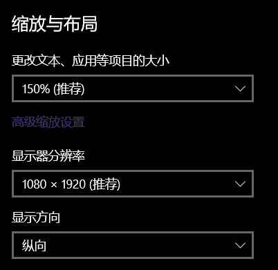
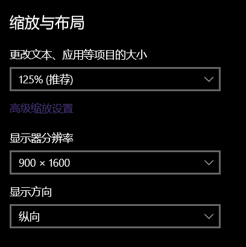
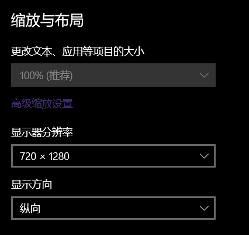

# DPI简述：
DPI简单含义是每英寸像素显示个数，也就是屏幕1英寸下显示多少个像素点，这个参数一般由硬件决定，**在屏幕同尺寸大小的情况下，分辨率越高的显示像素愈多，DPI也就越高，图象效果愈加精美，这也是高分屏的存在意义**，因此常听到某某手机分辨率多高多高就是因为手机大小通常是不会超过某个阈值(尺寸过大反倒丢失了手机的便携性)，分辨率越高显示越好。
市面上的手机分辨率通常都在上千(例如2340x1080)，DPI在300左右的都属于标配，在手机上小小的截个屏，放电脑上甚至还能接着放大显示。
但上面提到的都是物理DPI，实际上在操作系统层面上DPI可以自由调整的(至少不太落后的系统都支持DPI设置)，当然包括你的手机，在手机中进入开发者选项后可以修改**dp值**就能观察到不同dpi下的画面效果，当然不建议乱来，小心变砖，就像前段时间流行的在电脑设置中将屏幕缩放调到500%后调不回来的乐子风波。

# DPI的种类：
DPI有三种，其中关键的是后两种。
**这里强调一下，是三种DPI，很多人都以为是两种(物理DPI+逻辑DPI)，并且很多官方代码和API都是用“Logical”和“Physical”来表示，这没问题，问题出在了不少人将“物理DPI”理解错了，然后做出的分析出现了各种奇怪的逻辑漏洞。**

- **适宜DPI**：这个参数与物理设备(也就是显示器)相关。显示器有两个固定参数，分别是 ``分辨率(屏幕像素个数)`` 和 ``尺寸(屏幕大小)``，前者决定最大分辨率(同时也是推荐分辨率)，后者与屏幕当前分辨率共同决定适宜DPI。在win10的显示设置中设置缩放时会有个推荐值，这个值就是适宜DPI决定的；
- **屏幕DPI**：为了避免出现混淆，不采用“系统DPI”这种说法，也不采用“物理DPI”这种说法。这个属性可以通过系统设置对每个显示器进行单独设置，或者说每个屏幕/监视器都有着自己的屏幕DPI，例如在win10中可以通过显示设置中的缩放值进行调整，其他win系统的设置方式看实际情况；
- **软件DPI**：软件会默认使用96这个值，当然可以通过其他方式设置不一样的值(实际上只能设置与主屏幕DPI一致的值)，软件DPI将直接影响软件界面的绘制；

 

以上名称都是个人方便理解而创造的，换句话说就是这些名称在官方代码中有别的一套术语(而官方术语在我看来反而容易造成混淆，多半是历史包袱导致这些术语不能改动)，例如我这里说的“屏幕DPI”对应“Physical DPI”，“软件DPI”对应“Logical DPI”或是“System DPI”。
那么为什么我这里提到的“适宜DPI”没有对应的官方术语？想想也很简单，因为在代码层面并不需要这个参数所以就没有被纳入其中(如果真需要这份数据可以自己计算，就是难度有点高，而且这玩意儿也不顶用)

# 不同分辨率下的缩放推荐值会发生变化：
对我的副屏进行分辨率设置，可以看到推荐值(适宜DPI)都发生了不同的变化，也就是适宜DPI实际上并不是固定的，它会根据屏幕实际设置的分辨率而发生改变。
- 1920x1080 = 120*(9x16) → 150%
- 1600x900 = 100*(9x16) → 125%
- 1280x720 = 80*(9x16) → 100%

我副屏的物理大小，按标准显示器来看应该设置为1280x720的分辨率(实际上也可以直接这么做)，但调低分辨率会导致屏幕展示的像素个数变少，从而导致信息展示量变少(要不然为啥做高分屏，拿着高分屏设置低分辨率，您瞧瞧这做的是人事？)

# 参考：
- 技术贴，高DPI下程序完美显示：[https://tieba.baidu.com/p/4075787848#post_content_76655428316](https://tieba.baidu.com/p/4075787848#post_content_76655428316)
- Windows 上的高 DPI 桌面应用程序开发：[https://learn.microsoft.com/zh-cn/windows/win32/hidpi/high-dpi-desktop-application-development-on-windows?redirectedfrom=MSDN](https://learn.microsoft.com/zh-cn/windows/win32/hidpi/high-dpi-desktop-application-development-on-windows?redirectedfrom=MSDN)
- 高 DPI 参考：[https://learn.microsoft.com/zh-cn/windows/win32/hidpi/high-dpi-reference](https://learn.microsoft.com/zh-cn/windows/win32/hidpi/high-dpi-reference)

