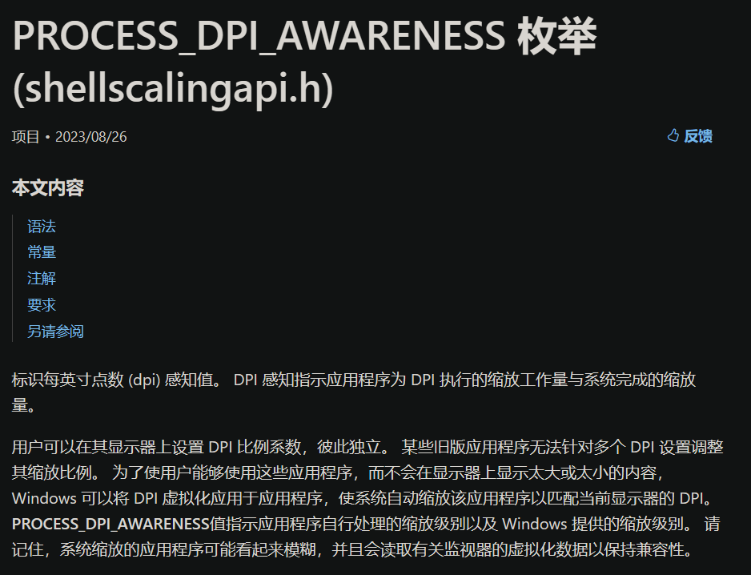
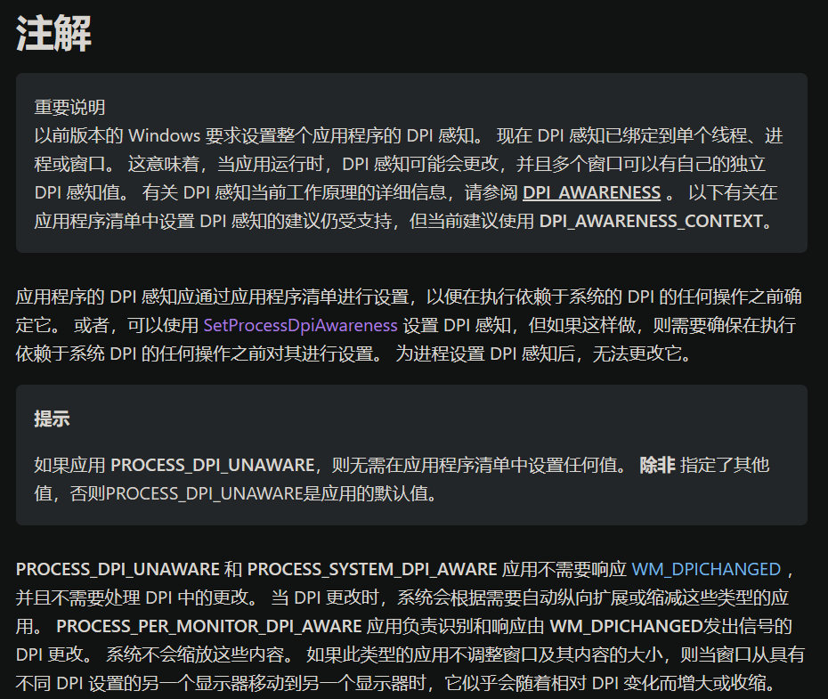

# 高DPI场景：
win的默认DPI是96(`USER_DEFAULT_SCREEN_DPI`)，这数字是历来就有的，你也可以说它这玩意儿纯纯一魔法数字/经验数值(相信土木水利人对“经验数值”感触良多)，在屏幕没发展的时候使用这个方法自然省事，因为市面上绝大多数屏幕的尺寸和分辨率都在一个合理范围内，并且在当时win占据大量市场的情况下DPI不是96的屏幕成为了一种异类。^(该观点未经考究，不确定是否正确，96在当时有可能是业界标准?)^
而后来屏幕越做越大，分辨率越来越高，96的DPI已经逐渐不能满足需求，高DPI也逐渐成为了一种趋势。而这带来了一个问题，那就是小小的屏幕装下了多多的像素，导致本该正常显示的内容实际上“缩水了”。
举个例子就是，一块高级屏幕，分辨率很高，但物理尺寸很小(换句话说就是物理DPI很高)，要是仍古板地使用96这个值作为屏幕DPI的话那就会直接带来一个问题，那就是理论上96像素在屏幕上对应1英寸，但实际上会小于1英寸，在视觉效果上会感受到图标和文字明显变小了，如果你用的是古老windos的话就会出现这种问题(因为老系统将接入的所有屏幕的DPI值都视为96)。
打个比方，在电脑上的字体通常情况下是32像素左右就能看得很清晰，而在手机里头32像素的字有如视力检查屏底部那细若蚊足的小字。

为了解决这个问题，winVista引入了DPI虚拟化这个概念，将传统的DPI再细化为屏幕DPI和软件DPI^(此为个人对DPI虚拟化的理解)^，屏幕DPI不再是固定的96，而是适合当前屏幕/监视器的一个值，这个值可由用户在系统显示设置中决定，同时软件DPI与屏幕DPI出现不一致时软件界面会被强制缩放^(这说法实际不严谨，后面提到虚拟屏幕时会再次说明)^，使得默认使用96DPI的旧软件可以不经任何改动就能在新系统中正常使用，甚至在不同屏幕下的显示大小都能保持一致，例如字体图片图标窗口大小等，噢，这伟大的向下兼容性啊(新系统兼容旧软件)，至于模糊啥的那没办法，至少偷着乐吧不用改软件就能兼容使用。

 

# DPI虚拟化：

在``PROCESS_DPI_AWARENESS``的[官方文档](https://learn.microsoft.com/zh-cn/windows/win32/api/shellscalingapi/ne-shellscalingapi-process_dpi_awareness)中提到了DPI虚拟化，它的作用就和我上面提到的一样，当软件DPI和屏幕DPI不一致时操作系统就会对界面进行强制缩放。

# 补充：
winVista除了引入了DPI虚拟化外，还提供了一个API``SetProcessDPIAware``用于软件DPI的间接设置，此后可以通过这个API使软件DPI和屏幕DPI保持一致(保持一致后就不用担心软件界面被缩放了)。
只不过随着win系统的发展，这个API已经变得落后，后面win8.1推出了``SetProcessDpiAwareness``并引入了**DPI感知模式**的概念。
再然后在win10中继续新增了额外的**DPI感知模式**并不断加以完善，同时将**DPI感知模式**绑定到更小的线程上面使之操作更为灵活。

 

在``PROCESS_DPI_AWARENESS``的[官方文档](https://learn.microsoft.com/zh-cn/windows/win32/api/shellscalingapi/ne-shellscalingapi-process_dpi_awareness)有段注解简单说明了DPI感知已经细化到线程级别。

# 参考：
- Windows 上的高 DPI 桌面应用程序开发：[https://learn.microsoft.com/zh-cn/windows/win32/hidpi/high-dpi-desktop-application-development-on-windows?redirectedfrom=MSDN](https://learn.microsoft.com/zh-cn/windows/win32/hidpi/high-dpi-desktop-application-development-on-windows?redirectedfrom=MSDN)
- ``PROCESS_DPI_AWARENESS``：[https://learn.microsoft.com/zh-cn/windows/win32/api/shellscalingapi/ne-shellscalingapi-process_dpi_awareness](https://learn.microsoft.com/zh-cn/windows/win32/api/shellscalingapi/ne-shellscalingapi-process_dpi_awareness)
- Windows 的字体渲染的一些鸟事：[https://www.bilibili.com/read/cv27282436/](https://www.bilibili.com/read/cv27282436/)
- DPI适配之理论篇：[https://www.cnblogs.com/cherishui/p/13209789.html](https://www.cnblogs.com/cherishui/p/13209789.html)
- ``SetProcessDPIAware``：[https://learn.microsoft.com/zh-cn/windows/win32/api/winuser/nf-winuser-setprocessdpiaware](https://learn.microsoft.com/zh-cn/windows/win32/api/winuser/nf-winuser-setprocessdpiaware)
- ``SetProcessDpiAwareness``：[https://learn.microsoft.com/zh-cn/windows/win32/api/shellscalingapi/nf-shellscalingapi-setprocessdpiawareness](https://learn.microsoft.com/zh-cn/windows/win32/api/shellscalingapi/nf-shellscalingapi-setprocessdpiawareness)
- ``SetProcessDpiAwarenessContext``：[https://learn.microsoft.com/zh-cn/windows/win32/api/winuser/nf-winuser-setprocessdpiawarenesscontext](https://learn.microsoft.com/zh-cn/windows/win32/api/winuser/nf-winuser-setprocessdpiawarenesscontext)
- ``SetThreadDpiAwarenessContext``：[https://learn.microsoft.com/zh-cn/windows/win32/api/winuser/nf-winuser-setthreaddpiawarenesscontext](https://learn.microsoft.com/zh-cn/windows/win32/api/winuser/nf-winuser-setthreaddpiawarenesscontext)
- ``PROCESS_DPI_AWARENESS``：[https://learn.microsoft.com/zh-cn/windows/win32/api/shellscalingapi/ne-shellscalingapi-process_dpi_awareness](https://learn.microsoft.com/zh-cn/windows/win32/api/shellscalingapi/ne-shellscalingapi-process_dpi_awareness)
- 知识分享：物理分辨率与逻辑分辨率？：[https://juejin.cn/post/6941678925542064158](https://juejin.cn/post/6941678925542064158)
- 了解屏幕缩放问题：[https://learn.microsoft.com/zh-cn/windows/win32/winauto/uiauto-screenscaling](https://learn.microsoft.com/zh-cn/windows/win32/winauto/uiauto-screenscaling)

