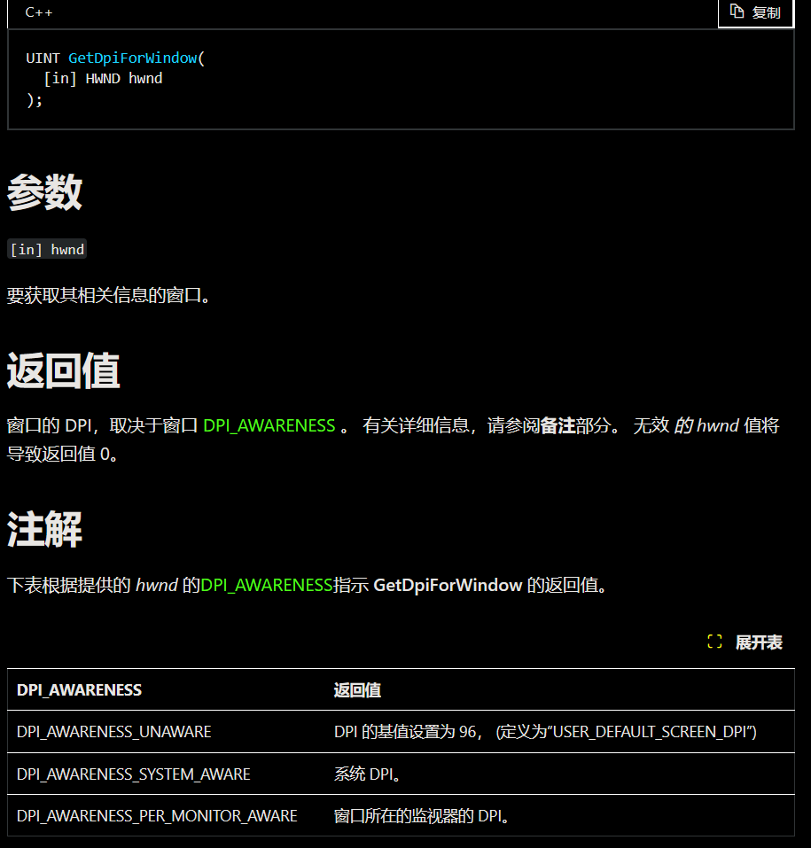
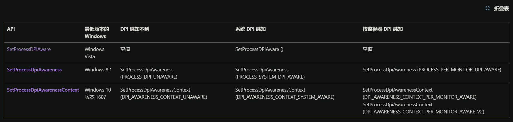
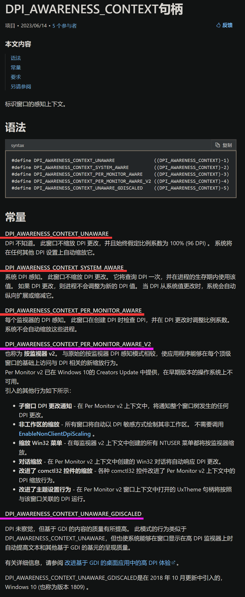

在说DPI感知之前，有个内容不得不进行补充，那就是DPI还有第四种。

# 第四种DPI：

**事实上，这里，还有一种DPI。**
**DPI种类其实不止前面提到的三种。**

这个是v软造成的历史问题，坑了我很长一段时间，真的是，非常恶心。
于是这里不得不发出个人看法：软件DPI还有什么实际存在意义？或者说它到底还能拿来干嘛？(高情商：下兼容，下兼容)。
但我又不敢把话说的太死，提出软件DPI无用论，万一哪天v软来个秽土重生在其他场合复活了软件DPI的话，那岂不是啪啪打我脸？

- **窗口DPI**：这是在软件DPI的基础上再进行细化的，该参数仅**在设置``DPI动态感知``时会与屏幕DPI保持一致**，否则会与软件DPI保持一致。虽然在win8.1就能设置动态DPI感知，但这个win系统并没有提供直接的窗口DPI获取手段，而后win10中增加的``GetDpiForWindow``解决了这个问题，参见[官方文档](https://learn.microsoft.com/zh-cn/windows/win32/api/winuser/nf-winuser-getdpiforwindow)。

 

# DPI感知：
DPI感知，粗略上说有三个模式(未来windows版本或许还会继续增加？不好说，虽然我觉得目前暂时够用)：

#### ``DPI_AWARENESS_CONTEXT_UNAWARE``：无感知(默认)
- 另一个同含义但不建议使用的枚举量为``PROCESS_DPI_UNAWARE``；
- 官方称为“DPI 不感知”；
- 这个是默认的，用于兼容旧程序(老程序默认使用该模式)；
- **软件DPI锁死在96**；
- **窗口DPI始终与软件DPI保持一致**；
- 由于作用和静态感知差不多(唯一区别或许就是静态感知会修改一下软件DPI)，可以理解为静态感知的v0版；

#### ``DPI_AWARENESS_CONTEXT_SYSTEM_AWARE``：静态感知(winVista引入)
- 另一个同含义但不建议使用的枚举量为``PROCESS_SYSTEM_DPI_AWARE``；
- 官方称为“系统 DPI 感知”；
- 这个是落后的感知模式，自winVista引入，使用API``SetProcessDPIAware``将设置为该模式；
- **该模式适用于 程序仅在主屏幕显示+屏幕DPI不变 的简单环境**，事实上主屏DPI发生变化后直接重启程序即可使界面恢复正常，这也就是为什么在win系统设置中调整屏幕缩放时会弹出一段小字提示部分程序需重启才能正常显示；
- **软件DPI会锁定为当前主屏幕的屏幕DPI值，屏幕DPI变化时并不修改软件DPI。** 说实话软件DPI的实际作用并不大，顶多就是获取一下当前主屏的缩放比例罢了。因为没有获取屏幕DPI的直接手段，仅凭单独的软件DPI并不能判断程序界面在当前屏幕下的缩放情况；
- **窗口DPI始终与软件DPI保持一致**；
- **屏幕DPI发生变化时程序无法做出反应，或者说该模式下程序对屏幕DPI不敏感。** 因为这模式下界面的缩放是交由系统完成的，程序不需要关心屏幕DPI变化所导致的界面显示问题；
- **只能保证主屏的虚拟屏幕与物理屏幕是暂时同步的**，其他屏幕/监视器无法保证，并且主屏的屏幕DPI发生改变时该同步性也会丢失；

#### ``DPI_AWARENESS_CONTEXT_PER_MONITOR_AWARE``：动态感知(win8.1引入)；
- 另一个同含义但不建议使用的枚举量为``PROCESS_PER_MONITOR_DPI_AWARE``；
- 官方称为“按监视器 DPI 感知”；
- 这个模式自win8.1引入(强调一下，动态感知不是win10才有的)，这个是较为通用的感知模式，win10及以后的系统都至少设置为该模式(至少目前来说这个模式较为实用，虽然缺点依旧是存在的)；
- **该模式适用于 程序在多个屏幕中拖动显示+屏幕DPI动态多变 的复杂环境**；
- **和静态感知一样，软件DPI同样被锁定为当前主屏幕的屏幕DPI值。该模式的软件DPI同样不可信且无实际作用**；
- **窗口DPI始终与窗口所处的屏幕DPI保持一致**；
- **每当屏幕DPI发生变动时，系统都会向程序发送``WM_DPICHANGED``以提示窗口当前的屏幕DPI和窗口DPI已经发生变化，同时会附带更改后的DPI值**(详见``WM_DPICHANGED``的[官方说明](https://learn.microsoft.com/zh-cn/windows/win32/hidpi/wm-dpichanged))；
- **每个监视器的虚拟屏幕与物理屏幕都始终同步**；

#### 简单总结如下：

 

# 补充：
### 不同windows下DPI感知的设置方式：

在官方文档[设置进程的默认 DPI 感知](https://learn.microsoft.com/zh-cn/windows/win32/hidpi/setting-the-default-dpi-awareness-for-a-process)的文末中附带一个总结表格，通过该表格可以清晰看到不同windows系统下设置DPI感知的方法。

- win8.1以前的旧系统最多只能设置“静态感知”(使用``SetProcessDPIAware``设置)，比winVista更老的系统就没辙；
- win8.1引入的设置DPI感知的API``SetProcessDpiAwareness``在win10没法直接使用，得在项目设置中进行简单的静态库配置；
- win10使用``SetThreadDpiAwarenessContext``和``SetProcessDpiAwarenessContext``进行DPI感知设置，那些老API说实在的没有什么调用的必要；
- 其实这种系统上的问题建议视而不见，没有良好的解决方法，也不建议大力投入(没这个必要)，毕竟当前win10市场占有率已经超过一半，做旧系统兼容没有那么大的意义(~~做框架的老哥表示：“这你得跟老板说，其实我也不想做”~~；

### 获取DPI值的手段：
- 事实上，仅自win10起才有获取软件DPI和窗口DPI的手段，分别是``GetDpiForSystem``和``GetDpiForWindow``；
- win8.1获取窗口DPI的手段就是获取``WM_DPICHANGED``所携带的屏幕DPI信息，而这需要重写窗口消息函数，或者说win8.1仅能获取进程内的窗口DPI；
- 目前为止没有直接手段获取屏幕DPI和适宜DPI；

### 其他DPI感知：

实际上，目前在``DPI_AWARENESS_CONTEXT``的[官方文档](https://learn.microsoft.com/zh-cn/windows/win32/hidpi/dpi-awareness-context)中，还出现了另外的两种模式(这俩模式都没实测过)：
- ``DPI_AWARENESS_CONTEXT_PER_MONITOR_AWARE_V2``：我愿称之为“动态感知v2版”，说实话并没有理解它的作用；
- ``DPI_AWARENESS_CONTEXT_UNAWARE_GDISCALED``：我将其称为“静态感知v2版”。
个人的理解是，程序DPI锁死在96，但**绘制行为不会绘制到虚拟屏幕上而是直接绘制物理屏幕上，这能有效避免静态感知中经常出现的图片“缩小再放大”的模糊问题**，
在这个模式下程序员可以不再关注DPI变化所造成的干扰，也不用因为动态感知的缺陷而不得不额外为自己的代码中添加“单元长度”这个成员。
说实话不清楚它是否已经投入使用，或者说不确定兼容性如何，再加上没有虚拟/物理屏幕坐标转换API这个原因，并不是很想用这个模式。
其实个人看来，与其增加这个模式，还不如重新修改底层绘制逻辑，移除掉在虚拟屏幕上的绘制行为，从根源上解决因为虚拟屏幕的缩放造成物理屏幕显示模糊的问题，老程序在高DPI屏下也能清晰显示，何乐不为？(~~现在是，幻想时间~~)；

# 参考：
- ``GetDpiForSystem``：[https://learn.microsoft.com/zh-cn/windows/win32/api/winuser/nf-winuser-getdpiforsystem](https://learn.microsoft.com/zh-cn/windows/win32/api/winuser/nf-winuser-getdpiforsystem)
- ``GetDpiForWindow``：(https://learn.microsoft.com/zh-cn/windows/win32/api/winuser/nf-winuser-getdpiforwindow)[https://learn.microsoft.com/zh-cn/windows/win32/api/winuser/nf-winuser-getdpiforwindow]
- Windows 上的高 DPI 桌面应用程序开发：[https://learn.microsoft.com/zh-cn/windows/win32/hidpi/high-dpi-desktop-application-development-on-windows?redirectedfrom=MSDN](https://learn.microsoft.com/zh-cn/windows/win32/hidpi/high-dpi-desktop-application-development-on-windows?redirectedfrom=MSDN)
- 关于Windows高DPI的一些简单总结：[https://www.cnblogs.com/findumars/p/5785904.html](https://www.cnblogs.com/findumars/p/5785904.html)
- ``DPI_AWARENESS_CONTEXT``：[https://learn.microsoft.com/zh-cn/windows/win32/hidpi/dpi-awareness-context](https://learn.microsoft.com/zh-cn/windows/win32/hidpi/dpi-awareness-context)
- ``PROCESS_DPI_AWARENESS``：[https://learn.microsoft.com/zh-cn/windows/win32/api/shellscalingapi/ne-shellscalingapi-process_dpi_awareness](https://learn.microsoft.com/zh-cn/windows/win32/api/shellscalingapi/ne-shellscalingapi-process_dpi_awareness)
- ``DPI_AWARENESS``：[https://learn.microsoft.com/zh-cn/windows/win32/api/windef/ne-windef-dpi_awareness](https://learn.microsoft.com/zh-cn/windows/win32/api/windef/ne-windef-dpi_awareness)
- 设置进程的默认 DPI 感知：[https://learn.microsoft.com/zh-cn/windows/win32/hidpi/setting-the-default-dpi-awareness-for-a-process](https://learn.microsoft.com/zh-cn/windows/win32/hidpi/setting-the-default-dpi-awareness-for-a-process)
- ``WM_DPICHANGED``：[https://learn.microsoft.com/zh-cn/windows/win32/hidpi/wm-dpichanged](https://learn.microsoft.com/zh-cn/windows/win32/hidpi/wm-dpichanged)
- ``SetProcessDpiAwareness``：[https://learn.microsoft.com/zh-cn/windows/win32/api/shellscalingapi/nf-shellscalingapi-setprocessdpiawareness](https://learn.microsoft.com/zh-cn/windows/win32/api/shellscalingapi/nf-shellscalingapi-setprocessdpiawareness)
- ``SetProcessDPIAware``：[https://learn.microsoft.com/zh-cn/windows/win32/api/winuser/nf-winuser-setprocessdpiaware](https://learn.microsoft.com/zh-cn/windows/win32/api/winuser/nf-winuser-setprocessdpiaware)
