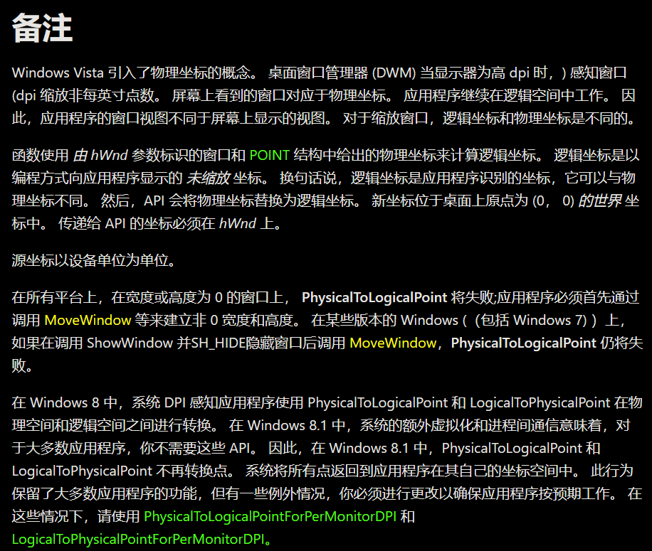

# 物理屏幕坐标：
这问题就仿佛在问“硬盘是什么”。
物理屏幕坐标简单的说就是物理屏幕上的坐标，物理屏幕就是实际展示出来的屏幕，不一定是监视器，有可能还是打印机或是投影仪又或是其他什么怪东西。
物理屏幕展示最终的绘制结果。

# 虚拟屏幕坐标：
虚拟屏幕坐标就是在虚拟屏幕上的坐标。
与物理屏幕相对，虚拟屏幕就是在软件层面上的屏幕，它会经过进一步的映射最终变换为物理屏幕上(没错，有图象变换)，这里的映射变换不展开讨论，太麻烦了而且与DPI关联性不大。
你也可以称虚拟屏幕为“逻辑屏幕”，大差不差。

这里不使用“逻辑坐标”的说法，是因为逻辑坐标在不同地方中有着不同含义(或者说这种词本身就强烈的需要上下文环境)，例如：
- “控件逻辑坐标”：子控件相对父控件的位置，在设置控件位置时简称逻辑坐标或相对坐标；
- “绘图逻辑坐标”：绘制操作与图象变换强相关，习惯将变换前的坐标称为绘图逻辑坐标，然后简称逻辑坐标；

为了严谨性，使用“虚拟屏幕坐标”这种说法。

# 说明：
- 很多相当古老的API(win2000)有着大量关于屏幕坐标的操作，而这些屏幕坐标，都是基于虚拟屏幕上的，换句话说就是虚拟屏幕这概念在相当早的时候就已经出现了。实际上后面推出的新API都是基于虚拟屏幕上的，哪怕部分API的官方文档说是用于获取物理坐标，(有可能是这些API已经过时不适用于新系统?)；
- 如果虚拟屏幕不与物理屏幕同步，大量的坐标API都将无法准确执行，无法得到有效的结果，例如``GetCursorPos``、``ClipCursor``、``GetPhysicalCursorPos``、``GetMonitorInfoA``、``MonitorFromPoint``、``SetWindowPos``、``GetDeviceCaps``等；
- 所谓的虚拟/物理屏幕同步，就是虚拟屏幕和物理屏幕的大小以及位置都是一致的；
- 没有任何虚拟/物理屏幕坐标相互转换的手段(哪怕官方给过相关API，但它们都是过时且无效的)，虽然可以选择自己手搓“虚拟屏幕坐标↔物理屏幕坐标”这样的的映射API，但说实话这没实际意义；
- 虚拟/物理屏幕的直接同步是最有效省事的方式；
- 仅有通过设置**DPI动态感知**才能同步虚拟/物理屏幕；
- 通过设置**DPI静态感知**只能做到主屏幕下的虚拟/物理屏幕的临时同步，其他屏幕无法保证，并且在主屏的屏幕DPI发生变化时主屏那脆弱的同步将会失效；
- 事实上，在**DPI不感知**和**DPI静态感知**这两种情况下，每个显示屏都将满足这样的关系：``软件DPI:屏幕DPI=虚拟屏幕大小:物理屏幕大小``(大小单位是像素)，但虚拟屏幕和物理屏幕的位置之间没有明显的对应关系，这也是不建议“手搓虚拟/物理屏幕坐标的映射转换”的原因；
- 事实上，在**DPI动态感知**下，虚拟/物理屏幕直接同步，导致所有的坐标操作都是基于物理屏幕的，这导致的一个问题就是将窗口从适宜DPI为96的屏幕中移到适宜DPI为192的屏幕下时，窗口(以及内容)都会变得非常小，因此该模式下需要通过其他手段来保证界面的正常显示；
- 当虚拟屏幕与物理屏幕大小不一致时，程序界面会被强制缩放。因为往往仅在**DPI不感知**和**DPI静态感知**这两种情况下才会出现虚拟/物理屏幕不一致，这也就是有“根据屏幕DPI和软件DPI的比值来判断程序当前的缩放情况”这种说法的原因，但这特性在**DPI动态感知**中并不适用，因为该模式下虚拟/物理屏幕已经同步不需要缩放；
- 因为每个程序的DPI感知模式不尽相同，每个程序所使用的虚拟屏幕都是不相同的；

 

# 虚拟/物理屏幕坐标相互转换：

### ``PhysicalToLogicalPoint``和``LogicalToPhysicalPoint``：

假的，不存在的，真有人信？
在``PhysicalToLogicalPoint``的官方说明中有如下备注：

说是从winVista起引入了“物理坐标”这个概念，不会有人真信了？
- 物理屏幕坐标和虚拟屏幕坐标这概念在win2000就已经有了，只不过因为那时的操作系统将屏幕DPI锁死96，导致物理屏幕坐标和虚拟屏幕坐标一直是相同的，因此没有“转换”这个需要，因此也没必要强调它们的存在；
- 可能有人对上面的说法存疑，就这么说吧，大量坐标API都是作用在虚拟屏幕上的，而这些API，不少都是win2000的老API，这已经是实锤的了；
- 但win后来的系统需要支持高分屏，于是导致了屏幕DPI发生了变化，不再是96，因此造成了虚拟屏幕坐标和物理屏幕坐标出现了不一致，所以v软就**临时**创建了``PhysicalToLogicalPoint``和``LogicalToPhysicalPoint``这俩API(它们自winVista引入)，然后“引入了”物理屏幕坐标(所谓引入，不过是强调罢了，因为在旧系统中物理屏幕一直存在只不过一直都被当成和虚拟屏幕相同的东西)；
- 但是正如那段备注中说明的那样，``PhysicalToLogicalPoint``自win8.1起已经失效(包括``LogicalToPhysicalPoint``)，不信的可以自己测试。自此，没有这样的虚拟/物理屏幕坐标转换API，除非v软哪天把这残疾API复活；

嗯嗯，是给了``LogicalToPhysicalPointForPerMonitorDPI``和``PhysicalToLogicalPointForPerMonitorDPI``这种函数，但我实测无效，或者说往函数的第一参数``HWND``中传入了不少看上去不会出问题的值它都没有成功修改坐标，但多次测试发现存在极个别``HWND``会使坐标发生变化。看不透，看不透，不建议深入，没有必要。

 

### ``LPtoDP``和``DPtoLP``：

有人说，“不对啊大佬，我看到了``LPtoDP``和``DPtoLP``这俩API，官方文档的确说着是用于虚拟屏幕坐标和物理屏幕坐标之间的转换的啊，但为什么实际上用不了啊，好奇怪”
对啊，为什么呢，好奇怪哦，我也不懂，这里我放几条链接希望有哥们儿对其进行分析(换句话说就是下面链接我都懒得看)：

- 映射模式和转换：[https://learn.microsoft.com/zh-cn/windows/win32/gdi/mapping-modes-and-translations](https://learn.microsoft.com/zh-cn/windows/win32/gdi/mapping-modes-and-translations)
- 坐标空间和转换函数：[https://learn.microsoft.com/zh-cn/windows/win32/gdi/coordinate-space-and-transformation-functions](https://learn.microsoft.com/zh-cn/windows/win32/gdi/coordinate-space-and-transformation-functions)
- ``SetWorldTransform``：[https://learn.microsoft.com/zh-cn/windows/win32/api/wingdi/nf-wingdi-setworldtransform](https://learn.microsoft.com/zh-cn/windows/win32/api/wingdi/nf-wingdi-setworldtransform)
- SetWorldTransform,SetGraphicsMode：[https://www.cnblogs.com/mr-totoro/archive/2012/12/06/5785710.html](https://www.cnblogs.com/mr-totoro/archive/2012/12/06/5785710.html)
- 坐标系类型：[https://learn.microsoft.com/zh-cn/windows/win32/gdiplus/-gdiplus-types-of-coordinate-systems-about](https://learn.microsoft.com/zh-cn/windows/win32/gdiplus/-gdiplus-types-of-coordinate-systems-about)
- 使用坐标空间和转换：[https://learn.microsoft.com/zh-cn/windows/win32/gdi/using-coordinate-spaces-and-transformations](https://learn.microsoft.com/zh-cn/windows/win32/gdi/using-coordinate-spaces-and-transformations)
- MFC中设备坐标系到逻辑坐标系之间的转换函数DPtoLP的用法示例：[https://blog.csdn.net/blognkliming/article/details/16364731](https://blog.csdn.net/blognkliming/article/details/16364731)

其中在“映射模式和转换”的文末中出现了这样一段话：
> LPtoDP 和 DPtoLP 函数可用于分别从逻辑点转换为设备点，以及从设备点转换为逻辑点。

大胆猜测``LPtoDP``和``DPtoLP``这俩API是用于图象变换中的，并且还需要进行前置设置(否则调用后并不会返回有效结果)，至于事实上是怎么样的，这俩API到底有无过时(因为它们非常古老，不一定在新系统中还能使用)，与DPI的关系如何，说实话我并不关心并且也不想去试。

那些“设备坐标”、“逻辑坐标”、“世界坐标”、“页坐标”啥的，我估摸着这和DPI的关联并不大，不打算了解这些概念(而且理解不了，好复杂)。

# 参考：
- ``SetProcessDpiAwareness``：[https://learn.microsoft.com/zh-cn/windows/win32/api/shellscalingapi/nf-shellscalingapi-setprocessdpiawareness](https://learn.microsoft.com/zh-cn/windows/win32/api/shellscalingapi/nf-shellscalingapi-setprocessdpiawareness)
- ``SetThreadDpiAwarenessContext``：[https://learn.microsoft.com/zh-cn/windows/win32/api/winuser/nf-winuser-setthreaddpiawarenesscontext](https://learn.microsoft.com/zh-cn/windows/win32/api/winuser/nf-winuser-setthreaddpiawarenesscontext)
- ``PhysicalToLogicalPoint``：[https://learn.microsoft.com/zh-cn/windows/win32/api/winuser/nf-winuser-physicaltologicalpoint](https://learn.microsoft.com/zh-cn/windows/win32/api/winuser/nf-winuser-physicaltologicalpoint)
- ``GetCursorPos``：[https://learn.microsoft.com/zh-cn/windows/win32/api/winuser/nf-winuser-getcursorpos](https://learn.microsoft.com/zh-cn/windows/win32/api/winuser/nf-winuser-getcursorpos)
- ``ClipCursor``：[https://learn.microsoft.com/zh-cn/windows/win32/api/winuser/nf-winuser-clipcursor](https://learn.microsoft.com/zh-cn/windows/win32/api/winuser/nf-winuser-clipcursor)
- windows - 从外部窗口的 GetWindowRect 获取 DPI 感知正确的 RECT：[https://www.coder.work/article/552912](https://www.coder.work/article/552912)
- ``GetPhysicalCursorPos``：[https://learn.microsoft.com/zh-cn/windows/win32/api/winuser/nf-winuser-getphysicalcursorpos](https://learn.microsoft.com/zh-cn/windows/win32/api/winuser/nf-winuser-getphysicalcursorpos)
- ``GetDeviceCaps``：[https://learn.microsoft.com/zh-cn/windows/win32/api/wingdi/nf-wingdi-getdevicecaps](https://learn.microsoft.com/zh-cn/windows/win32/api/wingdi/nf-wingdi-getdevicecaps)

