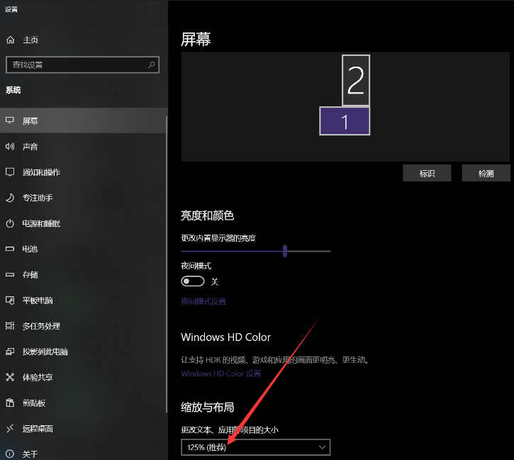
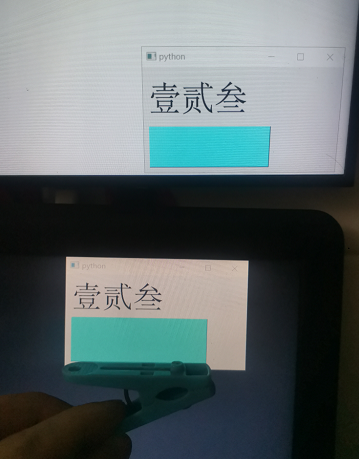
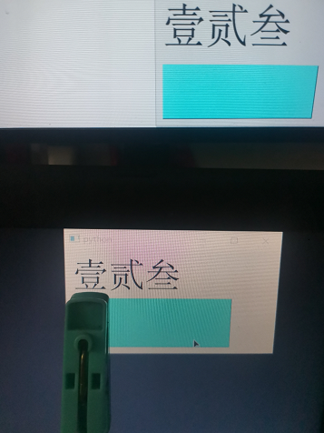
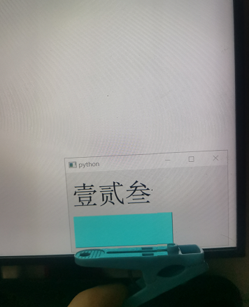
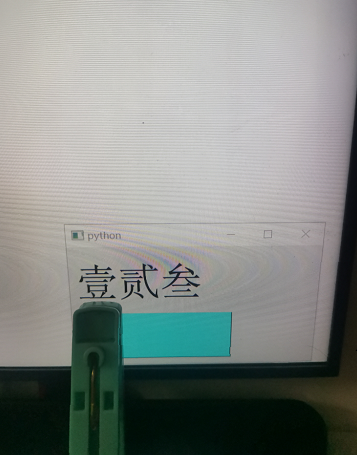
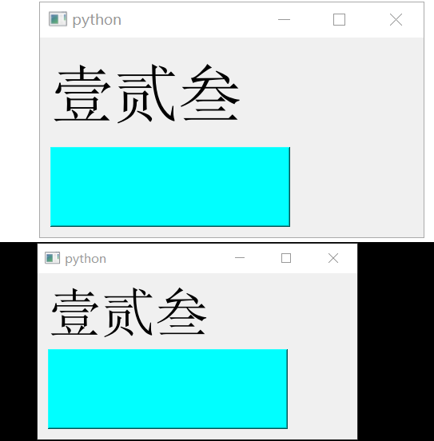
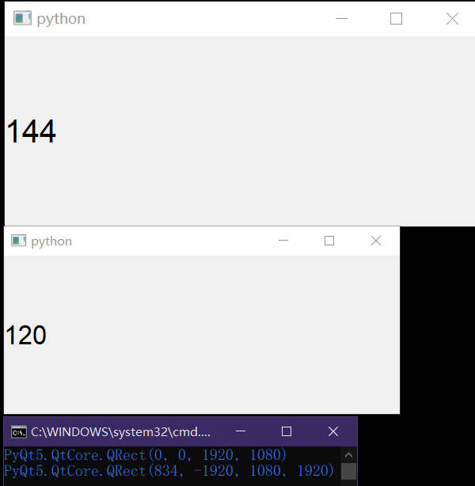

# DPI不感知 + DPI静态感知
- 会自动缩放窗口大小、窗口内容(字体、图片、图标等)，不需要用户/程序员手动调整；
- 虚拟屏幕坐标与物理屏幕坐标不一致，导致所有坐标API都无法得到预期结果；
- 静态感知在程序启动时会将软件DPI设置为屏幕DPI；

它的问题主要出在虚拟/物理屏幕坐标不同步，并且没有有效的坐标转换映射，导致无法保证坐标相关的API能够正确执行，
再加上会对窗口进行缩放导致模糊的原因，windows并不推荐新程序设置这两种模式。
实际上，如果屏幕DPI不发生变化的话，使用静态感知的效果和使用动态感知是差不多的。


# DPI动态感知
- 不会缩放窗口大小、窗口内容(字体、图片、图标等)，因此需要用户/程序员手动调整，否则会出现界面过小/过大的问题；
- 虚拟屏幕坐标与物理屏幕坐标保持一致；
- 屏幕DPI发生变化时会发出``WM_DPICHANGED``消息，以便用户/程序员能及时调整界面参数(字体大小、图片大小、元素间距等)；

该模式的问题主要是UI需要用户手动管理，也就是诸如字体大小、元素间隔(``margin``、``spacing``等)、图标图片大小等，都需要用户进行设置，而不仅仅要设置窗口的大小那么简单，
因此要额外设置“点/逻辑像素”这个单位，然后所有以像素为单位的都换成这个点单位，这个点单位大小(对应物理屏幕像素个数)的计算方式是``屏幕DPI/软件DPI``，而这个式子恰好就是“缩放比”的含义，因此也可以采用“缩放比”这种说法。至于为什么使用的是``软件DPI``而不是固定值96，可以自己试一试的。


前端开发，例如网页开发，往往不会直接使用像素``px``这个单位的，因为这单位的设备关联性太强，会造成正常界面在高分屏中会显示过小，如果是基于高分屏进行的软件开发的话又会导致在标准屏中的显示过大。因此通常会使用``em``和``rem``这种相对单位作为替代。


# 补充：
- 无论程序是否设置动态感知，在窗体被拖拽到屏幕DPI不相同的另一屏幕时，伟大的Windows都会强制对窗口进行大小调整，太伟大了(明明就是忘了改相关的代码)；
- 通过``SetWindowPos``可以绕开上面提到的问题，以此观察不同DPI感知模式下屏幕DPI变化时窗口大小的变化(虽然没有什么实际意义，单纯作为实验)；


<br>

# 示例1：

## 屏幕设置：

准备两块屏幕，并将屏幕DPI调整为适宜DPI，也就是将屏幕设置中的缩放设置为“推荐值”，两块屏幕都要进行设置。
适宜DPI的概念在前面的章节中已经提过了，忘了的话自己回去翻翻。




## 运行代码：

运行下面的PyQt代码两次，并将窗口分别放到两块屏幕上，以观察显示效果。

```py
from PyQt5.QtWidgets import QApplication,QWidget,QLabel,QPushButton,QVBoxLayout
from PyQt5.QtGui import QFont

if True:
	app=QApplication([])
	win=QWidget()
	vbox=QVBoxLayout(win)

	lb=QLabel("壹贰叁")
	btn=QPushButton()

	lb.setFont(QFont("",40))
	btn.setFixedSize(300,100)
	btn.setStyleSheet("background:#00FFFF")

	vbox.addWidget(lb)
	vbox.addWidget(btn)
	win.setGeometry(1000,500,400,200)
	win.show()

	app.exec()
```


## 运行结果：

下面放出四张屏幕拍摄结果以及一份屏幕截图

### 屏拍-下：
可以看到下屏的窗口中：
- 按钮的长度与夹子一致；
- 字体的大小与夹子一致；


|   |  |
|  ----  | ----  |


<br>


### 屏拍-上：
可以看到下屏的窗口中：
- 按钮的长度比夹子短；
- 字体的大小与夹子一致；


|   |  |
|  ----  | ----  |


<br>

### 电脑截图：
可以看到：
- 按钮大小一致；
- 字体大小发生了调整；
- 窗体大小发生了变化；



<br>

## 结论：
- Qt对字体的渲染是以``pt``为准，而不是``px``，因此跨屏时字体大小能随之调整；
- Qt对控件元素的大小是以``px``为准，这就导致了跨屏时该参数是不会自动发生调整，因此对于界面显示要求比较高的程序来说，程序界面布局(乃至控件的绘制)最好需要程序员手动进行管理；

当然，Qt还提供了一些与DPI相关的设置，但我试不出来它们的作用，或者说试出来了但不知道怎么描述，这里就先记一下。
框架中应该是有其他手段可以解决这类DPI缩放问题的，只能说是应该，具体有没有就不清楚了。

```py
QApplication.setAttribute(Qt.AA_EnableHighDpiScaling)
QApplication.setAttribute(Qt.AA_UseHighDpiPixmaps)
```

<br>


# 示例2：
对控件重写``nativeEvent``，这个函数略微棘手，需要``winAPI``以及``ctypes``的支持。

# 代码：
```py
from PyQt5.QtWidgets import QApplication,QLabel
from PyQt5.QtGui import QFont
from ctypes import Structure, cast, POINTER
from ctypes.wintypes import LPARAM, WPARAM,POINT,HWND,UINT,DWORD

class MSG(Structure):
	_fields_ = [
	('hwnd',HWND),
	('message',UINT),
	('wParam',WPARAM),
	('lParam',LPARAM),
	('time',DWORD),
	('pt',POINT),]

class Test(QLabel):
	def nativeEvent(self,eventType,message):
		msg=cast(message.__int__(),POINTER(MSG))
		msg=msg[0]
		#win32con并没有WM_DPICHANGED这个宏的值，乐，只能使用具体值
		if(int(msg.message)==736):#我这有注释，说明了736的含义，所以严格意义上不能说它是魔法数字
			dpi=msg.wParam & 0xFF
			self.setText(str(dpi))
		return super().nativeEvent(eventType,message)

if True:
	app=QApplication([])

	for s in app.screens():
		print(s.geometry())

	ts=Test()
	ts.setFont(QFont("",20))
	ts.setGeometry(1000,500,500,200)
	ts.show()

	app.exec()
```

# 运行结果：
运行上述代码，将窗口跨屏移动，可以看到``nativeEvent``接到了``WM_DPICHANGED``这个窗口消息，并获取到了正确的窗口DPI，说明Qt默认启动了DPI动态感知，同时``QScreen.geometry``能够准确获得屏幕的坐标也足以说明这一点。




<br>
<br>
<br>


# 参考：
- ``WM_DPICHANGED``：[https://learn.microsoft.com/zh-cn/windows/win32/hidpi/wm-dpichanged](https://learn.microsoft.com/zh-cn/windows/win32/hidpi/wm-dpichanged)
- ``GetDpiForSystem``：[https://learn.microsoft.com/zh-cn/windows/win32/api/winuser/nf-winuser-getdpiforsystem](https://learn.microsoft.com/zh-cn/windows/win32/api/winuser/nf-winuser-getdpiforsystem)
- Mixed-Mode DPI 缩放和 DPI 感知 API：[https://learn.microsoft.com/zh-cn/windows/win32/hidpi/high-dpi-improvements-for-desktop-applications?redirectedfrom=MSDN](https://learn.microsoft.com/zh-cn/windows/win32/hidpi/high-dpi-improvements-for-desktop-applications?redirectedfrom=MSDN)
- 如何确保应用程序在高 DPI 显示器上正确显示：[https://learn.microsoft.com/zh-cn/windows/win32/directwrite/how-to-ensure-that-your-application-displays-properly-on-high-dpi-displays](https://learn.microsoft.com/zh-cn/windows/win32/directwrite/how-to-ensure-that-your-application-displays-properly-on-high-dpi-displays)
- Windows 上的高 DPI 桌面应用程序开发：[https://learn.microsoft.com/zh-cn/windows/win32/hidpi/high-dpi-desktop-application-development-on-windows?redirectedfrom=MSDN](https://learn.microsoft.com/zh-cn/windows/win32/hidpi/high-dpi-desktop-application-development-on-windows?redirectedfrom=MSDN)
- CSS单位em、rem、vh、vw 等：[https://www.freecodecamp.org/chinese/news/css-unit-guide/](https://www.freecodecamp.org/chinese/news/css-unit-guide/)
- There Is No Such Thing As A CSS Absolute Unit：[https://www.smashingmagazine.com/2021/07/css-absolute-units/](https://www.smashingmagazine.com/2021/07/css-absolute-units/)
- High-DPI Support in Qt 5.6：[https://www.qt.io/blog/2016/01/26/high-dpi-support-in-qt-5-6](https://www.qt.io/blog/2016/01/26/high-dpi-support-in-qt-5-6)
- [Qt开发]当我们在开发兼容高分辨率和高缩放比、高DPI屏幕的软件时，我们在谈论什么：[https://www.cnblogs.com/Leventure/p/18237406](https://www.cnblogs.com/Leventure/p/18237406)
- High DPI Displays：[https://doc.qt.io/qt-5/highdpi.html](https://doc.qt.io/qt-5/highdpi.html)
- Qt-高DPI缩放（高分屏适配）技术简析：[https://blog.cls.ink/2024/03/12/Qt-高DPI缩放（高分屏适配）技术简析/](https://blog.cls.ink/2024/03/12/Qt-高DPI缩放（高分屏适配）技术简析/)


