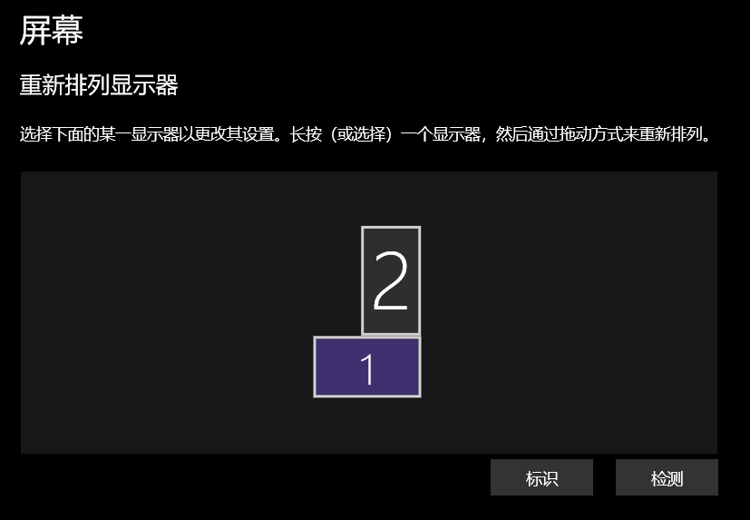

测试各种获取显示器信息的API，测试代码在本目录下的TestCode文件夹中。

这里先说明平台以及测试环境：
- 操作系统：win10专业版[22H2] (19045.3208)，64位；
- IDE：VS2019；
- 屏幕信息：主屏幕1920x1080(125%缩放)，副屏幕1080x1920(150%缩放)；
- 屏幕位置：副屏位于主屏上方与主屏右对齐；

 

 
 

***

虽然是想把运行结果摆上来，但，好麻烦，算了不搞了

